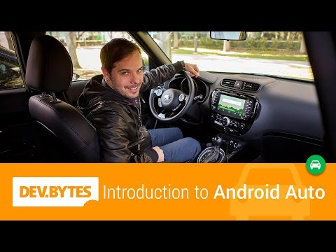

## DevBytes: Introduction to Android Auto

** 视频发布时间**
 
> 2014年11月18日

** 视频介绍**

> Timothy Jordan Introduces Android Auto. Android Auto brings the Android platform to the car in a way that's optimized for the driving experience. It's the same Google platform you already use for phones, tablets, televisions, watches, and more. In fact, all these experiences will often be in the same APK. But now, your app can also extend to the car in a way that's safer and more efficient for the driver. So drivers can stay connected with their hands on the wheel and their eyes on the road.Using Android Auto is easy. Users go to the Google Play store and download apps that support Android Auto onto their phone.. When they connect their phone to the car, the phone goes into car mode and casts the Android Auto experience to the car's screen. This means that although all the apps and services are actually running on the phone, they're displayed in the car's dash. Users interact with them using the vehicle's controls such as a built-in touchscreen and microphone.

** 视频推介语 **

>  暂无，待补充。

### 译者信息

| 翻译 | 润稿 | 终审 | 原始链接 | 中文字幕 |  翻译流水号  |  加入字幕组  |
| -- | -- | -- | -- | -- |  -- | -- | -- |
| 高冰 | 虞高 | -- | [ Youtube ]( https://www.youtube.com/watch?v=ctiaVxgclsg )  |  [ Youtube ]( https://www.youtube.com/watch?v=I6oxqQ5Z7uo ) | 1504130615 | [ 加入 GDG 字幕组 ]( http://www.gfansub.com/join_translator )  |

### 解说词中文版：

大家好

我是Timothy Jordan  本集视频将介绍Android Auto

在美国  上班一族平均每天要花1个小时的时间在开车上

我们平均每天都要查看125次

自己的智能手机

现如今  我们去哪都会开车

同时我们会用手机与外界保持联系

但是在开车时玩手机会让你分心

事实证明  在美国有25%的交通事故

是由低头一族造成的

如果在你开车时还能和手机保持密切联系

不过是以一个更加安全和更加舒适的方式

你觉得怎么样

还有  在这个新的平台之上进行开发

是如此的简单而又熟悉  你又觉得怎么样

欢迎来到Android Auto  它将Android带进了汽车里

它跟你的Android手机  平板电脑

电视  手表等同属于一个平台

一个APK安装包可以通吃所有平台

现在在汽车上当然也可以这么干

我们的这种做法对驾驶员来说

是更安全和更高效的  这样他们不仅可以和手机保持联络

而且还能一直手把方向盘并时刻注意路况

Android Auto是非常容易上手的

用户只需要登录到Google Play商店

下载支持Android Auto的应用到手机上

然后将手机和汽车相连

手机就会进入驾驶模式(Car Mode)

并将画面投射到汽车的中控台上

尽管你的应用和服务都还是在

手机上运行着

但都会在汽车的面板上显示

而且你还可以和触摸屏  车载麦克风等等

这些控制终端进行交互

你知道怎么操作它们吗

让我给你展示一下操作的过程

我现在位于Android Auto的办公区内

他们已经有了供开发使用的汽车

让我看看能不能找到Daniel  把他的车借来

嗨  Daniel

嗨  Timothy

干嘛呢

在享受Android Auto团队的美好时光

我们马上就要享用午餐了

听上去真不错

看   那个喷气机能用了

那好

现在我正坐在这辆新起亚·秀尔(new Kia Soul)里面

有些人是因为这台车的全景天窗才喜欢上它的

不过我独爱这辆车所带的Android Auto

我现在把我的手机和汽车连起来

你会看到手机会自动进入驾驶模式

点这个图标  Android Auto就启动起来了

酷不酷

这是主界面

每次都要从这里开始进行操作  这里面有一些卡片

上面有现在所处的位置  时间等等

同时也能查看所有的通知

工具栏在主界面的底部

这里有几个我们经常会用到的操作按钮

导航  拨号  音乐  还有汽车仪表盘

你可能也注意到了角落这儿有一个麦克风按钮

我一会再回来细说这个

先来点音乐听听吧

点这  然后点播放

你可能注意到了  尽管我在别人的车里

所有的东西都是运行在我手机上的

所以这里面的东西都是我的  收到的是我手机的通知

播放的是我账户里的音乐

刚才我们谈到了界面布局

如果你是开发者  你一定对这个很感兴趣

因为这和你的应用该如何展示息息相关

考虑到用户界面的一致性

并且要确保所有的应用都要遵循同样的安全准则

Android Auto会把你的应用

放置于一套标准统一的UI布局中

也正是因为这一点  把你的应用扩展到Android Auto平台是这么轻而易举

你不需要担心种类繁多的

显示参数  分辨率  和各类交互手势

甚至不需要担心驾驶员会因为什么操作而分心

你只需向Android Auto提供一些资源  比如图片  文本

颜色搭配  并且让你的应用支持返回上层的操作

这种移植办法可以让开发者

不需要自己再重新设计一套完整的用户界面

瞧  有一条来自Wayne的短信

我点一下就可以让它播放短信内容

嗨  Timothy

我听说你偷偷开走了一辆Android Auto汽车

要不要来一场幽灵车程

在汽车里可以接收短信通知

对于我们开发者来说  这又是一个挺有趣的事

开发者们可以充分利用汽车里的设备来为开发所用

就像在Android Wear上开发时要利用穿戴式的特点一样

最后我想给大家

看看语音界面

在这里可以回复短信或者进行搜索

我只需轻按屏幕右上角的麦克风按钮

定义joy riding.

Joy riding  开着偷来的车

狂飙的危险行为

这功能太帅了

好啦

让我们重新回到演播室  把剩下的内容讲完

好的

还有几件事没有讲

Android Auto的工作方式是将你手机里运行的应用和服务

投射到汽车的中控屏幕上

也就是说  你需要将现有的Android应用

做一些扩展以便能够支持在汽车上使用

今天介绍2个很棒的例子

音乐和消息

使用歌曲  广播  有声书等类型的音乐应用

是在开车时娱乐消遣的好办法

现在这些都可以扩展到汽车上面来

我们的API支持音频内容的播放  重放

并且会制定好界面布局

消息应用是当你在开车时

与外界保持联系最有力的工具

现在  这当然可以扩展到汽车上面来

我们的API支持消息的通知推送

复读消息内容  还有语音回复

Android Auto把汽车也加入到了Android平台之中

你可以轻而易举的将现有的应用

扩展到汽车上来

让驾驶员要注意路况的同时

还能够时刻与网络世界保持联系

请点击这个URL来获取我们为开发者准备的超棒的资源

我是Timothy Jordan  希望今后还能和你相伴

我的钥匙嘞