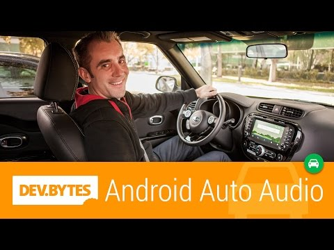

## Devbytes: Android Auto Audio

** 视频发布时间**
 
> 2014年11月18日

** 视频介绍**

> Wayne Piekarski introduces Audio on Android Auto. Google and Android Auto enable you to extend your existing audio applications for use in the car, using the Android 5.0 Lollipop media APIs. Your application and it’s audio content will run on the phone, but will be heard and controlled via the sound system built into the car. This DevByte from +WaynePiekarski covers how to expose the contents of your application’s audio library to the media APIs, such as song information and album artwork, and how to respond to requests from the buttons in the car. With audio for Android Auto, you can extend apps to the car in a way that’s more efficient for the driver. So drivers can stay connected, but with their hands on the wheel and their eyes on the road.Android Auto Audio documentation: https://developer.android.com/training/auto/audio/index.html    Code sample: https://developer.android.com/samples/MediaBrowserService/project.html             G+ Community: https://plus.google.com/communities/116320632775523824083     Wayne Piekarski: https://plus.google.com/communities/116320632775523824083

** 视频推介语 **

>  暂无，待补充。

### 译者信息

| 翻译 | 润稿 | 终审 | 原始链接 | 中文字幕 |  翻译流水号  |  加入字幕组  |
| -- | -- | -- | -- | -- |  -- | -- | -- |
| 韩晓健 | 苏楚霖 | —— | [ Youtube ]( https://www.youtube.com/watch?v=Q96Sw6v4ULg )  |  [ Youtube ]( https://www.youtube.com/watch?v=3wsx2MzILB4&index=4&list=PLvivLNHqjoowK2IZ9j_NYIucUrGgdiDrT ) | 1504130616 | [ 加入 GDG 字幕组 ]( {{ book.host }}/join_translator )  |

### 解说词中文版：

WAYNE PIEKARSKI  大家好

你知道开发者现在可以

为他们的应用添加Android Auto的支持吗

我是Google的Wayne Piekarski  这次的Devbyte

我将向你展示

简单的使用新的媒体API把

现有的音频APP修改成可以与Android Auto协作

你的应用还有音频内容都将在手机上运行

但是可以在汽车上听到声音

也可以用汽车上的系统操控你的应用

Android Auto软件在你的手机上运行

并负责绘制显示在汽车

显示屏上的用户界面

手机通过USB线来控制汽车的显示

你可以在Introduction to Android Auto Devbyte

中找到更详细的运行原理

我来向你展示如何把现有的音乐应用

扩展成可以与Android Auto协作

比方说你在存储了很多音乐的手机上

打开一个音乐播放App

你会想让你的用户可以在汽车上的控制键来选择和播放歌曲

而不需要使用手机

尽管这些事都是在手机上处理的

你的APP需要让Android Auto知道这个音乐库

以便它能把媒体信息

以及专辑封面显示在汽车的屏幕上

你的APP还要能响应

方向盘上的控制键

比如播放 停止 下一曲等

让我来向你展示一个例子

看看从用户角度是什么样子的

我们现在要做的是

打开音乐APP  然后选择播放列表

选择类型  然后从这些类别里

选择一首歌

音乐响起

让我们回到工作室来看一些代码

我来告诉你他是怎么工作的

要实现这么酷的功能

第一步我们要建立AndroidManifest.xml文件

来告诉Android Auto你的APP会给汽车提供服务

需要提供一个像这样的XML文件

文件里包含了媒体信息的汽车APP的标签

这是因为我们要实现一个音乐播放APP

还要声明一个媒体浏览服务

来通知Android Auto你的APP能提供

可用的媒体的信息

下一步要实现这个媒体浏览服务

首先要实现onGetRoot方法

它返回媒体库的顶层节点

它不在UI里显示

这里还要禁止

任何除了Android Auto

通过查询与Android Auto包名

相匹配的客户端包名来

查询你的应用

下一步要提供onLoadChildren方法

它生成媒体列表  给出父节点的

媒体ID

返回的每一项既像子文件夹一样可浏览

也可以像歌曲一样播放

可以通过

在Media Items Constructor里传递其中一个标志来区分

在onLoadChildren里应该激活一个异步任务

然后调用detach方法

当得到结果

这个异步任务能通过结果发送来返回结果

这里使用异步任务确保用户界面是可以正常响应

并且当代码正在查询媒体库时

不会被阻塞

现在  由于用户是在车里

减少用户操作

是非常重要的

所以你要在顶部放置常用项

比如播放列表  频道和其他常用的内容

还应该避免显示无限制的类别

比如所有艺术家  因为这些列表

对用户来说很不容易找到想要的歌曲

而是应该建立有限制的内容

提前准备好用户需要的东西

接下来我们要建立媒体会话

它就像胶水一样让Android Auto告诉

我们的音乐APP来播放什么音乐

媒体会话知道我们的APP的播放状态

播放队列和其他的数据

然后我们要通过setSessionToken方法把

媒体会话绑定到媒体浏览服务

确保在这里也调用了setActive方法

这是因为这表明会话已准备好接收命令

十分重要

通过SessionToken

Android Auto可以实现媒体控制器

它可以通过媒体会话回调方法来远程控制

我们的媒体会话

此图表明了各部件如何

合作实现的

可以看见媒体APP和Android Auto APP

在手机上互动并且显示在汽车上

顺便说一句  这个接口不是Android Auto特有的

Android Auto其实只是一个使用媒体控制器的客户端

最大的优点是其他你允许访问的SessionToken的APP

只是通过建立一个新的媒体控制器

就可以控制媒体会话

比如  手机上普通的音频播放

应该算是客户端其中之一

委托媒体库处理和媒体播放控制

相同的Android Auto的媒体浏览服务的客户端之一

为了测试你的App  我们提供了一个类似车上体验的

媒体浏览模拟器

这样你可以在手机或Android模拟器上运行媒体浏览模拟器

来测试是否正确的使用API

它使用和Android Auto相同的媒体控制接口

和媒体浏览服务来提供接近于

汽车里的操作体验

在开发时测试会非常棒

好了

就这么多

让我们回到车上离开吧

你可以访问网站了解更多的Android Auto文档

也可以加入Google+社区

你可以和人们分享你的想法

感谢收看Android Auto的介绍视频

我是Wayne Piekarski  下次见

