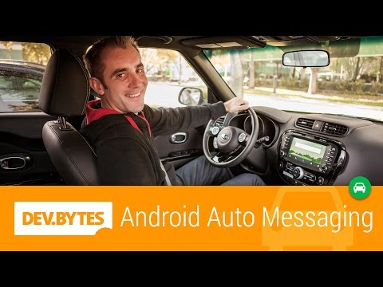

## DevBytes: Android Auto Messaging

** 视频发布时间**
 
> 2014年11月18日

** 视频介绍**

> Wayne Piekarski introduces Messaging on Android Auto. Google and Android Auto enable you to extend your existing messaging applications for use in the car, with a voice controlled interface. Android Auto takes care of all the hard parts of speech recognition for you; you just need to add a few lines of code to your app, and +WaynePiekarski shows you how in this DevByte. With messaging for Android Auto, you can extend apps to the car in a way thats more efficient for the driver. So drivers can stay connected, but with their hands on the wheel and their eyes on the road.

** 视频推介语 **

>  暂无，待补充。

### 译者信息

| 翻译 | 润稿 | 终审 | 原始链接 | 中文字幕 |  翻译流水号  |  加入字幕组  |
| -- | -- | -- | -- | -- |  -- | -- | -- |
| 苏楚霖 | 葛佳恒 | —— | [ Youtube ]( https://www.youtube.com/watch?v=gSVLuaOTIPk )  |  [ Youtube ]( https://www.youtube.com/watch?v=OUfGnG6m3XI ) | 1504130617 | [ 加入 GDG 字幕组 ]( {{ book.host }}/join_translator )  |

### 解说词中文版：

大家好

让我们为Android Auto开发一些应用吧

我是来自Google的Wayne Piekarski

今天  我想跟大家聊聊如何扩展

已有的消息应用

来支持Android Auto

Android Auto的软件是运行在手机上面的

它使用手机来绘制显示在汽车显示屏上的

用户图形界面

我们通过USB接口来连接手机和汽车

如果你想要更深入地了解它是如何运作的

请看看我们的Introduction to Android Auto

的开发视频

Android Auto提供了一套功能强大的扩展

协助你很方便地与之集成你的

消息应用

这套扩展还提供了专门为驾驶使用

优化的语音控制接口

你可以使用语音控制来回复信息通知

而不需要去操作手机

这个非常方便  因为驾驶员开车时

他们的注意力需要高度集中

并且需要始终注意前方的路况

最棒的事情是  Android Auto解决了

所有语音识别最麻烦的问题

而你作为开发者只需要添加几行代码而已

刚好  你看

我的同事Brian发来了短信

让我们看看他说什么

你有新短信

你音乐会已经迟到啦

回复信息

请说出你的信息

五分钟后到  Brian

你的信息是

五分钟后到  Brian

需要发送么

是的

正在发送消息

好的

出发去音乐会

像刚才那样  已有的信息应用

会使用通知对象来通知用户

有一个新的信息

通知对象会包含信息的文字内容

以及封装了通知点击以后需要执行的操作的

Intent对象

这是我们目前的实现

现在我想告诉你的是

如果向通知对象添加一些简单的通知扩展

来使用Android Auto的功能

想要实现在车里回复消息的功能

第一件事就是创建一个RemoteInput的实例

它会负责接收和处理

来自Android Auto的语音输入

首先我们会进行语音识别

然后通知系统会将已识别的语音

以普通字符串的形式添加到我们提供的Intent对象

如果你使用过Android Wear的扩展功能

你就会发现这是非常类似的

然后  我们需要给Android Auto

提供未读信息的内容

这样它才可以传送给用户

并获得回馈

首先需要从实例化一个UnreadConversation对象

它是CarExtender类里的静态嵌套类  另外你需要提供

四个信息  包括

发送人名字  时间戳

消息被Android Auto读完以后发送的Intent对象

以及把回复发送给通知系统的操作

现在你的消息应用

会有一个保存已有信息的列表

然后你需要写一个循环

遍历来自发送者的每一个未读信息

并添加到UnreadConversation对象里

现在需要已有的通知的代码

再添加上CarExtender和UnreadConversation对象

然后就像你之前做的一样去触发通知

Java代码方面基本上就完成了

在你已有的代码里面

简单地添加几行

你就能拥有Android Auto的功能了

最后你的应用还需要告诉

Android Auto它可以支持来自CarExtender的

通知

这就需要在你的AndroidManifest.xml的文件

引用一个XML文件  它有automotiveApp的标签

里面是notification属性

为了测试你的应用  我们提供了一个信息模拟器

它看起来特别像在汽车里面的体验

这样你就可以在你的手机里或者Android模拟器中

运行这个信息模拟器

以便测试你是否正确地使用了API

它会捕捉到通知并支持CarExtender的扩展功能

当你在开发的时候根本不需要离开你的工作台

进行测试  这真是太棒了

就像你看到的  你的应用基本上都保持原样

只是向通知对象添加了一些非常简单的扩展

来获得Android Auto的功能

也就是说扩展你现有的应用

并且服务于你的用户将会非常简单

更棒的是为Android Auto平台扩展的方法

跟为Android Wear平台进行扩展的方法是相似的

这展示了Android的通知系统可扩展性很强

并且对于开发者易于上手

让我们回到车里面

你可以访问文档网站来获得更多关于Android Auto的资料

也可以加入Google+的社区

你可以在那里分享你的想法

我是Wayne Piekarski  谢谢你观看我们的视频

下次再见

导航到Googleplex

