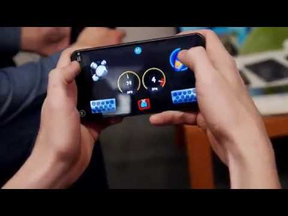

## Android TV: Beach Buggy Racing Multiplayer with Nearby Connections (Play Services)

** 视频发布时间**
 
> 2015年3月2日

** 视频介绍**

> Googlers play a multiplayer match of Beach Buggy Racing on Android TV. The demo shows how a game, using the Nearby Connections API in Google Play services, can seamlessly connect smartphones and tablets as second-screen controls to the game running on a TV.

** 视频推介语 **

>  暂无，待补充。

### 译者信息

| 翻译 | 润稿 | 终审 | 原始链接 | 中文字幕 |  翻译流水号  |  加入字幕组  |
| -- | -- | -- | -- | -- |  -- | -- | -- |
| 高冰 | 程路 | 程路 | [ Youtube ]( https://www.youtube.com/watch?v=JvPUD6eI_vw )  |  [ Youtube ]( https://www.youtube.com/watch?v=t65jSeOcfIo ) | 1503060387 | [ 加入 GDG 字幕组 ]( {{ book.host }}/join_translator )  |

### 解说词中文版：

嗨  Greg（GDC 大会主持人）

嗨  GDC大会到场朋友们

你们今天看上去不错

我现在和来自Google游戏服务团队的Ben在一起，

我们要一起玩一个多人游戏 

名字叫沙滩车竞速（Beach Buggy Racing）

但是我们只有一个游戏手柄

其他的都是Android手机

Ben  我们将要如何实现多人对战呢

幸运的是

沙滩车竞速（Beach Buggy Racing）的开发者们在游戏当中

实现了一个叫nearby connections的接口

它允许我们将Android设备连接到Android TV上

并作为遥控器

它会发送一个广播  给附近的手机说

我准备好了  来连我吧

我注意到现在我们已经开始游戏了

你的手机也发生了一些变化

具体是怎么一回事呢

当我的双手来回倾斜的时候

你可以通过水平陀螺仪传感器

控制汽车的驾驶

但更重要的是  我现在可以

使用Android设备作为控制器

而不是用不方便供多人一起玩的手柄

这看上去是件很棒的事

在控制器上首先得要加一些图形注释

比如你可以看到在屏幕右侧显示我有氮气加速器的图标

我可以去点击它以达到

加速的效果

然后在屏幕左边  我获得了我的特殊力量特效

在屏幕下方有踩刹车的图标

我可以在手机上更好的利用这些按钮

当然  在屏幕中央有实时显示的表盘

显示我目前开的有多快

让我们再玩一局吧。

好啦

我们要再玩一局了。

Greg  接下来把时间交换给你

拜了个拜

