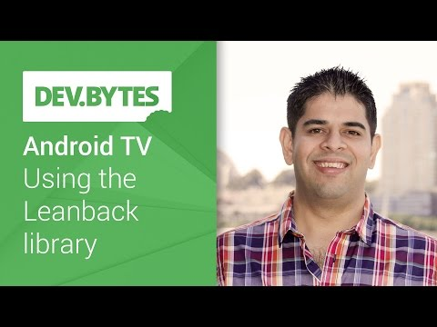

## Android TV: Using the Leanback library

** 视频发布时间**
 
> 2014年10月27日

** 视频介绍**

> The LeanBack Support Library makes it easy and fast to build great looking Android TV apps. Ankur Kotwal covers the key components to get you started building apps for Android TV using this library.Check out more great DevBytes on Android at this convenient playlist.

** 视频推介语 **

>  暂无，待补充。

### 译者信息

| 翻译 | 润稿 | 终审 | 原始链接 | 中文字幕 |  翻译流水号  |  加入字幕组  |
| -- | -- | -- | -- | -- |  -- | -- | -- |
| 韩晓健 | 贺颂 | 程路 | [ Youtube ]( https://www.youtube.com/watch?v=72K1VhjoL98&index=3&list=PLOU2XLYxmsILFBfx66ens76VMLMEPJAB0 )  |  [ Youtube ]( https://www.youtube.com/watch?v=aTP4Tqhrj6U ) | 1504080588 | [ 加入 GDG 字幕组 ]( {{ book.host }}/join_translator )  |

### 解说词中文版：

嗨  我是Ankur Kotwal  我是Google开发技术推广工程师

今天 我来讲讲

如何为Android TV开发应用

Android TV的开发是轻松 娱乐和简单的

通常电视屏幕是在10英尺远的观看

它要比其他Android设备大得多

为电视建立一个高效的用户界面

需要不同的方法和工具

为了开发简便  我们提供Leanback支持库

它包含为电视创建应用的API  资源和部件

你当然可以不用它来开发应用  但是为什么不用呢

它使得提高大屏幕上的高质量的用户体验

变得非常简单

当你创建一个TV的项目时

Leanback支持库会自动添加到工程中

如果你不用Android Studio

你可以在build.gradle文件中声明这些依赖项

Android Repository Package中提供

如果你还没有安装Android Repository Package

可以在SDK manager中安装

现在来看一看一个简单的例子

首先  你要在Manifest中

用Leanback Launcher Intent Filter声明一个TV的activity

它识别出你的应用是为Android TV建立的

同时这个Intent Filter也识别出

当用户选中电视上的应用图标时

应用中的哪个activity会被启动

Leanback库提供一个TV的标准主题

叫theme.leanback

它提供了TV应用一致的视觉样式

推荐所有的TV应用

都使用Leanback库

Leanback库是基于

model-presenter-view模式设计的

它是model-view-controller模式的衍生

对model对象有严格要求

object adapter可以用来定义任何一种model

因此你可以直接升级已存在的应用

而不用改变model

用object adapter也可以连接到

你的本地或在线的媒体数据

用presenter你可以决定这些项如何显示

Leanback库也提供浏览与操作

媒体目录的预建fragment

你可以利用这个

来建立你自己的媒体浏览应用

这是应用的初始化布局

它包括一个来自Leanback库的

BrowseFragment的子类

BrowseFragment可以让你毫不费力地创建

一个浏览类别的初始布局  媒体项目一行一行排列

就像你看到的这个例子

只要添加了这个类

就可以创建一个

具有标准的导航设计和优美的过渡动画的多面板的布局

来看看如何在fragment中填入内容

ArrayObjectAdapter用来

定义一列ListRow对象

ListRow presenter用来显示

类别自动的在左侧垂直显示

同时每个类别的媒体

水平滚动排布

当用户进入某个分类

所有的分类就会消失

并作为首项显示为每行的标题

每个ListRow对象由一个标题

和ArrayObjectAdapter组成

标题描述了本行数据

这里就是分类的名字

ArrayObjectAdapter包含了各个分类的媒体项

这里一个用户定义的CardPresenter来显示每一个媒体项

这你需要自己来实现

以上所有的类  ArrayObjectAdapter

ListRepresenter和ListRow

都由Leanback支持库提供

你唯一要做的就是

实现一个显示媒体项的presenter

当你创建一个ListRow对象时

你可以定制一个presenter

来定义每一项的显示方式

这个例子里  CardPresenter用缩略图的卡片

来显示每一个媒体项

CardPresenter类继承于Presenter类

重写onCreateViewHolder函数来生成显示

重写unbindViewHolder函数来按照需求绑定对象到视图

你要记住一点

Android TV的所有互动页面

都应该被方向键导航

为实现这一点  你需要把Focusable属性

和FocusableInTouchMode属性设置成真  就像这样

为了与用户的输入互动

你要在BrowseFragment中添加onItemClick监听器

回掉时  你可以获得一个intent

开始项目的DetailsActivity

或者通过fragment manager用DetailsFragment

替换BrowseFragment

支持库中的DetailsFragment

允许你创建一个初始布局

来显示详细信息

同样  你也是毫不费力

同样  ArrayObjectAdapter用来定义一列内容

DetailsOverviewRow是一行

媒体的具体内容

为了给予DetailsOverview对象它本身

使用DetailsOverviewRow presenter

这一行包括图像  DescriptionView

和一系列交互动作

你可以通过调用setImageBitmap函数和addAction函数简单地

预览图片和添加交互动作

AbstractDetailsDescription presenter类

可以用来显示DescriptionView

也可以添加更多的内容  比如相关的视频

你可以在ArrayObjectAdapter里

添加一个附加行来显示

这里  在ArrayObjectAdapter的结尾处

一个附加的ListRow对象包含了一列相关的视频

同样  ListRow presenter用来显示这行内容

以上就是

Android TV开发的基础

总的来说  Leanback支持库

让创建高质量的应用变得非常简单

BrowseFragment和DetailsFragment

是开始Android TV开发的简单方式

本节展示的部分示例代码罗列在此

你可以在developer.android.com/tv上

发现更多Android TV平台的独一无二的特点

比如推荐  背景管理

我期待着看到你的大屏应用

