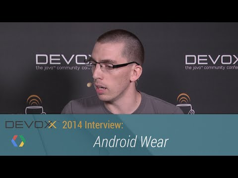

## Devoxx 2014 Interviews: Android Wear

** 视频发布时间**
 
> 2014年11月27日

** 视频介绍**

> Google Developer Expert Cyril Mottier (@cyrilmottier, cyrilmottier.com) discusses how to think about Android Wear as a new platform, what the challenges are and what his experience has been building and shipping his first Wear application (CapitaineTrain.com).See more from Devoxx 2014: https://www.youtube.com/playlist?list=PLOU2XLYxmsIJaacrFiQbQGGrPXIWvj1Wr

** 视频推介语 **

>  暂无，待补充。

### 译者信息

| 翻译 | 润稿 | 终审 | 原始链接 | 中文字幕 |  翻译流水号  |  加入字幕组  |
| -- | -- | -- | -- | -- |  -- | -- | -- |
| Martin  | 黄玄 | —— | [ Youtube ]( https://www.youtube.com/watch?v=4KEfqz6oniw&index=3&list=PLOU2XLYxmsIIUo31YBwgabebMn2Xb75qq )  |  [ Youtube ]( https://www.youtube.com/watch?v=Fiqd1fgpTPs&list=PLvivLNHqjoowK2IZ9j_NYIucUrGgdiDrT&index=57 ) | 1503210440 | [ 加入 GDG 字幕组 ]( http://www.gfansub.com/join_translator )  |

### 解说词中文版：

我们在 Devoxx 2014 大会上

这里是我和谷歌 Android 开发专家 Cyrill Mottier

我们今天将专门针对

Android Wear 可穿戴设备进行深入的探讨

因为他正好在此次大会上做了一个关于 Android Wear 的演讲

欢迎

客气

客气

嗯，说到 Android

从最开始的时候，它就是形式各样的

其实从第一天开始，我们就假定人们会生产出

不同尺寸和形状的手机还有平板电脑

然后开发者们需要去跟它们打交道

现在我们又有了 Android Wear   

这货明显少了不少东西，但它大概不仅仅是

一个更小的体型而已

来跟我们说说从一个开发者的角度看它有哪些改变吧

CYRIL MOTTIER: 好的，没错，如你所说，

Android Wear 可不仅仅是一个缩小的 Android 

实际上，它是一个专门为了可穿戴设备而调整过的 Android 

关于调整，我是说，它彻底改造了

人们与设备交互的方式

它创造了新的 UI ，新的用户界面

因此它的交互模型与过去截然不同，

你再也看不到一堆排成网格状的 App 了

你需要遵循得是卡片原则 

每个卡片都是来自应用的一个消息

你可以划掉它或点开查看更多信息

ALEXIS MOUSSINE POUCHKINE: 对的

所以我觉得这正是理解它的关键

我们不应该尝试仅仅去缩小一个原有的应用

我们不应该尝试仅仅去缩小一个原有的应用

正是这样

所以你必须要以完全不同的角度去思考

这基本上需要你用一个

完全不同的过程去设计

所以，放下所有你在手机和平板上的成果

开始想想如何为一个更小的形态做一个全新的东西吧

开始想想如何为一个更小的形态做一个全新的东西吧

你也说到了关于形状的事儿

其实还蛮搞笑的

作为一个 Android 开发者

我们时刻准备着面对不同的设备尺寸

但它们通常都是正方形或者是长方形的屏幕

但它们通常都是正方形或者是长方形的屏幕

然而现在摆在我们面前的是个圆形的屏幕
这简直就是在逗我们嘛

不过也有好的事情啦，我们很高兴得看到 Android

自己就能很好的适应那样的屏幕

太棒了

所以其实
我觉得真正重要的是为可穿戴设备找一个好的使用场景

所以其实，我觉得真正重要的是为可穿戴设备找一个好的使用场景

我们并不是要尝试去把所有的应用都搬过来

我们并不是要尝试去把所有的应用都搬过来

所以第一个很明显的案例就是

你几乎不用做什么就已经实现的，

通用的通知推送

所以一个可穿戴设备，或者说 Android Wear

是与一架手机或者平板配对的，任何你在这台设备上接收

到的通知都会被镜像到可穿戴设备上

而且开发者并不需要为了这个过程做任何事情

对吧？

算是吧

不过我们也在尝试一些打破常规的

好吧，这其实是剧透了我明天要在会议上说的

呃，从根本上来说

Android Wear 有三条主要的原则：

你的应用一要让人一目了然

二要与情景相关

三是只需要提供弱交互甚至无须交互

所以当你想想这些原则

就会发现对于当前的 Android 

不论是手机或平板，唯一符合这些原则的

就是通知推送了

所以其实，Android Wear 可以直接使用的

的确是显示所有手机和平板上所显示的通知消息

的确是显示所有手机和平板上所显示的通知消息

而且这些通知都是实时同步的

所以当你在可穿戴设备上划掉通知的时候

它们同时也在手机被划去，反之亦然

这样做应该是很棒的

就使用 Android 的通知 API 而言

有没有什么额外要做的

来使可穿戴设备上的通知看起来不错？

呃，正如我说的，默认情况下它就是可以的

只是没有那么花哨而已

所以你可以通过一些可穿戴设备的扩展类来定制它

所以你可以通过一些可穿戴设备的扩展类来定制它

这些都是在支持库中有提供的

这样做，你就可以使用一些只适用于可穿戴设备的新通知功能

这样做，你就可以使用一些只适用于可穿戴设备的新通知功能

比如你可以改个背景，

或者可以定制自己的标签或者页面等等

这就使得你很容易……

把东西整合起来？

把这些信息分成不同的卡片

对的对的

所以终于，你已经达到了某种境界

觉得当前的这一切已经满足不了你了

你想要定制一些 UI 界面

你想要做一个真正运行在你“手腕上的 Android 系统”上的应用

你想要做一个真正运行在你“手腕上的 Android 系统”上的应用

正是如此 :)

所以。。

说到做一个这样全新的 App ，本质上是一个 APK 文件 

然后让它独立得运行在可穿戴设备上

带我们看看这东西有多么难做，比如说

你们现在有多少可以用的 API ？

你们能用它们做些什么？

或者是讲讲工作流什么的

当你刚开始做通知的时候

你还是需要使用传统的 APK 的方式

特别多人不明白，

Android Wear 其实就是 Android 

我们现在正在说得其实就是 Android KitKat

所以你现在正在平板上做的东西本质上

和可穿戴设备上是一样的

你有着完全相同的一套 API

除了一些比如 USB 这样的包

你不需要 USB, Webkit 

因为它们在可穿戴设备上是没有意义的

当你在为可穿戴设备写应用时

从技术的角度上来说

这和你在手机或平板上做开发是完全一样的

你真正需要时刻考虑的是

它们从用户体验和用户界面的角度来看是完全不一样的

这大概是 Android Wear 和 Android 的唯一区别了

这大概是 Android Wear 和 Android 的唯一区别了

OK，不过我还知道一个不同之处

可穿戴设备并没有真正意义上的连接上网络

或者说它只是连接到了手机上而已，所以这些数据……

目前是还没有，但是也许将来会实现吧

这其实也是使用 Android 的一个好处吧

Android Wear ，其实就是一个面向未来的产品

我不知道什么时候会有技术上的升级

也不知道可穿戴设备什么时候可以自己连接上网络

但是它已经时刻准备着了

我们几乎没有什么需要做的，因为它就是 Android 而已

对的

那我们先回到现在，回到当下我们有的和开发者有的来

开发者们需要用数据层的 API 来完成数据交换

或者是与互联网连接什么的

所以这些是怎么运作的？

手表是不能够直接向互联网发出请求的

它做任何事情都需要经过手机

是的

所以当下，我们有的只是一个连接到了手机上的手表

所以当下，我们有的只是一个连接到了手机上的手表

手机和手表都可以被视为网络上的节点

因为手机比手表要强大得多

所以它就可以扮演着手表的服务器的角色

无论你想从网络上获得什么数据

你得先把手表连接上手机

去向手机发送和请求数据

这时候手机就会向网络发送请求了

这感觉就好像手机是你的后端一样

这一切都要感谢一个叫 Data API 的 API

但实际上 还有两个别的 API

但是大多数时间你是在用 Data API

因为它可以在手表和手机之间自动同步数据，得益于 Google Play 服务

因为它可以在手表和手机之间自动同步数据，得益于 Google Play 服务

它们是基于 Google Play 服务运作的

说得很好

Google Play 服务扮演着关键性的角色

它让许多神奇的事情发生

它可以自动更新

而不需要等待系统的更新

这非常棒，因为如果有一些 Bug 需要修正的话

Google 可以自动推送更新而不需要过问用户

所以我们刚才很快很不具体的过了一下

所以我们刚才很快很不具体的过了一下

但我们知道其实你已经做了一些更为实际的事情

一个实际上已经发布并且有一定用户的应用

跟我们聊聊这个经历吧

它是什么东西，有什么用，或者是一些经验教训什么的

我们现在正在做的是一个名为 Capitainer Train 的应用程序

它是一个卖火车票的公司

但我们想做的不仅仅是卖火车票尔图

我们其实想要革命性的改变人们在火车上的乘车体验

我们其实想要革命性的改变人们在火车上的乘车体验

这意味着我们想要改进的是乘车的整个体验

这意味着我们想要改进的是乘车的整个体验

我们在法国做的一件事就是

让乘务员和车长去扫描一个条形码

因为这个条形码包含了你实际的车票

你的电子车票，对吧

对。而且为了完成这个，我们已经有一个用来显示条形码手机 App 了

对。而且为了完成这个，我们已经有一个用来显示条形码手机 App 了

它很不错

但是当 Android 又发布的时候

我觉得我们应该在手表上也做一个

因为它更加实用和方便

你不需要从口袋或者是包里掏出你的手机

然后解锁

你只需要看一眼你的手腕

然后把你的手腕亮给乘务员看 就搞定了

是呢

你在座位上收到了消息推送

然后乘务员来了……

对的，但其实这里有两个部分

一部分是行程之前 另一部分是在行程之中

所以，你说得对

另外还有在行程之前的部分

你可以访问所有的信息

例如行李 座位 还有列车的出发时间等等

例如行李 座位 还有列车的出发时间等等

然后接下来在旅程中你还会有一个能够出示的条形码

所以在最初我想做它时

我想的是差不多只使用消息通知就行了

但事实上 这样犯了一个大错误

因为如果要展示条形码就必须保持屏幕亮起

而你肯定不希望当你出示条形码时 屏幕熄灭了

而你肯定不希望当你出示条形码时 屏幕熄灭了

而且我们还希望它

希望它保持最大亮度

是的，最大亮度

正因为这样 我们就需要使用系统级的 APK

呃，为 Android Wear 开发还是很棒的 也很有挑战性

因为正如我说的 它非常接近我们在（手机或平板上）做的事情

它毕竟是新的

还有一些小瑕疵

它肯定会有的啦

当然的

但这毕竟是 Android

也不是那么新啦 真正新的是手表和手机的通讯方式

也不是那么新啦 真正新的是手表和手机的通讯方式

并且我花了大量的时间

来理解究竟发生了什么

理解它做了什么

可能确实有点小魔法在里面吧

我想大概也是因为我总是尝试去深究它

我想大概也是因为我总是尝试去深究它

然后理解它到底是什么原理

也许那些想要做东西的人觉得无所谓

他们不关心它到底是怎么工作的

所以根本上说 这个应用程序会在对用户真正重要的时刻自动显示通知给用户

所以根本上说 这个应用程序会在对用户真正重要的时刻自动显示通知给用户

我们想要做的就是

让它是真正与情景关联的

是的

与情景关联

我们不想要一个你到火车站时

才想起来要开始用的软件

所以它是自动的

就像魔法一样 这才是 Android Wear 该做的

在正确的时间展示正确的信息

没错 这似乎才是可穿戴设备适合做的

没错 这似乎才是可穿戴设备适合做的

那么这个应用已经发布了

人们已经在使用它了？

是的

用户反馈是好是坏？

不过我想用户仍然在使用它就是个好的反馈吧

不过我想用户仍然在使用它就是个好的反馈吧

是啦 不过因为并不是

很多人都有 Android Wear 设备

它仍然比较新嘛

但是拥有 Android Wear 设备的人都感到很惊奇，因为

但是拥有 Android Wear 设备的人都感到很惊奇，因为

这是个魔法时刻

从目前看来这很不可思议

毕竟它那么神奇 总是在对的时间出现

然后你就可以出示给乘务员看了

我想最惊讶的应该是乘务员吧

他们肯定会想 这是什么东西？

他们一定觉得很骄傲能这样扫描条形码

而且我相信你从中也收获了不少乐趣

而且我相信你从中也收获了不少乐趣

当这个东西还没完全开放的时候 他们可是头一批见到它的

是的 特别是在 beta 阶段的时候

因为我是唯一拥有这个 APP 的人

乘务员也都从未见过这样的东西

这对他们也非常方便 对吗？

他们也同样迫不及待某些人能够推出这样的东西

这对他们来说也更加快速和便捷

正是这样

所以它的确奏效

所以我想我们已经有了一个快速的了解

那么我还有最后一个问题

你戴得是什么款式的手表？

LG 的

好的

告诉我为什么你选择 LG 而不是别的

呃 其实我还有一个三星的和

一个 Moto 360 但是我还是决定用回这个 LG 的

在我用了三周 Moto 360 之后

因为我觉得 Moto 360 还是很棒

它颜值爆表

而比这样方形的屏幕更好看

但是我觉得它太大了

而且 对于它的第二个问题就是 我经常跑步

当我带着皮革表带跑步的时候会流很多汗

我不喜欢戴着湿的表带

而这个 LG 的是塑料的

就不会有类似的问题

你可以换表带啊

我可以换 但实际上

我会希望在工作和跑步之间切换

我会希望在工作和跑步之间切换

我更愿意用两个不一样的表带

这对当前的 Android Wear 来说是不可能的

我希望将来会有吧

好的 我们已经

有不同的产商 不同的原厂家

不同的各种东西 这一切的目的就是一个 Android Wear

但是不同的实现与不同的设备

正是如此

我已经测试过这个应用 例如 在这三个设备上

它们都能完美运行

这也正是 Android 最擅长的了

它可以跑在任何地方

太棒了

所以 关于这些问题  我觉得我们要聊的就这些了

感谢 Cyril 跟我们聊了这么多 

去下载一些用于手表的 App 吧

去开发 或者用用看 然后给我们一些反馈

再会

