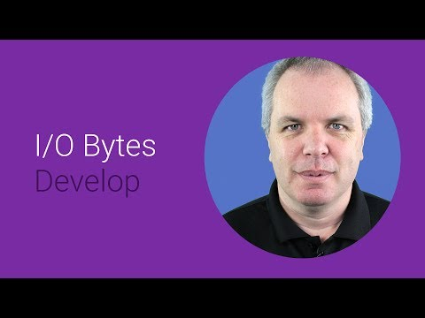

## Building Cloud-powered wearable Apps

** 视频发布时间**
 
> 2014年6月25日

** 视频介绍**

> Android wear extends the Android platform to a new generation of wearable devices. The user experience is designed specifically for wearables. In this session you'll see how to use the Android Wear SDK to build a connected cloud-powered application. Using Android Studio and it's cloud extensions, you'll see how to build an app that 'listens' for changes in stock prices, and notifies a wearable device. You'll also see how to use voice controls on the device to trigger interactions with the app, such as buying or selling the stock after a notification. Call to action: Get the SDK and start building apps today!

** 视频推介语 **

>  暂无，待补充。

### 译者信息

| 翻译 | 润稿 | 终审 | 原始链接 | 中文字幕 |  翻译流水号  |  加入字幕组  |
| -- | -- | -- | -- | -- |  -- | -- | -- |
| 段威 | 素年待锦 | 程路 | [ Youtube ]( https://www.youtube.com/watch?v=HAQ1UFu3b5M )  |  [ Youtube ]( https://www.youtube.com/watch?v=syp3_bun76o ) | 1503210449 | [ 加入 GDG 字幕组 ]( http://www.gfansub.com/join_translator )  |

### 解说词中文版：

可穿戴式计算

是一块巨大的增长领域  在未来的四年里市场预期

价值可达80亿美金

这就意味着  会有很多人用全新的方式

体验你的应用

但你要怎么开始呢

该如何去开发一款能在手腕上使用的应用

嗨  我是劳伦斯  来自谷歌开发者关系团队

在本视频中  我们要来看看

怎么做才能在手表上运行你的应用

开发这样的一款应用

需要三个核心的架构

首先  要有云服务

为你的应用提供后端

举例来说  如果你正在开发一项

关注股市动向的服务  你希望某一支股票的波动

超过特定阀值  比如上涨或下跌1％  就收到通知

这类预设是你可以集成

进入后台服务的

接下来呢  你需要有一个移动应用

来对接这项服务

这个应用能生成手机端的通知

也可以将其推送到与之配对的安卓穿戴设备上

第三  当然啦  就是安卓可穿戴应用本身

实际上  安卓系统对可穿戴设备的支持

已内置于移动应用中

所以当应用生成手机端通知时

这些消息也将被推送到可穿戴设备上

另外  也有很多API可以实现通知推送

这样  使用可穿戴设备的用户们就能拿这些接口做些有趣的事

比如来触发响应式动作

再说回  我们的股票交易应用

如果我们收到通知  某支我们感兴趣的股票

股价下跌超过1%  我们就会

考虑趁着低价入手

以上这些我们该如何实现呢

Android Studio早已安排好你需要的一切

它不仅有用于开发后台服务的工具

也包含了开发安卓移动端应用的工具

现在  你也可以获取到

开发可穿戴设备应用的工具

你可以用开放式API搭建云后台

Android Studio的工具让你用Java来编写

它已为你处理好细节

你能编写云后台

来为你的安卓应用提供API实现需求

在这段代码里你可以看到的例子

这些属性告知安卓客户端

这片代码的功能  比如实现一个叫

报价的Api  并提供一种getQuote()的方法

好的  一旦你搭建好了云服务

用工具你就可以自动地创建

客户端的库来访问之

下一步呢  你当然要开始编写应用了

怎么通过你的应用访问你的API

要知道  工具类已经在你的Maven目录下为你下载完毕

你只要简单地把它们加进来

用你的gradle文件  像这样

还记得之前我们分配好一个API

我们叫它报价APi

这个就是的

好  从你的安卓应用里  你可以轻易地

调用这些工具类去和API后台交换数据

先前我们编写API的时候

我们在函数中用到了API method定义属性

我们称之为getQuote()

你能看到这儿有个getQuote()函数在客户端的类里

猜一猜它们做什么

对啦  它们为我拿到一个报价

这就是典型的云端驱动型安卓应用

那么我们怎么将其扩展到安卓可穿戴设备上呢

手机上的提醒自然会在手机上显示啦

可只要我们更新代码去生成下通知

它们就会Duang一下在我其它设备上出来了

而且只要股价波动超过1％

它们同样会弹出提醒

当这些代码生成一个通知

如你所见  它会显示在我的安卓设备上

同样  它们也会显示在我的安卓可穿戴设备上

并根据设备的尺寸参数自动调整UI

现在我们来看看如何添加反馈

使用户可以根据通知  与可穿戴设备交互

实现买卖股票的操作

如这段代码所示

让我们来看看设备收到通知时会发生什么

如你所见  我收到了卡片式推送

允许我与之交互  实现买入卖出等操作

当我说买买买  指令将传回我的手机

让我可以进一步处理

这是一个股票交易应用

像这类应用  我就需要登录自己的账户

来完成这笔交易

简单吧  这样一个云端驱动的安卓应用就完成了

总结下  你先用云端

建好提供API的后台

其次  你需要开发一个调用这个API的安卓应用

最后  你运用接口

将这个应用扩展到配对的安卓可穿戴设备上

如果你想要完整地观看视频中

提到的这个股票交易应用的全程

是如何搭建的  请访问这个链接

我迫不及待想看你们会

搭出怎样的可穿戴云应用

感谢观看

