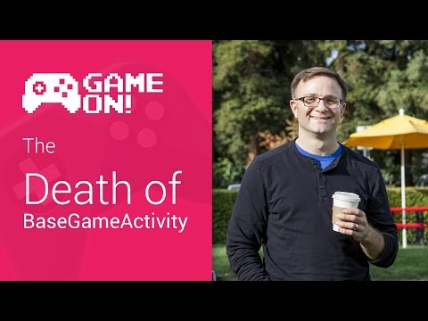

## Game On! - The Death of Base Game Activity

** 视频发布时间**
 
> 2014年11月13日

** 视频介绍**

> Have you been developing Google Play game services for your Android games? Wondering what happened to the BaseGameActivity and GameHelper classes that used to be all over our sample code? Well, Todd has an important announcement for you about those classes. (Spoiler alert: The title kinda gives it away.)

** 视频推介语 **

>  暂无，待补充。

### 译者信息

| 翻译 | 润稿 | 终审 | 原始链接 | 中文字幕 |  翻译流水号  |  加入字幕组  |
| -- | -- | -- | -- | -- |  -- | -- | -- |
| 贺颂 | 段威 | -- | [ Youtube ]( https://www.youtube.com/watch?v=1oSoaFLuTwM )  |  [ Youtube ]( https://www.youtube.com/watch?v=9g9lDzM-fgg ) | 1504030543 | [ 加入 GDG 字幕组 ]( http://www.gfansub.com/join_translator )  |

### 解说词中文版：

(逗比向)先生们女士们  我们聚集此地不是为了

缅怀益友的逝去

而是为了庆贺他们来过这个世界

并带着喜悦的心情回顾同他们在一起的美好时光

他们既不是万众瞩目的焦点  也没有

吸引人注意的特质  但是却拯救过万千Android开发者于

一行复一行敲打模板代码的水深火热之中

现在  他们依然在天堂

为弃用警告而努力

当然了  其实我说的是BaseGameActivity和Game

Helper  就是他们已被从我们身边带走

可能有人会说几周前刚改变就放弃它们有点太快了  

（严肃向）的确如果你关注Android平台Google Play Game Service

有一段时间的话  你会

注意到我们的样例代码最近也已经更换

而且之前  我们所有的样例代码都会继承自BaseGameActivity类

它通过GameHelper类来完成大量复杂的操作

而这两个类都从我们的样例应用中消失不见了

而且也突然从技术文档里不翼而飞了

如此突然就好像一开始他们就

从来不存在一样

那么到底发生了什么

的确如你所见  回想当时Google Play Game Services刚发布的时候

Android应用因为有了谷歌服务

棒棒哒  只需要你使用了

其中的一个服务即可

但是玩游戏  说到此你回想一下

却使用了三个——有Play Games API，Plus API和AppState API

到头来事实却是  过去的时候

使用多于一个API客户端的行为

在我们工程领域看来

好像是种学术上来讲一团糟的做法

看  为了使玩家顺利地连接上Google Play Games

首先你要做的事情就是创建三个客户端

然后你要收集你所需要的数据然后启动

游戏客户端的连接

目前一切顺利  对吧

那么接下来  如果连接失败了

可能因为你的玩家需要登入

这其实没什么大不了的

只要记住我们进行到了哪一步那么一旦玩家已经登入

我们还能知道从那一步继续下去

然后  当然  你需要对Plus client做同样的事情

必须严格遵照这些步骤

可如果我们想提供给

用户多个登陆的窗口

这不是个好主意

当然了  如果Plus Client也崩了

那你不得不想办法也解决那个问题

啊哦  但是要是它再次崩溃  用户就恼了

不想再尝试登陆了  你就要通过先断开Plus Client

再断开Game Client来解决这个问题

可不能搞错了顺序

因为一旦弄错顺序将会让你的游戏客户端处于一个

相当糟糕的状态  你当然不愿意它发生

好了  假设那全都起作用了  你还得

用App State client以一样的规则  

把这些全都重做一遍

而且必须要在成功连接其他client的情况下才能这么做

但是如果上述尝试再次失败

又要以倒序来断开所有链接

APP State Plus然后是Games

看起来很简单（可我都快累死了）

这也是为什么GameHelper和BaseGameActivity存在的基本原因

多状态设备对于每个项目来说都是一样的

所以与其让万千开发者

一遍又一遍写一样的样板代码  

不如创造一个可被所有开发者重复使用的

代码模块

所以我们把这些都封装进GameHelper类中

再写入了BaseGameActivity类中

然后使得BaseGameActivity调用所有相关方法

这样一来你的游戏只需要从BaseGameActivity继承即可

这其中大部分的初始化工作我们都为你做好了

在2014年初美好的事就这么发生了

Play Services团队发布了GoogleApiClient

革命性地改善了API的工作方式

那的的确确是很赞的代码

非常优雅

美得让人叹为观止

看了GoogleApiClient的介绍就知道

如果你想一次使用多重Google services 

例如制作或者储存游戏  甚至驾驶汽车或者调用YouTube视频

GoogleApiClient全部为你搞定了

它的工作机理如下

第一步  你要创建一个Build对象

第二步  添加你需要的API和数据

第三步  添加一些回调监听器

别忘了最后调用build()方法

接下来开启客户端上的连接

然后你就差不多完成了

你会在onConnectionFail()回调方法里

获得登陆失败的相关信息

分析下代码  根据得到的错误码

决定是否再弹出一个登陆框

在你的onConnected()监听器中就能开始调用API了

而且在你的activity的onStop()方法中

你能调用disconnect()方法  然后GoogleApiClient

就会正确地断开你的所有服务

这样一来你的API客户端就会变得简洁直观

只需要解决一些错误即可

很自然吧  至少是我们的工程团队想要这样的效果

这样一来的话  GameHelper类突发性的任务处理量

整体上就会少很多

而且它的角色也逐渐由一个

在后台要处理大量繁重任务的帮助类

变成一个不需要你怎么操心的代码框架

只不过需要去维护

一些必要的操作罢了

所以说我们所做的就是

提取出那些必要的操作  嗖的一下

封装成一些静态的方法  放入一个全新的名为BaseGameUtils的类中

然后我们可以弃用GameHelper和BaseGameActivity了

并且不再在任何样例应用中使用它们

那么这对你来说有哪些好坏呢

首先对于你已经写好的代码没有任何影响

你那些正在运行的代码

也会一直工作下去

也可能你决定要尝尝鲜

你要用我们在Github上发布的新版本

去替换掉BaseGameActivity或者GameHelper

你就会在log日志中看到一些弃用警告

其他情况下意味着

当你查阅我们的样例应用或者官方文档的时候

你可能会说  慢着

我发誓我在这附近看到过整个的helper类

可以供我使用的呀

我是不是醉了  当然不是  

要也不是因为这个

我们刚把这些类从样例和文档中移除了

现在如果你想看看代码运行情况

我的建议是看看

非常简单的Trivial Quest例子

有些人会觉得简直不用动脑子 

它展示了规范的登入方式

以及如何用Google API service去处理连接的问题

你可以常对我们的文档温故知新

毕竟现在更新之后支持GoogleApiClient

(逗比向)有了这些  我们终于能对BaseGameActivity

和GameHelper说拜拜了

虽然离开了这世界却依然在我们的心中

且慢  你说啥

你说他们没死是个什么意思

他们去迈阿密的海滩度假了吗

是啊你懂的  要是在我买这些花之前

让我知道这些的话

不就不用花钱了么

行吧  就这样了

懒得去管

我要换下这身衣服了

这玩意儿穿身上真难受

那到底棺材里装着谁

你知道吗

我不操心

也别告诉我答案

我也不想知道

悲哀的音乐

