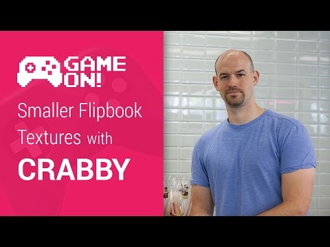

## Game On! - Smaller Flipbook Textures with CRABBY

** 视频发布时间**
 
> 2014年11月12日

** 视频介绍**

> If you’re a 2D game developer, a large portion of your game content comes from textures. And in a world with harsh data-caps, devices with low memory, and impatient users, you can’t afford to have a game with bloated flipbook textures. Colt McAnlis introduces you to CRABBY an experimental texture compression codec that aims to reduce your texture footprint for these awesome sprite-based games.

** 视频推介语 **

>  暂无，待补充。

### 译者信息

| 翻译 | 润稿 | 终审 | 原始链接 | 中文字幕 |  翻译流水号  |  加入字幕组  |
| -- | -- | -- | -- | -- |  -- | -- | -- |
| 高冰 | 韩晓健 | 程路 | [ Youtube ]( https://www.youtube.com/watch?v=P7riQin9Bfo )  |  [ Youtube ]( https://www.youtube.com/watch?v=39X57KUhYxs ) | 1504030544 | [ 加入 GDG 字幕组 ]( {{ book.host }}/join_translator )  |

### 解说词中文版：

如果你是名2D游戏开发者

开发一款游戏  大部分的显示内容就是纹理

在游戏数据大小受到严格限制  设备内存小

用户总会不耐烦的情况下

一个庞大开销的游戏是不现实的

我是Colt McAnlis  在新一代的纹理格式的帮助之下

你可以减少游戏的纹理占用空间

减小安装包的大小  加快游戏加载时间  这听上去还不错吧

让我们仔细想一下

在一个内容丰富的应用商店里  最重要的是用户的需求

让一个人成为你游戏的玩家要经历  先看到游戏的展示

然后安装  再试玩  最后买进游戏成为玩家这一过程

你想要把这一过程做到最简

假如在这个过程中

下载环节就花去了10分钟  会让用户感到很不爽

安装率也会直线下滑

对于2D游戏  序列帧动画

都会包含庞大的纹理占用空间

通常来讲  设计师会逐帧的进行绘画

并将这些图拼成一个单独的纹理贴图集

这样做可以使加载速度更快  渲染表现更好

但是这些序列帧动画

会导致占用比实际需要还要多的内存

首先  在每帧的动画中

有太多重复的像素信息

也就是说  一段动画从头到尾

许多帧看上去都差不多

实际上每帧中只有很小一部分是在变化的

第二点  把每幅帧都存到纹理贴图集之中

将会浪费更多存储空间

主要是因为每帧的动画中都会有透明留白的区域

然后把画面一个一个放起来时

自然就多出来很多没有用的区域

你必须要想些办法来缩小纹理占用空间

而不是生成出来一个冗余的

纹理贴图集

对于这类问题

通常我们会采用比如GIF  H.264或者WebM的格式进行压缩处理

但很遗憾  这对于游戏开发是没有用的

你看  以上的纹理格式

都需要经过CPU解压之后

再被传到GPU上  最终显示在屏幕上

你不得不把每一帧都送到CPU进行解压

然后再传给GPU

这一点儿也不高性能

虽然这种压缩方式减小了应用发行的大小

但也就仅此而已

我们特别想得到一种

不需要CPU解压的

压缩帧格式

即使是GPU能够直接识别这种压缩过的格式

为了满足这一难题的要求

我们发布了一款叫Crabby的开源纹理格式

主要用来解决压缩序列帧动画和GPU重绘的问题

Crabby的压缩方式是

消除图片中相同的像素区域

比如给你一帧动画

将图片细分成4*4像素大小的区域

然后采用穷举搜索算法来识别哪些色块

是完全相同的

不一样的色块

都会以每像素32位的大小保存

然后对图中每种色块

一一建立索引

例如所有的纯白区域

都会共有同一个纹理索引

用这一过程处理动画的所有帧

每帧之间都可以共享信息

所有帧处理完就最终得到了我们想要的纹理格式

与标准的PNG文件相比

Crabby极大地改善了

应用发行大小  CPU使用率

更重要的是改善了GPU的使用率

有必要指出  Crabby的压缩方式是无损的

也就是说在压缩过的图片上

不会出现视觉失真

如果你对这种压缩方式

损失了哪部分的图像质量感兴趣

你可以拿这些像素块的纹理格式

和WebP格式或众多优秀的适合GPU特性的压缩格式来对比一下

在渲染动画的过程中

Crabby采用了一种特殊的着色器

按要求在GPU上重建任何一帧

具体是这样工作的

我们采用标准的UV纹理坐标

对每个色块进行纹理映射处理

将处理后的数据放进一个个的二维表里

然后将该模型转换成像素块纹理模型

之后就可以利用这个像素块

来绘出我们最后要得到的帧画面

这一做法的优点在于

所有的工作不需要CPU解压的中间环节

直接由GPU进行处理

为了对比这种做法跟传统做法的表现

我拿来了3部手机

来全屏运行Crabby的demo

全屏意味着整个屏幕都会有像素覆盖

这些像素信息都会进行解压缩处理

这可是我们运行游戏时最坏的情况

Nexus 5在测试中的表现最好

但是你可以看到Galaxy Nexus和Nexus 7

的表现稍稍逊色

这主要是因为这两种设备采用了Tiling Architecture技术

Crabby的双模型结构可以在

采用Tile-Based结构的GPU上表现的更出色

Crabby的编解码器支持alpha模式

并且被托管在了GitHub上供你尝试  并希望你能做出突破

GitHub里面提供了Windows  Android和WebGL平台上的

OpenGL接口

快下载下来看一看吧  顺便帮我们找找bug

让你的游戏变的更轻量

安装更快捷  并重获用户的芳心

缩小纹理占用空间是你要迈出的重要一步

这样我在玩消灭僵尸时就会倍爽

谢谢收看

