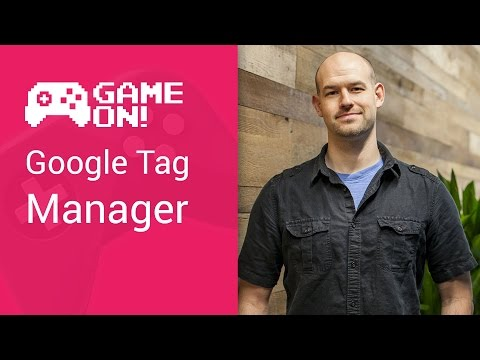

## Game On! - Google Tag Manager

** 视频发布时间**
 
> 2014年11月12日

** 视频介绍**

> Successful mobile games constantly deliver updates and new content to their hordes of happy fans. But this comes with a problem : How do you constantly push out that content without forcing your users to re-download your app each time? This episode of GameOn will discuss Google Tag Manager, which can help you push smaller, more frequent updates to your users, and even help you run A/B testing on your games.

** 视频推介语 **

>  暂无，待补充。

### 译者信息

| 翻译 | 润稿 | 终审 | 原始链接 | 中文字幕 |  翻译流水号  |  加入字幕组  |
| -- | -- | -- | -- | -- |  -- | -- | -- |
| 苏楚霖 | 虞高 | 程路 | [ Youtube ]( https://www.youtube.com/watch?v=AK342F1Hk84 )  |  [ Youtube ]( https://www.youtube.com/watch?v=_zkJDaMhZfw ) | 1504030545 | [ 加入 GDG 字幕组 ]( http://www.gfansub.com/join_translator )  |

### 解说词中文版：

作为一名成功的移动游戏开发者

有一件非常重要的事情需要你不停的做

就是要更新你的游戏  修复bug

而且保证你的用户能及时升级并愿意升级

很不幸的是  当你升级游戏包不当时

可能会给用户带来大量的升级数据

我的名字是Colt McAnlis  有个比较简单的办法

来推送数据保持你的应用同步更新

就是Google Tag Manager

你看  你游戏里面的所有东西都是数据

组成你游戏的东西  比如关卡  动画效果

文本  定位  声音  甚至布局  这些都是数据

如何升级这些数据却是个问题

当你推送新版本的app升级时

用户就处于一个应用更新阶段

也就是说  他们会被提示有新版本升级

当然也可以忽略它

有个普遍的现象就是  你的游戏有多个不同版本

每个版本都是不同时期的升级版本

为了保证用户同步使用

让他们能正常下载到新版本的游戏

你需要一个更好的方法

来向用户推送更新

这就是Google Tag Manager目的所在了

Tag Manager是一项基于云的服务

向世界上不同的设备

推送基于文本的多种类别数据更新

他避免了数据更新的烦人问题

又能确保所有用户能

同步到最新的数据

只需要用一种关键的技术来实现

游戏里面的不同数据

应该有不同的升级周期

比如app里的小版本升级和大版本升级

就会很明显的周期隔离

修改字符串或者翻译

可能每周一次  稳定测试

A/B测试之类的微调可能每天一次

然而图形方面可能会每两个月

或者更长时间才会修改

那Tag Manager是怎么帮上忙的呢

一般是这样的  当你需要修改数据时

可能这样做  给你的数据包签名

然后重新上传到Google Play Store

经过相应的流程后  用户

会收到提示有新的升级

他们可以下载整个升级的应用

但使用Tag Manager  你可以跳过很多繁琐事情

从数据里分离

出来你的代码和其他资源

你就可以通过Google Tag Manager console

来推送更新的数据

当用户打开你的app

就会检查是否有新数据更新

并同步这些更新的信息到设备里面

不止可以向所有人推送相同的数据更新

Tag Manager还允许设置一些规则来区分不同的用户

并推送不同的更新内容

当用户的设备查询更新的时候

会向Tag Manager提交一些设备信息

并使用这些信息来匹配你设置的规则

确定用户应该接受哪种类型的更新

然后再向不同用户推送指定的更新数据

这些规则可以让你

区分不同的用户

并提供不影响其他人的版本

最棒的是你可以随心所欲的控制这些东西

包括同步保持用户实时更新

使用Tag Manager是多么简单的事情

就像使用一系列的API来获取数据似的

看看

你还可以在Tag Manager里面更深的拓展你的规则

来提供自动的A/B测试

在Tag Manager里创建一个实验

包含两件事情

首先  你需要一个规则集

可以区分哪些数据需要修改并让哪些用户来测试这些修改

比如说  修改用户购买游戏升级道具

时显示在屏幕上的文本跟购买其他装饰道具

的提示不同

还需要指定一个期望的动作触发

就是用户在设备上执行的

比如摁一个按钮  接受一个请求

购买一个道具  或者杀死一个NPC

当实验设置完成  Tag Manager会完成

所有的事情并向不同用户

推送不同的更新

你根本不需要担心这些

当用户向Tag Manager提交了他们的反应

对于你的实验而言  它会使用Google Analytics来收集分析

并返回给终端

有了Tag Manager  妈妈再也不用担心你的升级了

一件不需用户下载完整的升级包

就能频繁的推送数据更新的利器

同时你还有一系列的规则

通过他们可以区分不同用户并推送不同的更新

而且还有超强的实验功能

你可以建立大规模的A/B测试

并获得大量不同的反馈来改进你的游戏

这个只需要一小段代码就能实现的超强功能

那怎么才能拥有Google Tag Manager呢

只需要打开Tag Manager的首页并注册

你就可以获得终端和帮助文件的访问权限

还有一些需要包含在用户端的

库文件

为成千上万的用户制作不断升级改进的游戏

是一件充满挑战的任务

但是使用Google Tag Manager  你可以忽略它们

只需要关注真正的问题  僵尸

谢谢观看

