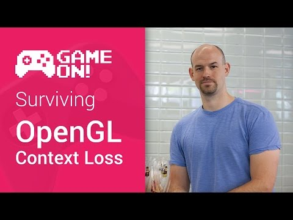

## Game On! - Surviving OpenGL Context Loss

** 视频发布时间**
 
> 2014年11月12日

** 视频介绍**

> For Android Game Devs who are working on their own engines, OpenGL Context Loss is a tricky process to get right. Every time your user rotates their screen, swaps apps, or opens a keyboard, all of your game's GPU content could be invalidated! In this video, Colt talks about the problem, and more importantly, how to fix it.

** 视频推介语 **

>  暂无，待补充。

### 译者信息

| 翻译 | 润稿 | 终审 | 原始链接 | 中文字幕 |  翻译流水号  |  加入字幕组  |
| -- | -- | -- | -- | -- |  -- | -- | -- |
| 韩淼 | 素年待锦 | —— | [ Youtube ]( https://www.youtube.com/watch?v=NHVtLC5QOpo )  |  [ Youtube ]( https://www.youtube.com/watch?v=nfsTB0J2JG0 ) | 1504030546 | [ 加入 GDG 字幕组 ]( {{ book.host }}/join_translator )  |

### 解说词中文版：

COLT MCANLTS  嘿  游戏开发者们

不知你们是否注意到 当一个用户从另一个应用程序

切换到你的游戏之后 整个人都不好了

那是主要因为OpenGL环境丢失

并且  这是安卓中

一个处理不当就可能疯狂的进程

我的名字是Colt McAnlis 在这里我将会有一些简单的步骤

去让因为环境丢失的而恢复的过程更简单一点

首先你要知道  OpenGL的环境丢失

可能会因为任何原因而发生

比如 用户翻转他们的手机

或者他们接到一个电话  或者在他们从你的游戏退出或进入的任何时候

而令OpenGL环境丢失如此频繁

可能是因为你在GPU上的任何文件  比如  结构

顶点缓冲区  和一些类似的东西

当环境丢失发生时它们都变得无效

这也就意味着  你在游戏中使用的任何引用

也会变得无效

这些项目再也不会存在

正确地从环境丢失中恢复现在只需要两个步骤

首先  环境丢失发生时你需要进行检查

并且恰当的从基本OpenGL数据库中恢复并且按序存放

第二  你需要通过并重新创建

任何你游戏需要的GPU进程

现在让我们从头开始

当一个环境丢失发生时  进行检查是一个极其简单的任务

通常在你通常在你的渲染帧的结束时

你进行调用到EGL交换缓冲区

以便OpenGL移向下一帧

当损失发生时,交换缓冲区

将返回一个EGL false值

让你知道出错了

在真正的OpenGL中  你可以

得到环境损失的原因

通过立即调用GL错误的方法

返回的枚举将会让你知道

如果你已经失去了你的显示  外表  或上下文对象

这三个对象  外表 显示器  上下文

当你在首次安装OpenGL时就被创建

并且每个对象都有他们自己的创建和销毁方法

这在安卓平台上时非常非常重要的

每个对象可能会独立于其它对象丢失

并应该独立于其它对象恢复

在环境丢失发生后

尝试同时恢复三个对象

很容易把你逼疯的

所以当一个项目丢失时你没有被及时通知

第一件你需要去做的就是继续

并且调用那个项目的销毁方法

然后将它发送给默认的状态

这个过程将确保一切被打扫干净

哦  这真是一个好主意来设置global flag

它能帮你找到环境丢失的细节

以便于我们从这个状态中恢复

既然现在我么已经检查到了一个环境丢失

并且妥善的有根据的使项目无效

它实际上是按时间以相同的方式来恢复失去的对象

在你去进行任何绘制调用之前开始渲染帧

是收回他们最好的时候

这一点非常简单

既然在先前帧我们验证了我们的对象

我们只需要检查那些

处于无效状态的对象  并直接调用

它们的初始化函数

一旦你发现你所有的对象都已经恢复

可以再重新连接GL环境和表面

通过调用EGL Make Current

哦，你也可以回滚你的环境丢失的标志到到false这一点上

因为一切都已经恢复

对你来说很简单就能进行

现在，很值得在这里指出一个警告

对于整个过程  这里有一个暂时的质量

你可能会收到渲染帧的调用

在系统已准备好让你

从环境丢失中恢复之前

因此，只有真的稳定下来

才能成功创建您的GL对象的调用

如果是这样的话  最好的方法就是

简单地中止你的渲染功能

并不断尝试每个后续帧恢复

直到系统实际上已经稳定下来

以便使OpenGL从丢失中恢复

这是很困难的去重现

你的游戏的部分GPU资源

之所以这很困难

是因为通常  游戏开发者们

将其GPU的资源初始化

和它们对应于系统的初始化捆绑在一起

比如 加载一个地图文件

通常会要求你去读取磁盘离线的地图数据

去在其中寻找纹理信息

加载纹理到CPU内存中  然后复制到GPU的内存

当亏损发生时  该地图引用是无效的

重新创建它们唯一的路径

需要回去重新加载地图对象

在现实中  这是一个坏主意

这只会导致你陷入疯狂的低谷

正确的事情做法是双重的

首先 你需要给你的资源添加一个管理系统

以及你加载和关闭磁盘的资源

比如说  不是要你直接将磁盘加载组织

而是创建一个组织管理系统

去为你做这个工作

管理系统应该定义一个对象

拥有GL处理以及一个磁盘上的文件路径

管理员将从磁盘处理加载特征

并以您的名义创建的GPU资源

这确实造成一点点开销

不过  只要你想传递管理权

给云纹理而不是OpenGL

这让你可以使用不同的API轻松的传输

为了使资源系统完全正常的工作

你需要支持我们的方法的第二步骤

这会允许创建一个可以根据需要

销毁和创建资源的功能链

由于您的资产管理员保持着文件名

您可以轻松地返回并重新创建任何GPU资源

你需要一旦GL发生损失  而无需更新

很可能已经与管理员接口连接

的外部系统

哦  它也适合于很酷的过程

就像是能够检测到已经在磁盘上改变了的资源

并自动在内存中进行更新

但是这是一个不同的展示

总之，我们需要做的最后一件事

即适当地支持创建销毁循环

直到我们的GL损失恢复进程

首先  当一个GL环境损失被探测到时

你要把所有现存的制图组件控键统一摧毁

这包含了所有你创建过的有用管理操作

以及任何可能的子系统

静态或手动创建的资源

一旦GL环境损失恢复正常

你就可以推进重建

所有游戏的GPU资源

与此同时  一切都应该重新启动并运行

了解更多关于安卓系统生命周期

可以跳转至Android开发者网站

并且不要忘了看看谷歌Play Games服务的例子

其中包括其他巧妙的方式

用于处理Android NDK应用程序

现在,通过适当地恢复一个环境损失

并且增加一个自适应模型重建你的GPU资源

你会为你的用户创建一个稳定的环境

这样他们就可以找回真正重要的素材

杀死僵尸

感谢观看

