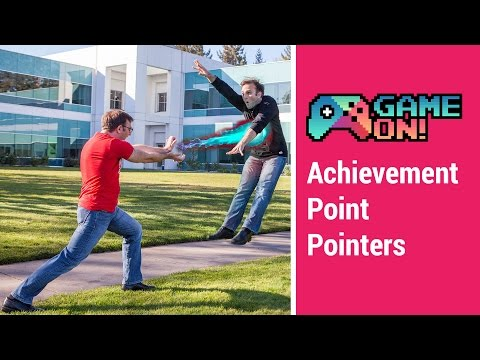

## Game On! - Achievement Point Pointers

** 视频发布时间**
 
> 2014年8月19日

** 视频介绍**

> Have you been scoring your achievements appropriately? Don't know what that means? Wondering what these new game profiles are all about? Check out this video where Todd Kerpelman explains how to make sure your achievements are scored just right, and why you should care. There are also ostriches.

** 视频推介语 **

>  暂无，待补充。

### 译者信息

| 翻译 | 润稿 | 终审 | 原始链接 | 中文字幕 |  翻译流水号  |  加入字幕组  |
| -- | -- | -- | -- | -- |  -- | -- | -- |
| Wallace4ever | Guangwei Feng | -- | [ Youtube ]( https://www.youtube.com/watch?v=bEJNe9XMNdA )  |  [ Youtube ]( https://www.youtube.com/watch?v=bEJNe9XMNdA ) | 1505050796 | [ 加入 GDG 字幕组 ]( {{ book.host }}/join_translator )  |

### 解说词中文版：

游戏开发者们你们好  欢迎回到另一辑激动人心的

Game On 一分钟视频

那么如果你在关注今年的 Google I/O 大会

你可能已经注意到 除了

那些基于安卓的手表 汽车 以及电视

以及一些混合产品之外  我们还发布了一个针对

Play Games服务的主要更新

除了像探索和保存游戏这样的激动人心

的特色（我会在以后的几辑中介绍）之外

我保证 每个用户都将拥有自己的个人游戏档案

并随着游戏而升级

该游戏档案自始至终在Play Games及相关体验中都是

可见的

玩家将在他使用游戏服务登录时

就能够看见它

这是他们在玩游戏的应用程序看到的第一件事

并且玩家可以与朋友们

比较他们的个人游戏页面

并在进度中的每一处

我们都会向玩家展示他们的个人资料是什么样的水平

在这里我可以看到我在15级

而我的经理Rado只在7级

显然我的经理是一个有点懒的人

所以 所有的工作中 我们要去做的

就是提高这个游戏档案的知名度等级

我认为完全可以这样假设

这将是多数人用来评价他们对

游戏社区的贡献的指标  以及个人价值的指标

或者最起码  它是你的游戏玩家们

尤其是有竞争力的玩家们

需要关心的

那么  玩家如何做到提升自己的游戏等级档案呢

这需要解锁XP

如何得到这个XP点数呢

这需要赚取成就点数

我们转换成就点数到XP

这需要通过使用一个相当复杂的公式

我不想具体介绍 因为要做很多算数

对了 还有一点

每一次你决定某个成就是有价值的

那么在Play Games 应用中大致等于100 XP

那么当玩家开始关心他们的游戏档案级别时

他们将开始关心他们赚了多少XP

而且随着玩家关心他们赚取了多少XP

他们就将要关心那些你置于游戏中的成就

以及他们的价值

因此 恰当地使用这些成就 并适当地为他们打分

他们可以是一个强大的力量  可以保持玩家

快乐地参与您的游戏

因此  让我们来谈谈如何确保这些成就

被正确地获得

那就需要从有一定数量的成就做起

来看看我们表现前100强的附带成就的游戏

可以发现他们每个都品均

带有三十至四十个成就

所以 你应设置一些完善分类的成就

在那之后  你就可以自由地

在成就中加入难度了  对吧

多样性是除盐之外的生活的调味品

所以你想添加一些困难的成就

它可能需要玩家的一些额外努力来赚取

还有一些容易的成就  玩家只需进行

一些自然地游戏教程即可获得

一旦你这样做   你就可以

适当地赋给这些成就以点数

我们建议简单的成就价值约5至20点

中等难度的约25至45点   而难甚至是史诗级难度的

成就就应在50到100点范围内

现在请记住  你可在每个游戏中设置的最大的总成就点数为1000

所以如果你正在做一个共有100个成就的游戏

那么你就要以低于推荐值的

点数来为成就赋分了

不过没关系 有很多的成就也是一种乐趣

也请记住  如果你有一些未来的扩展

计划加入你的游戏  并且伴随着一些新的成就

那么你就应该

不应该分配光这1000点

保留一些点数 那样的话你就可以

为将来的新更新分配成就点数了

但是  如果你已经创建了

项目之外的成就 并且

它成了个大惊喜  那该怎么办呢

我想这是个好问题

但现在你想要添加更多的更新

并且你想随这些更新添加更多的成就

可是你已经用光了你1000点

那么怎么办呢

好吧答案是我们给你

更改所有成就点数的权利

即使它们已经被发行

所以  你可以减少你的一些较旧的成就的价值

于是你就挤出了一些可用的点数

将它用在新的成就上

现在如果你这样做了  你当前的玩家

可以保有他们原来从

旧成就中获得的点数

这就意味着你的多数可能已经在原始版本的游戏中

获得1000点的忠实用户

能够获得总数超过1000的

成就点数

这使得在长远宏大的游戏计划中

点数不是个大问题  你可奖励你最忠实的玩家

但不要过于频繁地这样做 否则

让玩家困惑因为他们发现朋友的点数

和自己有很大不同

第二点是  请仔细检查你的成就是可以实现的

你是否设置了五项秘密成就

而实际上没人能做到

是的  我们知道你是谁

并且事实上  如果你这样做了

你会注意到 我们会在Play Games应用中

隐藏那部分的成就

也许你的玩家很早就注意到了但并没有在意

因为这是一个令人失望的拿不到的成就

但这不是世界末日

但现在  这意味着他们不能玩你的游戏来提升等级了

也许他们可能决定抛弃你的游戏

转投类似能提高他们的等级的游戏

也许这不是你想要冒的风险

请三思而后行

但在另一面  你还需要

需要注意太早就放弃了太多的成就的现象

当心别让你的成就变得很容易

不要让他们在游戏的前30秒就能赢得成就

一定程度上  这是作为游戏开发者的你的一个错失的好机会

因为你已经用完了所有的成就点数

而玩家还没有真正地有机会

向你的游戏投资

但同时  如果你太快地奖励了太多的分

它可能会引发一些在我们这边的速度限制警报

并且你可能会发现  你的成就是

不如应该的样子一样有价值

所以请记住  设定很容易的成就是可以的

但他们应该是玩家们通过那些

自然地游戏教程中获得的 而不是

按下启动按钮或完成第一关就能得到的

最后  你可能已经注意到我们不仅会告诉

每个玩家他们已经赢得的XP的数目

而且我们会把它们由游戏类别分解开来

在这里你可以看到  我显然是一个玩解谜的玩家

如我的头衔解谜者展示的一样

而我的朋友Damien的话  你就可以看到

他是一个更爱竞速游戏的玩家

而我们的官方头衔是基于

我们获得了最高分的那个游戏的

所以我的最后一点建议是

游戏开发者应确保将你的游戏

在两处设置为正确地类别

没错 两处

不仅是在PlayStore里上架时

这你可能已经做到了

而且要在这里的游戏服务详细信息页面设置

是的  你需要进行两次设置

第一次是为Play Store  而另一次是为了游戏服务

为用户的游戏资料而使用

因此  这将确保我们会将您的Threes游戏推荐给

竞速游戏玩家  我们也将确保

玩家不会最通过玩僵尸射击游戏却

作为一个音乐游戏爱好者而提升等级

如果你采纳我的建议 朋友们

新的游戏档案就在您附近的Android设备上

并且将要席卷全国

像高大的野生鸵鸟跑踏一般

现在您可以利用此跑踏  并通向名气和荣耀

或以你的脸上一堆爪痕收场

决定在你  你的命运就在你手中

请务必记住

一  创建多种的成就

并适当设置它们的分数

二  不要设置五个秘密成就

而没有人可以真正做到它们

这并不酷

三  正确设置你的游戏类别

所以最后  感谢收看

你若一直做很棒的游戏  我们就会持续玩它们

现在如果你不介意的话  我有一个Flappy Bird的克隆版本

我试图将它移植到我的Android blender

我得去工作了 再见