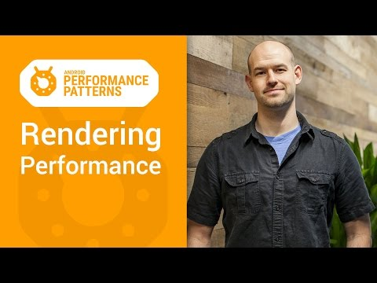

## Android Performance Patterns: Rendering Performance 101

** 视频发布时间 **
 
> 2015年1月6日

** 视频介绍**

> Rendering performance is all about how fast you can draw your activity, and get it updated on the screen. Success here means your users feeling like your application is smooth and responsive, which means that you’ve got to get all your logic completed, _and_ all your rendering done in 16ms or less, each and every frame. But that might be a bit more difficult than you think.In this video, +Colt McAnlis takes a look at what “rendering performance” means to developers, alongside some of the most common pitfalls that are ran into; and let’s not forget the important stuff: the tools that help you track down, and fix these issues before they become large problems.

** 视频推介语 **

>  暂无，待补充。

### 译者信息

| 翻译 | 润稿 | 终审 | 原始链接 | 中文字幕 |  翻译流水号  |  加入字幕组  |
| -- | -- | -- | -- | -- |  -- | -- | -- |
| 周亿 | 姜昭宇 | ——| [ Youtube ]( https://www.youtube.com/watch?v=HXQhu6qfTVU )  |  [ Youtube ]( https://www.youtube.com/watch?v=HXQhu6qfTVU ) | [1501130351 | [ 加入 GDG 字幕组 ]( http://www.gfansub.com/join_translator )  |

### 解说词中文版：

你已经打造了一个伟大的移动应用

但是用户却不总是这么认为

他们说慢的不行

他们觉得滑动没有他们想要的那么顺畅

我是Colt McAnlis

听起来好像你的应用有严重的渲染性能问题

但是别担心

我们能够通过了解安卓底层是如何工作的

来解决这个问题

渲染问题是你建立一个应用遇到的最常见的问题

一方面  你的设计师想要给你的用户

一个最有用的超然的体验

但是另一方面

这些花哨的图形和过渡却不能

在所有设备上都良好的运行

所以  让我们来看看渲染性能都包括些什么

首先  你要知道

系统每16毫秒会尝试重绘你的Activity

也就是说你的逻辑控制画面更新要保证

至多16毫秒一帧才能达到每秒60帧

如果你达不到  假设你花了24毫秒而不是16毫秒

那么就会出现我们称之为掉帧的情况

系统尝试把一张新的图绘制到屏幕上

但是这图却还没准备好

所以就不会刷新任何东西

结果就是用户会盯着同一张图

看上32毫秒而不是16毫秒

掉帧是造成用户口中渣体验的核心问题

用户将很容易察觉到因为掉帧而引起的卡顿现象

如果用户正在执行与系统交互  比如拖拽列表视图

或者是打字的时候  那将会直接卡出翔

用户马上就会开始吐槽

这有一大堆的原因会导致你掉帧

比如  你花了太多的时间重绘你视图中的大部分东西

这样很浪费CPU周期

或者你有太多的对象堆叠到一起

在绘制用户不可见的对象上浪费了太多的宝贵时间

又或者是你有一大堆的动画重复了一遍又一遍

这样导致CPU和GPU组件的大量流失

检测和解决这些问题很大程度上依赖于你程序的构架

但是通常来说

还是能够使用工具来追踪并定位到具体出错的地方

比如  你可用使用Hierarchy Viewer

来检测你当前的活动是否过于复杂

如果是  那么你有很多时间没有利用

并且浪费了很多的时间进行重绘

你也可用使用设备上的工具

比如Profile GPU  Rendering

来更好的检查你的问题

对于那些隐藏在CPU代码中的BUG

Traceview是一个很棒的检查是否掉帧工具

渲染性能是一个最常见的坑

别让它成为你打造不可思议的程序的绊脚石

记得查看本系列其他视频

当然也别忘了加入G+和我们一起讨论

代码分析  你值得拥有  性能问题  永不能忘

