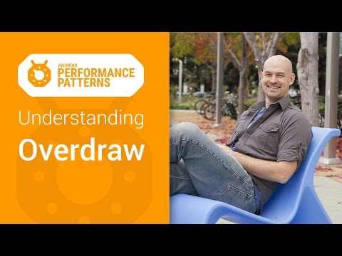

## Android Performance Patterns: Understanding Overdraw

** 视频发布时间**
 
> 2015年1月6日

** 视频介绍**

> One of the most problematic performance problems on Android is the easiest to create; thankfully, it’s also easy to fix.OVERDRAW is a term used to describe how many times a pixel has been re-drawn in a single frame of rendering. It’s a troublesome issue, because in most cases, pixels that are overdrawn do not end up contributing to the final rendered image. As such, it amounts to wasted work for your GPU and CPU. Fixing overdraw has everything to do with using the available on-device tools, like Show GPU Overdraw, and then adjusting your view hierarchy in order to reduce areas where it may be occurring.In this video, +Colt McAnlis runs through the problem, takes a look at the tools, and talks about some great ways to solve this issue in your own application.Watch more Android Performance Patterns here: https://goo.gl/3dBbse

** 视频推介语 **

>  暂无，待补充。

### 译者信息

| 翻译 | 润稿 | 终审 | 原始链接 | 中文字幕 |  翻译流水号  |  加入字幕组  |
| -- | -- | -- | -- | -- |  -- | -- | -- |
| 程路 | 程路 | ——| [ Youtube ]( https://www.youtube.com/watch?v=T52v50r-JfE )  |  [ Youtube ]( https://www.youtube.com/watch?v=T52v50r-JfE ) | 1501130352 | [ 加入 GDG 字幕组 ]( {{ book.host }}/join_translator )  |

### 解说词中文版：

亲如果你曾经粉刷过房间的话

你应该知道  墙壁刷颜色是需要非常大量的工作的

而且如果你需要重新粉刷一遍的话

那相当于第一次就白干了

同样的  如果你的应用程序里出现了性能问题

那就跟重新粉刷墙壁一样

之前做的工作全部都是白费功夫

我是Colt McAnlis

如果你希望兼顾高的性能和完美的设计

那么可能会出现一个性能问题  过度绘制

过度绘制是一个术语

特指某些组件是在屏幕一个像素上绘制了超过一次

例如  我们有一堆叠放的UI卡片

被用户激活的卡片在上端

而那些没有使用的在下面隐藏

这意味着我们花大部分时间来绘制的卡片

基本都是不可见的

这里有一个巨大的问题

因为我们像素渲染的不全是最后呈现给用户的界面

我们在严重的浪费GPU性能

当下流行的布局  是一把双刃剑

带给我们漂亮设计的同时

同时给我们带来了很大的麻烦

为了最大限度地提高应用程序的性能

你可能会需要减少过度绘制

而值得庆幸的是

在Android设备上可以很容易看到

应用程序受过度绘制的影响程度

只需进入开发者模式

然后打开显示GPU过度绘制

哈哈  如果你发现你的手机变样了请不要恐慌

这是正常情况

Android系统正在使用深浅不同的颜色

在屏幕上显示过度绘制的情况

如果这里你没有过度绘制

那么你能看到的是它不带一点颜色  原本的样子

然而随着过度绘制的程度加大

颜色也会加深

1倍过度绘制  例如  浅蓝色

意思就是这个像素你多绘制了一次

当然  以同样的模式过度绘制2倍

3倍  4倍  那么颜色随之加深

你应用程序的目标应该是尽可能减少过度绘制

进而你就能看到更多蓝的色块而不是更多红的色块

虽然过度绘制很大一部分原因

来自你的视图相互重叠的问题

但是各位开发者们更要注意的是不必要的背景重叠

比如一个布局里的所有子元素都有背景颜色

那么这边Activity也就会随之的被过度绘制

不要忘了文本框  还有标题和背景

当然  还有头像背景以及头像本身

你马上就可以看到这些元素的情况

做一些简单的类似删除不需要的背景等

就可以把你的应用程序的过度绘制问题从红色变成蓝色

这就是为什么你要学习

Android Performance Patterns系列课程的原因

同时别忘了加入我们的Google+社区查看更多信息

代码分析  你值得拥有  性能问题  永不能忘

