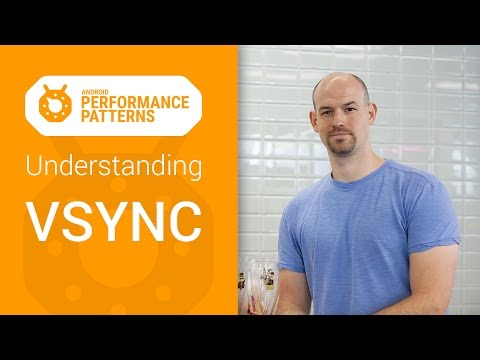

## Android Performance Patterns: Understanding VSYNC

** 视频发布时间**
 
> 2015年1月6日

** 视频介绍**

> Unbeknown to most developers, there’s a simple hardware design that defines everything about how fast your application can draw things to the screen.

** 视频推介语 **

>  暂无，待补充。

### 译者信息

| 翻译 | 润稿 | 终审 | 原始链接 | 中文字幕 |  翻译流水号  |  加入字幕组  |
| -- | -- | -- | -- | -- |  -- | -- | -- |
| 高洁 | 高洁、Kesen | ——| [ Youtube ]( https://www.youtube.com/watch?v=1iaHxmfZGGc )  |  [ Youtube ]( https://www.youtube.com/watch?v=1iaHxmfZGGc ) | 1501130353 | [ 加入 GDG 字幕组 ]( http://www.gfansub.com/join_translator )  |

### 解说词中文版：

想要开发一个高性能的应用程序

首先你得了解它的硬件工作原理

那么  最好的办法就是去使用它

应用程序运行速度的快慢

很容易被人误解为是硬件进程的控制问题

然而这最主要根源都应归于渲染性能

我的名字是Colt McAnlis

如果你想要提高你的应用程序的渲染性能

就必须理解什么是VSYNC

但首先  让我们退一步

在讲解VSYNC之前

我们需要了解两个相关的概念

第一个是刷新率

它代表屏幕在一秒内刷新屏幕的次数

这个值被规定在赫兹里  取决于硬件的固定参数

第二个是帧速率

代表了GPU在一秒内绘制操作的帧数

例如30fps  60fps

在这种情况下  高点总是好的

现在  刷新频率和帧率需要一起合作

才能让你的内容呈现到屏幕上

GPU会获取图形数据进行绘制

然后硬件负责把内容呈现到屏幕上

这将在您应用程序的生命周期中

一遍又一遍的发生

不幸的是  刷新频率和帧率

并不是总能够保持相同的节奏

如果你的帧速率实际上比刷新率快

那么将会出现一些视觉问题

举个栗子  你先拍了一张照片

然后旋转相机大约5度再拍了第二张张照片

现在  将第二张照片剪切一半

并把它粘在第一张的上半部分

两个图片是相似的

但是在沿切缝的地方上半部分

和下半部分有明显的区别

这称为撕裂  是应用程序中

帧率与刷新频率不一致的情况导致

问题是  当你的显卡正在使用

一个内存区域写入帧数据

从顶部开始  新一帧覆盖前一帧

并立刻输出一行内容

现在  当你屏幕刷新时

实际上并不知道缓冲区是什么状态

因此  它从GPU中抓住的帧并不是完全完整的

这也就是说它有一半的前一帧和一半当前帧

这种解决方案被称为双缓冲

这是非常有效的  当GPU将帧写进存储器

被称为后缓冲

而存储器中的次级区域被称为帧缓冲

当写入下一帧时  它会开始填充后缓冲

而帧缓冲保持不变

现在  我们刷新屏幕

它将使用帧缓冲

而不是在绘制操作过程中

这就是VSYNC用武之地

如果屏幕在刷新中  VSYNC  垂直同步

将会在后缓冲到帧缓冲

这里基本上保持同样的复制操作

帧速率比刷新率高是合理的

因为你的GPU刷新会比屏幕读取快

在这种情况下  当屏幕刷新成功

你的GPU将等待垂直同步  直到下一次屏幕刷新

这时  你的帧速率将有效的

达到设备的刷新率上限

但是如果你的屏幕刷新比GPU写录快两倍

会发生什么呢

例如  当GPU以每秒30帧的速度输出

而屏幕实际上以每秒60帧的速度刷新

这意味着  每次刷新都将从相同的帧采样

或者更确切地说

屏幕会在一排显示两次相同的GPU帧

当这种断断续续的情况发生  你就遇到麻烦了

例如  当你的帧速率比刷新率高时

突然骤降

那么用户将会看到一个顺畅的动画卡住了

然后剩余部分又能顺畅播出

这种不流畅的用户观赏体验

这通常被描述为闪屏  跳顿  延迟或者卡屏

相信我  这些你肯定都不想遇到

您的应用程序应避免这些帧速率突降的情况

确保GPU迅速获取数据

并在屏幕再次刷新之前写录内容

这才是你对VSYNC理解开始

当你开发高性能的应用程序时

你需要知道Android设备的底层工作原理

并确保在Android Performance Patterns页面中

查看其它的视频

哦  别忘了加入我们的Google+社区

开启神奇之旅

代码分析  你值得拥有  性能问题  永不能忘

