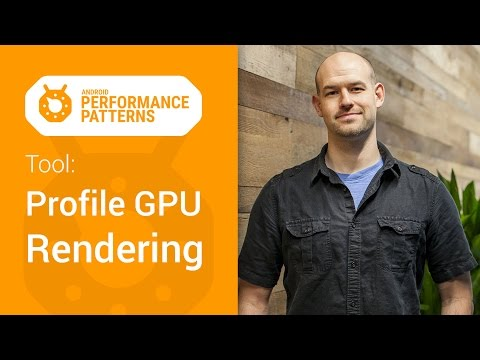

## Android Performance Patterns: Tool - Profile GPU Rendering

** 视频发布时间**
 
> 2015年1月6日

** 视频介绍**

> “If you can measure it, you can optimize it” is a common term in the computing world, and for Android’s rendering system, the same thing holds true. In order to optimize your pipeline to be more efficient for rendering, you need a tool to give you feedback on where the current perf problems lie.And in this video, Colt McAnlis walks you through an on-device tool that’s built for this exact reason. “Profile GPU Rendering” will help you understand the stages of the rendering pipeline, and also get a chance to see what portions of it might be taking too long, and what you can do about it for your application.Watch more Android Performance Patterns here: http://goo.gl/3dBbse

** 视频推介语 **

>  暂无，待补充。

### 译者信息

| 翻译 | 润稿 | 终审 | 原始链接 | 中文字幕 |  翻译流水号  |  加入字幕组  |
| -- | -- | -- | -- | -- |  -- | -- | -- |
| 周亿 | 姜昭宇、Kesen | —— | [ Youtube ]( https://www.youtube.com/watch?v=VzYkVL1n4M8 )  |  [ Youtube ]( https://www.youtube.com/watch?v=VzYkVL1n4M8 ) | 1501130354 | [ 加入 GDG 字幕组 ]( http://www.gfansub.com/join_translator )  |

### 解说词中文版：

对于现代流行的手机应用来说

渲染性能问题往往是偷取你宝贵的帧数的罪魁祸首

这种问题很容易产生  也很容易出现 

而且  在一个非常方便的工具的帮助下 

它们也很容易去追踪 

我是Colt McAnlis 

使用GPU渲染分析工具 

你能够方便的  基于设备的去查看 

究竟是什么导致你的应用程序变慢 

想要获取这个工具  只需要进入开发人员选项 

然后勾选GPU呈现模式分析选项 

这样会弹出一个子窗口提醒你要如何收集您的分析数据 

为了方便使用  选择在屏幕上显示条形图的选项卡 

这样做的时候您的设备上会多出三个色块区 

你会发现每一个可以看到的activity 

这个工具会在上面显示分析过的图形数据 

比如  图像的底部表示来自Navigation 

activity的渲染性能 

图像的上部反应的是通知栏的使用时间 

图像的中间含了所有的 

运行中的应用程序中应用的性能信息 

既然这就是我们感兴趣的地方 

那么让我们来仔细的看看 

当你和你的应用程序互动的时候 

你会看见垂直的柱状图在屏幕上 

是从按照左到右的顺序显示的 

每一个垂直的柱状图代表一帧的渲染 

越长的垂直柱状图  需要渲染的时间就越长 

随着需要渲染的帧数越来越多  他们会堆积在一起 

这样你就能够观察到这段时间的帧率的变化 

这跟绿色标记线代表16毫秒 

这条绿色标记线的移动是基于全局比例和标记线本身 

要确保一秒钟内达到60帧的速率 

你需要确保这些帧的每一条线 

都在16毫秒的绿色标记线以下 

任何时候你看到一个竖条超过了绿色的标记线 

你就会看到你的动画有卡顿现象出现 

如果你眼尖  那么你已经发现了 

每个垂直柱状图实际是由三种颜色堆叠在一起的 

这些颜色直接和Android渲染流水线 

和它实际运行帧数的时间关联 

蓝色代表测量绘制的时间 

或者说是它需要花多久去创建 

和更新你的Java Display Lists 

请记住  一个视图在可以实际的进行渲染之前 

它必须先被转换成为一个GPU所熟悉的格式 

简单来说  它可能就只是几个绘图命令 

复杂的话  我们可能根据 

你的Canvas对象嵌入了自定义路径 

一旦完成  结果会作为一个 

Display List对象被系统送入缓存 

蓝色条是记录了需要花费多久的时间在屏幕上更新视图 

当你看见这个条非常的高 

这可能就意味着你的一堆视图突然的变得无效 

或者是你的几个自定义视图的绘制函数特别复杂  

红色的柱状图这部分反映的是执行时间 

这是Android 2D渲染执行 

Display List所花的时间  

为了绘制到屏幕上 

Android需要使用OpenGL ES API 

接口绘制出你的Display List 

这些API有效的将数据发送到GPU 

最终在屏幕上显示出来 

记住  绘制像自定义视图这样的复杂视图 

需要用到的OpenGL的绘制命令会更复杂 

当你看到红色柱状条很高的时候 

这些复杂的视图可能就是罪魁祸首 

另外值得一提的是 

这栏的非常高的峰值可能是 

因为重新提交了视图绘制而造成的 

这些视图并不是失效的视图 

有些时候发生了某些事  例如视图旋转 

我们需要回去清理这个区域的视图 

这样可能会影响到这个视图下面的视图 

因为这些视图都需要进行重新绘制的操作 

最后  橙色部分表示的是处理时间 

或者说  这是CPU告诉GPU它已经完成 

渲染一帧的地方 

这是一个阻塞调用  因此 

CPU会在那一直等待GPU发出接到命令的回复 

如果柱状条越变越高 

那就意味着你给GPU太多的工作 

太多的复杂视图需要OpenGL命令去绘制和处理 

保持动画流畅的关键就在于让这些垂直的柱状条 

尽可能的保持在16毫秒这条绿色标记线的下方  

任何时候  垂直柱状条超过了那个值 

你就有可能丢失一帧的内容  

用户可不希望有这种事情发生 

GPU渲染分析是一个很棒的工具 

它使你能够及时的发现你在渲染时出现的问题 

但是修复这些问题也不是说说那么简单的 

所以记得查看剩下的 

Android Performance Patterns的内容 

当然不要忘了加入Google+的交流组 

代码分析  你值得拥有  性能问题  永不能忘 

