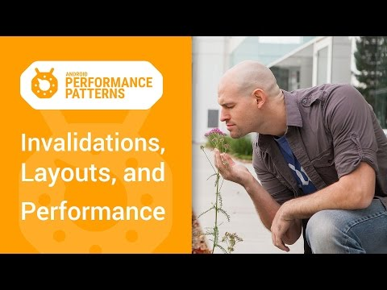

## Android Performance Patterns: Invalidations, Layouts, and Performance

** 视频发布时间**
 
> 2015年1月6日

** 视频介绍**

> Views are the backbone of your Android Activity, but have you ever really understood how much updating the visual properties of a view affects your performance? In order to hit the middle ground between performance and flexibility, Android’s UI Toolkit must execute a number of stages to prepare data before rendering it to the screen. So every time you change one of those views, this pipeline has to spin up, and start doing work again.In this video, +Colt McAnlis introduces the required stages of the rendering pipeline, and describes what actions in your application will trigger each of them to occur.Watch more Android Performance Patterns here: https://goo.gl/3dBbse

** 视频推介语 **

>  暂无，待补充。

### 译者信息

| 翻译 | 润稿 | 终审 | 原始链接 | 中文字幕 |  翻译流水号  |  加入字幕组  |
| -- | -- | -- | -- | -- |  -- | -- | -- |
| 周亿 | 姜昭宇、Kesen | —— | [ Youtube ]( https://www.youtube.com/watch?v=we6poP0kw6E )  |  [ Youtube ]( https://www.youtube.com/watch?v=we6poP0kw6E ) | 1501130357 | [ 加入 GDG 字幕组 ]( {{ book.host }}/join_translator )  |

### 解说词中文版：

顺滑精妙的动画是App设计里面最重要的元素之一

这些动画能够显著提升用户体验

但是很容易忘记他们可能会花费你的性能

我是Colt McCanlis

如果你要写一个高性能的Android应用程序

你应该先了解Android系统是

如何处理UI组件的更新操作的

为了在你的设备上绘制一些东西

Android需要将高级的XML转换成

GPU能够使用的东西以便渲染到屏幕上

这是通过一个被称为显示列表内的对象的帮助实现的

一个显示列表基本包含了所有GPU需要的渲染信息

它包含一个GPU可能需要的常用资源列表

同样也包含了渲染时需要的OpenGL命令列表

在某个视图第一次需要被渲染时

DisplayList就会因此而被创建

当这个视图要显示到屏幕上时

我们会执行GPU的绘制指令来进行渲染

如果你在后续有执行类似移动这个视图的位置等操作

而需要再次渲染这个视图时

我们就仅仅需要额外操作一次渲染指令就够了

然而如果你修改了视图中的某些可见组件

那么之前的DisplayList就无法继续使用了

我们需要回头重新创建一个DisplayList

并且重新执行渲染指令并更新到屏幕上

再执行新的列表  从而更新屏幕

但是记住这个

任何时候视图中的绘制内容发生变化时

都会重新执行创建DisplayList

渲染DisplayList

更新到屏幕上等一系列操作

这个流程的表现性能

取决于你的视图的复杂程度

取决于视图的状态变化也包括渲染管道的执行性能

举个例子  假设某个按钮的大小需要增大到目前的两倍

在增大按钮大小之前

需要通过父视图重新计算并摆放其他子视图的位置

在这种情况下  我们更新了一个视图

但是与其他需要被完成的任务连在了一起

这些类型的视觉变化

需要在附加的阶段执行渲染流水线

你看  当你的视图改变时

便开始进行测量的工作

修改视图的大小会触发整个

Hierarcy视图的重新计算大小的操作

如果你改变布局样式   可以调用布局模块

或者用视图组件重构它的子类

布局从这开始  遍历层次结构

确定每一个组件位置

你必须意识到

每一个阶段都需要时间来运行

引起性能问题的一个很重要的方面

是因为过多复杂的绘制操作

如果突然出现大量的无效或者重新定位的视图

这会带来一个巨大的性能问题

而尽量减少无效布局可以提高整体的性能

当然  你可能需要一些办法来在你的问题出现的地方

获取更详细的错误信息

首先  你可以在设备上使用

Profile GPU rendering工具

来更好的观察哪个部分的渲染有问题

这会给你在创建  执行和处理绘制操作上带来方便

这会给你一个方便的绘画线管的创建

执行和处理的时间花费快照

另外也可以通过开发者选项里面的

Show GPU view updates来查看

视图更新的操作

当你的应用程序不响应时

你会看到未响应部分闪着提示红光

无论未响应块有多少

它都可以帮助到你解决问题

最后我们还可以通过

HierarchyViewer这个工具来查看布局

使得布局尽量扁平化

移除非必需的UI组件

这些操作能够减少

Measure Layout的计算时间

但是这也仅仅是个开始

想要获取更多关于减少无效视图

扁平化你的层次结构和使用硬件层的信息

请查看Android Performance Patterns的其他视频

别忘了加入Google+来获取更多的好的提示和技巧

代码分析  你值得拥有  性能问题  永不能忘

