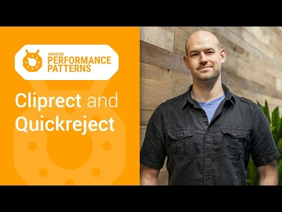

## Android Performance Patterns: Overdraw, Cliprect, QuickReject

** 视频发布时间**
 
> 2015年1月6日

** 视频介绍**

> The Android system knows that overdraw is a really difficult problem, and in general, it does what it can to remove unseen surfaces before they can waste your precious processing time. But sadly, this doesn’t extend to complex custom views, where the system may not be able to understand what types of overlap are occurring on your view.

** 视频推介语 **

>  暂无，待补充。

### 译者信息

| 翻译 | 润稿 | 终审 | 原始链接 | 中文字幕 |  翻译流水号  |  加入字幕组  |
| -- | -- | -- | -- | -- |  -- | -- | -- |
| 周亿 | 姜昭宇、Kesen | -- | [ Youtube ](  https://www.youtube.com/watch?v=vkTn3Ule4Ps )  |  [ Youtube ]( https://www.youtube.com/watch?v=vkTn3Ule4Ps ) | 1501130358 | [ 加入 GDG 字幕组 ]( {{ book.host }}/join_translator )  |

### 解说词中文版：

对于现在的移动应用来说

引起性能问题的一个很重要的方面是

因为过多复杂的绘制操作

我们可以通过工具来检测

并修复标准UI组件的过度绘制问题

但是针对高度自定义的UI组件则显得有些力不从心

我是Colt McAnlis

有一个窍门是我们可以通过执行几个API的方法

来显著提升绘制操作的性能

如果你记得  过度绘制发生在你的硬件周期

绘制像素点在屏幕上  但是对最终结果

没有帮助的时候  例如Nav Drawer

从前置可见的Activity滑出之后

你看  如果还继续绘制那些在Nav Drawer

里面不可见的UI组件

这就导致了过度绘制  我们就浪费了时间

为了解决这个问题

Android系统会通过避免绘制那些

完全不可见的组件来尽量减少过度绘制

比如  那些Nav Drawer里面不可见的视图

就不会被执行而出现浪费资源的情况

但是不幸的是  这个技术对于那些过于复杂的

自定义的视图即重写了onDraw方法

在这种情况下  Android底层系统无法检测

具体在onDraw里面会执行什么操作

系统无法监控并自动优化  也就无法避免过度绘制了

但是我们可以通过canvas.clipRect()

来帮助系统识别那些可见的区域

这个方法可以指定一块矩形区域

只有在这个区域内才会被绘制

其他的区域会被忽视

这个API可以很好的帮助那些有多组重叠组件的

自定义视图来控制显示区域

比如  你有一堆UI卡

你能够定义当前卡片的哪一部分被它之上的卡片遮盖

通过设置矩形的边界来完全忽视掉这一区域

很棒的一点是

同时clipRect方法还可以帮助节约CPU与GPU资源

就CPU来说  每一个Canvas绘制命令提交给

OpenGL ES实际上都要使用资源

在clipRect区域之外的绘制指令都不会被执行

那些部分内容在矩形区域内的组件  仍然会得到绘制

任何的两个剪辑矩形的相交部分依然会被绘制

这也是为什么就GPU来说

cliprect帮助它定义一个扩展矩阵

从而从像素级的避免了额外绘制

除了clipRect方法之外  我们还可以使用

canvas.quickreject()来判断

是否没和某个矩形相交

如果你发现一的一部分视图花掉了大量的处理事件

canvas.quickreject()能够告诉你

它是否在cliprect的外面

如果在外面  跳过那些非矩形区域内的绘制操作

别忘了你能在设备上通过使用Show GPU

过度绘制这个工具查看过度绘制的影响

这个工具会通过你的应用程序把可视化的像素

染上不同的颜色过度绘制正在发生

在这个区域红色越多越糟糕

如果你想学习更多关于过度绘制

验证  以及它是如何影响你的性能

记得去查看其他的本系列视频

当然别忘了加入Google+的讨论组

获取有用的提示和技巧

代码分析  你值得拥有  性能问题  永不能忘