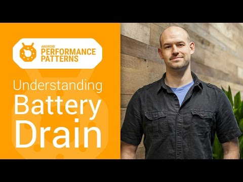

## Android Performance Patterns: Understanding Battery Drain on Android

** 视频发布时间**
 
> 2015年1月6日

** 视频介绍**

> As your mobile device is busy executing tasks, calculating how to split a bar tab, and uploading photos of your cat, the underlying hardware is effectively pulling energy from your battery to accomplish this work.And, as we’ve all seen, the more work your device does, the more battery it pulls, and the sooner your users are left holding on to an uncharged phone, that doubles as an expensive door stop.In this video Colt McAnlis discusses the keys to writing applications that are light on battery drain; which means understanding what’s going on under the hood.Watch more Android Performance Patterns here: https://goo.gl/3dBbse

** 视频推介语 **

>  暂无，待补充。

### 译者信息

| 翻译 | 润稿 | 终审 | 原始链接 | 中文字幕 |  翻译流水号  |  加入字幕组  |
| -- | -- | -- | -- | -- |  -- | -- | -- |
| 程路 | 程路、Kesen | ——| [ Youtube ]( https://www.youtube.com/watch?v=4D7_N2XEw20 )  |  [ Youtube ]( https://www.youtube.com/watch?v=4D7_N2XEw20 ) | 1501130365 | [ 加入 GDG 字幕组 ]( {{ book.host }}/join_translator )  |

### 解说词中文版：

你的移动设备正在高负荷的运转

要显示一个选项卡

并要上传你家喵咪的照片

底层硬件就要通过消耗

电池能量来完成这项工作

众所周知

设备所执行的任务越多

消耗的电量就越快

一个电量即将耗尽的手机

基本上就相当于一个昂贵的砖头了

我是Colt McAnlis

编写应用程序的一个关键在于电量消耗

这与是否理解后台的执行过程

有很大关系

在电气工程领域中

硬件从电池吸收能量并执行任务

这一行为被称为放电

任何电气工程领域科班出身的人

都会这样给你讲

设备在执行相同程序时

在不同状态下的耗电量

并不是都一样的

为了验证这一点  让我们拿手边的Nexus5实验

把它设成飞行模式

然后放在办公桌上

现在  如果我们把手机这样放着什么也不做

直到电量耗尽

那么手机可以待机一个月

我们把这个时间作为基准线

基准线左右基本都是没怎么用手机的

但是只要激活你的设备

那么就会开始各种耗电

激活设备这里包括但不仅限于

CPU操作

打开移动数据网络

或者解锁屏幕等

所以问题来了

到底我的程序做了什么事情

这么耗电呐

很遗憾  这回答起来很难

你想想  用硬件监控硬件的耗电情况

是自相矛盾的

因为  监控硬件自身在监控

手机电量消耗情况的时候

自身也在耗电

因此  大部分设备并没有对此做特殊优化

如果真正想统计

电池的消耗统计信息

就只能再拿一个

不需要手机电源供电的设备

来记录这些操作

如果我们真这样做了

你会得到一些灰常有意思的信息

例如  我们可以发现

Nexus5在待机模式的时候

其实基本不怎么耗电

但是  当我们解锁点亮屏幕的时候

我们在电量监控器里看到一个很大的涨幅

跟你想的一样是吧

打开指示灯   GPU绘制整个屏幕

然后CPU都开始工作

GPU负责绘制整个屏幕

从电池消耗角度看  它丫可不是一个省油的灯

还有

这跟应用程序唤醒设备完全不一样

WakeLock或者AlarmManager

还有JobScheduler都是定时任务触发API

当设备处于休眠状态  被以上的API唤醒

你会首先看见电池用量的一个小高峰

随即任务执行的时候会继续消耗一点电量

一个需要指出的地方是

需要做的工作结束之后设备应该立即回到休眠状态

这个灰常重要

休眠状态可以减少电耗

但是如果你忘记让设备休眠

或者让其长时间保持非休眠状态

电池将秒秒钟跳票

还有  设备如果处在移动网络下  那请允许我做一个悲伤的表情

你要知道  你的设备将通过

移动网络发送所有数据哦

你可以看到电量的消耗首先是硬件唤醒

然后是发送数据包  最后是接收数据包

因为移动网络发起一次请求实在是太贵了

所以硬件本身会在完成一次请求的时候

保持一段唤醒状态

以保证收到这个时候

更多的网络请求

这是很大的数据量啊

这是一个很棒的工具

遗憾的是  更多的开发者并没有

接触过这样的设备

值得庆幸的是  随着Android L的发布

我们已经有了一套新工具

可以帮助你优化应用程序的电池损耗

首先  用户可以在设备上查看

相关的应用程序

消耗电量的占比

你可以通过打开设置  点击电池

然后选择要查看电耗的应用程序

与此同时也会提供给你

这个应用程序花了多少时间让手机

保持唤醒状态或者执行联网任务的时间

相信我  如果你的电池使用详情

看起来是这个熊样  那你估计就遇到问题啦

其次  还有一个全新的工具

可以让你观察应用程序整个生命周期内

的详细耗电情况

Battery Historian 这个工具允许

你给每个任务创建一个时间轴

能很容易的看到耗电率

比如  你的应用程序需要移动网络

这些信息将会为耗电性能优化

提供一个明确的目标

坦白讲  修复这个问题会是是一个独立的话题

这也就是为啥你要一直关注我们

Android Performance Pattern 系列视频的原因

我们会教给你电池性能管理的禅道

代码分析  你值得拥有

性能问题  永不能忘

