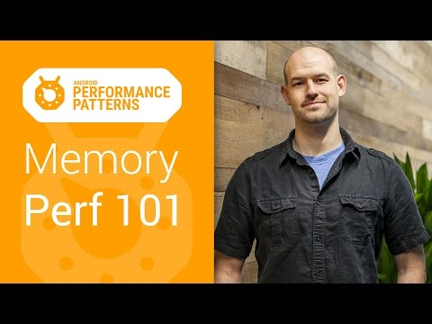

## Android Performance Patterns: Memory Performance 101

** 视频发布时间**
 
> 2015年3月11日

** 视频介绍**

> What’s great about Android’s runtime that most of the stress of memory reclamation is done for you; The system will track what you’re doing, and when it sees an object isn’t needed any more, will free it on your behalf. While this is great for your general health, and blood pressure, this doesn’t exclude performance problems from happening here.In this video, Colt McAnlis walks through how the android memory system works, and identifies some common perf problems, and introduces you to tools to help track down and solve the issues.

** 视频推介语 **

>  暂无，待补充。

### 译者信息

| 翻译 | 润稿 | 终审 | 原始链接 | 中文字幕 |  翻译流水号  |  加入字幕组  |
| -- | -- | -- | -- | -- |  -- | -- | -- |
| Martin | 隆斯朝 | ——| [ Youtube ]( https://www.youtube.com/watch?v=OrLEoIsMIAc )  |  [ Youtube ]( https://www.youtube.com/watch?v=p_7vC3AJbRQ ) | [1504170661] | [ 加入 GDG 字幕组 ]( http://www.gfansub.com/join_translator )  |

### 解说词中文版：

Android 运行环境很好的地方就是几乎所有内存回收压力

都已经为你优化好了

系统会追踪你正在做的事  当系统看到一个对象不再被需要

的时候

它就会替你释放内存  这对于维护会带来好处

也不从这里排除发生的性能问题

我是 Colt McAnlis  这有一个好主意让你知道

你管理的内存环境下Paul's work的高级属性的性能的类型

当你看到分配的内存数量达到上限的

时候

我们启动一个垃圾回收事件来释放

不需要的资源

为将来的内存分配解放空间并且取决于什么运行环境可以使用

垃圾回收机制来停止运行中的应用程序

为了正确地清除不再需要的资源

GC是管理环境中常见的和自然一部分

并且垃圾回收事件在Android中非常快速

实际上这里的性能问题是你的应用程序

滥用内存

会导致一系列的内存回收事件启动  这将在空闲时间使手机

升温

任何时候你的画面在16帧并且没有第二个障碍

用户就会开始关注  任何你的代码

强制分配内存来超过内存的阈值

就会出现问题  内存泄露只是一个例子

实际上你的代码给很多对象分配了内存并且不释放

内存

随着时间推移  这些对象变成大的固定块内存

迫使裁判程序在剩下的空间工作并提升了温度

成员可以在短时间内更严格地

分配和释放大量对象

使临时对象产生的热量饱和并且最后再启动GC

举个例子  在嵌套循环中间分配新对象

或者是

写你想要的函数  现在的解决方案很简单

将代码截图  为了做这个你需要知道哪个确切的地方

产生错误

你可以用一些很好的工具来帮你做

首先  使用内存监测工具会让你知道你的应用程序

的生命周期内

内存分配是如何工作的  你看到的每次内存分配

中的下降

就是GC事件的发生  短时间的帧中又很多下降

代表有大问题

为了获取更多细节  请看外面那层或者是专门分配内存

的那部分

你可以用 Android Studio 中内存分配追踪器页面

或者是使用 Android Studio 的 Heat 来看某种类型的对象

的高峰

或者是某种类型的对象没有在合适的时候被释放

这些例子都是不好的  目前所有你可以避免的内存回收

事件

都可以使你的应用加载更多帧来做有趣的事  这允许你

创建一个流畅的  漂亮的

用户体验  这也是为什么我需要在剩下的 Android 性能模式

中检查提示的原因  同时也别忘了加入我们的 Google+ 社区来

获得更多

在职开发者的建议  像平常一样保持冷静

记得给你的代码加上注释

