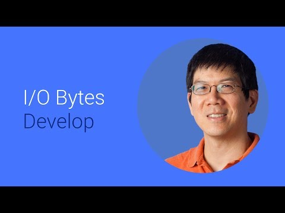

## Sample rates and resampling: Why can't we all just agree? 

   

** 视频发布时间**
 
> 2014年6月25日

** 视频介绍** 

> Ever wonder why digital audio has so many different sample rates and how they are handled? We'll discuss where different sample rates arise, how a resampler converts between them, and the upcoming quality and performance improvements in Android's resamplers.

** 视频推介语 **

>  暂无，待补充。

### 译者信息 

| 翻译 | 润稿 | 终审 | 原始链接 | 中文字幕 |  翻译流水号  |  加入字幕组  |
| ----|----|----|----|----|----|----|
| lch | Guangwei Feng | -- | [ Youtube ]( https://www.youtube.com/watch?v=6Dl6BdrA-sQ ) | [ Youtube ](https://www.youtube.com/watch?v=I9tRxIN7Hko) | 1504010488 | [ 加入 GDG 字幕组 ]( {{ book.host }}/join_translator ) |

### 解说词中文版：

如果你是一个写Android应用的音频爱好者

在Android L的开发者预览版中

有一些令人激动的新特性

我是Andy  今天我们一起

来谈一谈数字音频的采样率

以及如何给你的用户以最好的听感

但是先别着急  我们从头开始

先来讨论音频的采样率

这里是设备  内容  以及连接线

这当中每一个都有不同的采样率

举个例子  这部手机的设备音频采样率是48kHz

但是这并不能保证上面的应用会使用全部频率

游戏应用经常会使用24kHz和32kHZ的采样率

音乐流使用44.1kHz

视频流则是48kHz

与此同时  我的蓝牙免提

则是嗡嗡嗡的8kHz

这意味着这些采样率林林总总

甚至你光是看这一部只能手机

无论如何  首先要搞清楚什么事采样率

简而言之  拿来一个模拟音频信号

就是你多长时间采样一次你的波形

所以  当一个游戏采用32kHz的采样率的时候

我们就需要对其进行重采样并转换为耳机所使用的

48kHz的采样率

正如你能预料到的  这种重采样的处理

会产生许多麻烦

通常情况下大家都知道的就是失真

失真的情况可以发生在当音频频率

大大超过采样率的情况下

这时高频信号看起来

或者说由于失真变成了低频信号

就像右边的绿色信号那样

不会失真的音频频率的最大值

是采样率的一半  也称为奈奎斯特频率

为了避免失真  我们使用一个低通滤波器

低通滤波器可以过滤导致失真的高频信号

它有三个频段

通过频段留给音频频率

阻止频段阻止高频信号的失真

过渡频段位于二者之间

那么如何制造一个好的重采样滤波器呢

首先限定长度

通过限定长度会产生一些抖动

这就是吉布斯现象

其次  我们希望通过频段的信号抖动减小

来避免音频信号被扭曲

第三  我们还希望阻止频段的信号抖动也减小

以此避免阻止频段的频率升高以及高频信号失真

最后  我们还得让过渡频段变窄

更短的过滤长度意味着更宽的过渡频段

这和主要是频率和时间之间的

不确定性有关

你想要的是一个窄的过渡频段

正如你可以想象的  设计一个真正好的滤波器十分困难

要让过渡频段带宽是过滤长度的二倍

而阻止频段的衰减加倍又会导致过滤长度的加倍

啊——  设计上的权衡

好消息来了

在Android上  我们将帮你处理采样过滤器的问题

访问这些链接来获取有关其工作方式的更多信息

并且会为你提供很多重采样的工具

那么Android提供的这些东西适合用在哪里呢

就像动物和植物一样 这里也有多项式重采样

和过滤器重采样

在多项式重采样这边  你可能

听说过线性插值取样和立方样条取样

这些方法大多用在图像处理领域

我们这边则是基于滤波器的重采样

这在音频处理领域更为普遍

特别地  我们采用的是一个窗口化的Sinc滤波器

现在我们再回到Android音频处理上

其中我们强化了重采样

我们提升了其采样质量

在一个正弦扫描频率或者是一个线性调频的频谱图上  我们的直接就是一条直线

这意味着一个输入频率

完全对应一个输出频率

这对于采样率转换过后的也成立

我们的例子展示了从44.1kHz到48kHz的采样率转换

之后的情况

转换前的情况是上图  看到那些像是编织篮子的图案了吗

那就是谐波中的失真

简直渣到爆

下面是转换之后的  看起来是那么干净

这是在低质量设置下的  这意味着

来自许多设备的音乐听起来会更好

我们通过你的频率动态地计算滤波器

在从42kHz到32kHz的频谱图上

上面是转换前的  失真直接体现在了旧的重采样上

图中显示了线反射向下

转换后的是下图

我们同样把图弄得很干净

这是我们的高品质设置

这意味着我们在不同频率下对音频的处理更少

同时也把使用的频率范围

扩展到从8kHz至48kHz的任意频率

所以我们现在可以很高效地进行重采样  或者减少复合运算

我们还提升了速度

我们的重采样速率大约是旧的重采样器的

两倍  相比之下还有更高的质量

这也意味着可以处理更多其他的任务

以及更长的电池续航

我们现在已经将Android的数字音频处理变得十分简单

我们期待着你能释放出不同采样率所带来的力量

现在  是由你来创造奇迹的时候了

请关注这些链接以获取更多信息

感谢你的收看

