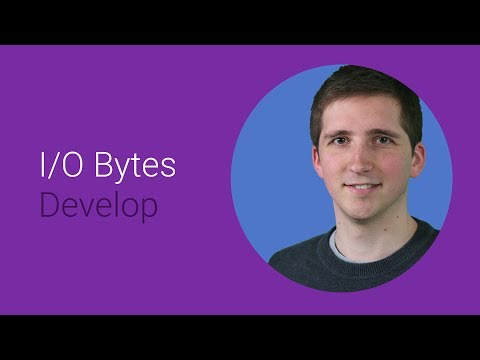

## ExoPlayer: Adaptive video streaming on Android 

   

** 视频发布时间**
 
> 2014年6月25日

** 视频介绍**

> ExoPlayer is a newly open sourced media player built on Android's low level media APIs. It supports DASH and SmoothStreaming adaptive playback, and is used by Google's YouTube and Play Movies applications. This talk discusses the design of ExoPlayer, its use of Android's low level media APIs, and how you can use, extend and customize ExoPlayer in your own video applications.

** 视频推介语 **

>  暂无，待补充。

### 译者信息 

| 翻译 | 润稿 | 终审 | 原始链接 | 中文字幕 |  翻译流水号  |  加入字幕组  |
| ----|----|----|----|----|----|----|
| 伍文其 | Wallace4ever | -- | [ Youtube ]( https://www.youtube.com/watch?v=6VjF638VObA ) | [ Youtube ](https://www.youtube.com/watch?v=czwKDhAdtoA) | 1504010489 | [ 加入 GDG 字幕组 ]( {{ book.host }}/join_translator ) |

### 解说词中文版：

嗨

我是Ollie，来自Android团队

我想给大家介绍一下ExoPlayer ，一个应用级的

Android媒体播放器

由于建立在Android的底层的媒体的API之上，

ExoPlayer带来了了许多优越特性

甚至超过了Android的内置媒体播放器

你将很高兴地听到它同时支持

动态自适应http流媒体和流畅的流的播放

在Google 我们已经在YouTube中

使用ExoPlayer并用它来播放电影

现在我们正把它开源，以便于

你们也能在你们自己的应用中使用它

我将向你们展示创建ExoPlayer所需的更底层的API

它展现出应用级别的媒体播放器的优点

并告诉你如何将ExoPlayer

集成到自己的应用程序里

我们在介绍ExoPlayer之前

让我们先来看看Android的媒体API

在Jelly Bean之前　Android的高层媒体播放器API

实际上是应用程序的开发人员用来开发视频

它使用起来真的非常简单

这个例子就是只需要两行代码就可以播放一段视频

第一行创建播放器　　第二行就开始播放

开发者用这两行代码几乎全部隐藏了

所有的复杂的视频回放

然而　在隐藏之下　为了能让视频重复播放　

实现媒体播放器是做了大量的工作的

对于流式传输　播放器需要做的第一件事

就是通过网络去下载视频数据

这个数据需要根据一些策略来缓冲

当更多的数据需要被下载时该策略将指定缓冲的时机

以及缓冲多少内容

在视频能够播放之前

单独的音频和视频样本

需要以他们被发送的格式

从容器中提取出来

然后这些样本需要被解码

最后　译码器解码出的视频样品就

会被传达到荧幕和观众

在稍微高一点的层次上　播放器

需要跟踪其整体状况　　比如重放位置

重放是否正确的进行

媒体播放器API的操作是很便捷的

因为它隐藏了所有的复杂的事物

然而，这个方法的一个缺点是

更多优秀的开发者

不能修改或者扩展其潜在的行为

以更好的适应他们的需求

举个例子 开发人员无法调整缓冲策略

或添加一个持久高速缓存用于缓存媒体数据

为了更好的支持这些使用场景

我们给Android添加了底层的多媒体接口

从Android4.3起 内置的媒体接口

就提供了联网 缓冲和媒体提取功能

我们还增加了MediaCodec API

它提供了访问解码器　包括

硬件加速的视频解码器

该MediaCodec API支持视频帧的直接渲染

和可以使用音频轨道进行播放音频的解码接口

这是从Android1.5就开始的困扰

这些底层的API为开发人员提供了一种可以的替代

Android的高层媒体播放器的方案

这些API使人们有可能用JAVA建立应用级媒体播放器

同时他们的播放器的

逻辑是从应用级层面来实现的

此代码通常将调用提供的API

来装入和提取多媒体样品

对他们进行解码　并呈现出来

开发者可以选择性地

在应用层面实现这些功能

例如 联网 缓存

同时样本提取使开发人员可以

更轻松地自定义这些组件

在谷歌　我们已经开发了自己的应用程序级媒体

播放器　叫做ExoPlayer

它同时支持DASH和自适应式平滑流传输

回放 DRM保护的内容 并已专门为

易于进行修改和扩展而设计

谷歌的YouTube和播放电影的应用

已经在一些较新的Android设备上使用了

而我们也看到了一些了不起的结果

例如 播放电影 用ExoPlayer进行DASH回放时

已经可以看出 减少了65％的回放延迟

减少至少40％的缓存以及平均提高11%的

播放分辨率　这些都是相对使用媒体播放器而言的

由于ExoPlayer是应用层的多媒体

播放器 我们能够调整它 并添加新功能

通过Play 商店进行更新

我们希望，这将使我们能够进一步提高

这些性能数据

我们真的对Exoplayer 给我们自己的

应用程序带来的进步感到很高兴

但是，我们认识到，对于多数的开发者

采取相似的做法的壁垒是相当高的

ExoPlayer本身就是大约16000行代码

并且使用了Android的底层的多媒体API是一个挑战

所以从头开始创建这样的播放器需要做出很多的努力

出于这个原因 我们决定开源ExoPlayer

我们希望以此来降低进入门槛

允许第三方开发者获得类似的改进

无需承担从头开发

他们自己的应用程序级媒体播放器的成本

让我们来看看ExoPlayer是如何设计的

以及你如何在自己的应用程序中使用它

而不是使用一个单一的Java对象

一个ExoPlayer是从一系列模块化部件构成的

其中的每一个部件都对所期望的行为

或播放器的一种功能做出贡献

在顶层　我们有ExoPlayer

对象本身 　这在保持播放器的状态方面

几乎不占用资源

这个对象调用到组件叫做跟踪渲染

它的工作是在播放过程中呈现媒体

ExoPlayer库提供一个轨道渲染器来

播放视频 　它采用了MediaCodec　API

来解码所述视频的样本　并使其呈现在表面

它支持它们在底层的解码器中的

任何视频格式

H.264是常用的

该ExoPlayer库还提供轨道渲染器来播放音频

该渲染器其使用MediaCodec API来

解码音频样本和音频轨道API来播放它们

而音频和视频轨道渲染的实现都

需要得到由一个样品源组件

提供的采样

对于那些不需要控制

网络，缓冲和样本提取行为的开发者来说

ExoPlayer库提供了

名为FrameworkSampleSource的实现方法

其中链接到Android的媒体来提取API

通过这样做，它提供了在Android 中

运行的所有容器格式的支持

让我们来看看相应的代码

首先 我们所建立的样本源

通过该URI到其中视频载入的位置

然后　　我们让我们的音频和视频渲染器渲染样品源

最后　我们建立ExoPlayer的一个实例

经过两个渲染器　并开始播放

这是最简单的ExoPlayer如何可以使用的例子

现在让我们来看看　一个更复杂的使用情况下

ExoPlayer具体如何支持

DASH和SmoothStreaming自适应回放

对于DASH和SmoothStreaming　　ExoPlayer库所

包含的组件完全

取代了Android的媒体提取API

有一个叫做ChunkSampleSource组件的单个实例

被用于向提供音频和视频渲染器提供样本

每个ChunkSampleSource需要来自的媒体块

一组源组件

通常介于2秒和10秒的持续时间

在这个例子中 我们将重点放在DASH

DASH MP4 ChunkSource组件应该被用到之处的的反馈上

最后 每个ChunkSource需要一个数据源

正如其名称所暗示的　数据源组件

负责实际加载多媒体

在这种情况下 我们使用了

在网络上的转移数据的HTTP数据源

请注意　对于DASH回放音频和视频通常

分开是分开传输的　这就是为什么有两个HTTP

数据源组件　而不是只有一个

回头看看代码

你可以看到每个组件是如何用

它所依赖的组件来实现注入的

该视频渲染器被注入了采样源

它与ChunkSource一同被注入

也与数据源一起被注入

这种从很多使用依赖注入的组件构建的

做法让播放器能够

很容易地让应用程序开发者

替换其中的任何组件或全部

以自己的自定义的样子就行

我已经到目前为止已经展示了一个稍微简化对象模型

在一个完整的例子中　 一些更多的组件是必需的

首先，一些被叫做加载控制的东西

被要求用于管理媒体块的缓冲

其次　也是最重要的是用于自适应回放

每个ChunkSource需要一种叫做格式评估

格式评估从可用格式中进行选择

在媒体每块请求之前

对于音频我们使用一个固定的实现方式

 将针对一个单一的格式

对于视频　我们使用一个自适应的实现方式

这将对于当前网络状况

选择一个合适的格式

其旨在为用户提供可能的最高质量

而不会导致任何缓冲

现在我们知道如何建立一个ExoPlayer

使用由ExoPlayer库提供的标准组件

来实现自适应回放

我也谈到了一个应用程序开发人员

定制这样的播放器 以更好地满足他们的特定用例是多么容易

现在让我们来看看一些例子

假设开发人员希望添加持久缓存的

缓存媒体数据 　 而如果用户观看

同一个视频两次

它的第二次就将从缓存播放

在ExoPloayer模型中 它很简单

当构建播放器时　开发者可以简单地插入

缓存中的数据源组件

缓存DataSource组件是由ExoPlayer库提供的

但同样 开发人员可以自由地编写它

自己从无到有地实现它

同样地　一个开发者可以选择

替换默认LoadControl实现方式

以实现不同的缓冲行为

或者实现一个完全自定义的轨迹渲染器

例如 为了在视频之上覆盖另一层

自适应回放最普遍使用的能力是

注入的自定义格式评估器

这使得开发者能够用

自己的自适应算法来体验它

ExoPlayer还有许多其他的

可以被扩展和定制方法

我们期待着看到

开发人员可以用它做什么

综上所述　我们已经看到了Android的底层的多媒体

接口是如何让强大的应用级的开发多媒体播放器工作的

它可以更容易地更新

修改  并由开发者们扩展

相比android的标准多媒体播放器

谷歌正在使用ExoPlayer来实现

对于我们自己的应用程序的益处

我们希望通过开源ExoPlayer来实现这一点

我们将允许其他开发者实现类似的结果

所以 如果你很好奇 想了解更多信息

那么就访问开发者指南吧

你会发现大量的有用信息

还有一些了不起的例子来帮助你开始

