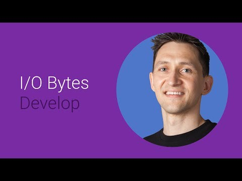

## Building impressive Android media experiences

 

** 视频发布时间**
 
> 2014年6月25日

** 视频介绍**

> Learn how to use the low-level Android multimedia APIs to create media experiences that rock! This session will cover the inner workings of MediaCodec, and dive into the latest platform features (including new features in the L developer preview).

** 视频推介语 **

>  暂无，待补充。

### 译者信息 

| 翻译 | 润稿 | 终审 | 原始链接 | 中文字幕 |  翻译流水号  |  加入字幕组  |
| ----|----|----|----|----|----|----|
| 任皓 | 田源 | 程路 | [ Youtube ]( https://www.youtube.com/watch?v=CrskWnKG8pk ) | [ Youtube ](https://www.youtube.com/watch?v=zPPM76yvTVQ) | 1504010493 | [ 加入 GDG 字幕组 ]( http://www.gfansub.com/join_translator ) |

### 解说词中文版：

LAGOS MOLNAR:当今世界  视频无处不在

作为一个应用开发者  你想让用户眼前一亮

但是如何才能创造出你想象中的

细致微妙的媒体魔法呢

我是来自于Android视频框架组的Lajos

我和大家分享的是如何在Android上创造很棒的  甚至是

令人难忘的多媒体体验

大家都知道  Android有很棒的上层多媒体相关的API

但是如果你不满足于播放和拍摄视频

或者你需要一个功能

是MediaPlayer和MediaRecorder不支持的

你会需要用Android Media的具体细节--底层API

来做些相对复杂的活

它们的组成部分包含MediaCodec

MediaCodec通常用来解码压缩音视频

和编码原始音视频

MediaExtractor解析媒体的容器文件

到音视频数据包

相反的  MediaMuxer打包音视频

到媒体容器中

MediaCrypto和MediaDRM用来解密受保护的媒体内容

和管理数字权限

使用这些底层API你可以做到MediaPlayer和MediaRecorder

能做的所有事情

我知道这样可行是因为我确实做到了

例如要开发一个媒体播放器

你需要两个MediaCodec对象和一个MediaExtractor对象

用来从数据源中解析出独立的音频和

视频数据包

为播放有安全保护的内容  你需要一个MediaDRM对象

来管理安全会话

同时你需要用一个MediaCrypto对象

来做视频解码器

你可以使用两个MediaCodecs和一个MediaMuxer对象

来实现MediaRecoder的功能

事实上  你还可以开发出多种多样的多媒体应用程序

而且  我补充一句  还可能是十分酷的应用哦

然后你把这些媒体模块和其他的结合起来

诸如纹理和纹理渲染器之类

举个例子  这是模仿Google+中的Auto Awesome Movie（可以把视频、图片、

音频等方便的组织成一部电影）的视频编辑的做法

解码两个源视频到GL Textture对象(图像类库）

使用GLES渲染器组合他们到（嵌入系统图像类库)

一个视频编码器的input surface上

请看大屏幕

就是这么容易

那MediaCodec怎样工作呢

MediaCodec  就其本质上说  就是一个处理器

通过输入的数据生成输出的数据

这是个异步的数据处理过程

使用一套输入和输出缓存

在简化版流程中  客户端请求空输入缓存

填充数据后发送到

编码器处理

编码器会处理这些数据并且将它们

放到输出缓存中

最后客户端请求填充好的缓存

使用其内容  然后发回到编码器

编码器的实际操作要更复杂些

因为每一个操作都并行发生

产生原始视频缓存的编码器也

能连接到surface

我们梳理下MediaCodec的状态

当你创造编码器时  它的状态是未初始化状态

首先你需要配置它

当你调用Start方法  编码器前进到已清空状态

此时它控制所有缓存

一旦你的输入缓存队列弹出输入数据

编码器就会进入到运行状态

它在这里发挥生命中最有价值的部分来处理

输入缓存  生成输出

如果排一个带有流结束标志的输入缓存

编码器进入到流结束状态

这里编码器不再接受输入缓存了

但是仍然生成输出直到处理到有流结束标志的缓存

你可以通过调用Flush

从任何执行的状态回到清空状态

或者调用Stop来回到配置状态

如果你调用Reset

不管当前在哪个状态  编码器都会回到未初始化状态

在极少的情况下  编码器遇到错误

然后转入错误状态

通知错误的办法是使用一个排队操作的无效返回值

或者有时通过一个异常

调用Reset可以让编码器重新处于可用状态

在用完编码器之后

你应该调用Release释放它

默认的  编码器使用字节缓存ByteBuffer

存储输入和输出数据

然而视频编码器可以被配置

使用硬件加速的surface缓存存放原始视频

操作硬件加速视频编码器是更优的模式

因为这让编码器工作时不需要进行内存拷贝

采用任一种模式  MediaCodec使用缓存索引来引用缓存

你通过调用DequeueInputBuffer

得到一个空输入缓存的索引

然后你可以使用数据填充缓存

加上一个时间标记或者标志然后使用QueueInputBuffer

发送缓存到编码器

为得到填充好的输出缓存  调用DequeueOuputBuffer

得到缓存的索引

注意时间标记是怎样从输入缓存中传递的。

如果使用字节缓存你可以处理数据

然后通过调用ReleaseOutputBuffer来释放缓存

一些注意事项

尽管缓存被缓存数组中的索引引用

并不是所有的索引都是有效的

所以实际上有一些无索引的缓存被使用

所有的输出缓存都是只读的

你应该只使用出列和入列或者释放缓存调用

来访问你持有的缓存

尽管缓存被异步处理

仍要及时的释放每一个缓存

否则会阻塞一些编码器

如前面提到的  你可以设置一个视频编码器

来处理硬件加速的surface中的输入数据

实现方法是在配置后调用CreateInputSurface

把这个surface传递给现在直接和编码器交互的

视频帧的生成器

和普通操作类似

生成器将请求并清空输入缓存

填充数据  打上时间标记 

将数据发回到编码器处理

当你想要停止编码会话

调用SignalEndOfInputStream

来很方便的将流结束标记加到最后收到的数据帧上

同样  你可以配置视频解码器

通过在配置中指定一个输出surface 

来使用硬件加速输出缓存

使用熟悉的DequeueOutputBuffer

来获取填充好的缓存的索引

然而  和输入字节缓存相反  你不能

检查surface输出缓存的内容

你只能决定是否

发送缓存到输出surface

为抛弃缓存  调用ReleaseOutputBuffer  把render设置为False

或者把render设置为Ture来在输出surface上显示缓存

在Lollipop开发者预览中  添加了支持对

要被渲染的surface缓存进行时间标记的可选项

如果设置  一些缓存使用者将在使用这个缓存前

先等待时间标记

我们最近已经添加一些特性让MediaCodec更加有用

其中之一  前面简单证明了的

是精确规划视频帧显示的能力

到目前为止  音视同步一直很难做到

使用附加的在MediaCodec中支持的surface时间标记

和在AudioTrack中支持的高精细度时间标记

同步现在变简单了

视频帧的规划仅在surface视图上起作用

当你想要视频帧出现在显示设备上时

使用精确的声音时间标记来计算确切的系统时间

然后通过调用ReleaseOutputBuffer设置时间标记

为大约两个VSYNC周期之前（Vertical synchronization）

帧将在请求的时间标记之后的

第一个VSYNC显示

另一个最近的对MediaCodec的改进

是对自适应播放的支持

适配的回放是视频编码器可选的功能

可以在回放的过程中无缝的改变视频尺寸

而客户端可以开始给解码器提供数据

即新尺寸的输入视频帧  然后输出缓存的尺寸

自动改变

而毫无明显的间隔

这功能仅在编码器被配置

使用硬件加速的surface缓存时被支持

如果编码器不支持自适应回放

你仍然可以改变尺寸

首先  使用流结束标志

标记旧尺寸的最后帧

然后等待所有的帧被解码完成

然后停止编码器 或者如果使用API 19

及更高则直接清空它

然后配置它为新尺寸

最后再启动编码器

哇

同时我通常认为那很方便

在你能依赖于自适应回放功能之前

你需要调用FeatureSupported API

来验证它被你正用的编码器

支持

要在编码器配置期间启用自适应回放

使用两个特定的键  最大宽度和最大高度

这些最大尺寸的提示

是被编码器支持的

如果配置成功

编码器会将尺寸切换到

比在无缝方式中的合页更小一些

动态地切换到更大的尺寸仍然可行

但是它可能不是无缝的

如果你试图切换到编码器不支持的尺寸

编码器将进入错误状态

一句话建议  为节省内存

使用你的用例需要的最小尺寸的合页

当编码器运行时  要改变视频尺寸

简单的使用QueueInputBuffer提示SYNC帧

SYNC帧是特殊的关键帧

它其中也包含配置改变参数

对于H264  这意味着SPS和PPS

在单个缓存中和IDR帧一起提供

唔

信息量太大

我们已经在开发者网站上

发布了流视频播放器的例子

使用底层APIs也可自适应回放

那是Ollie的视频

详细的阐述这个例子

一定要去看它们

并且为了想要更多的那些你们  底层的媒体APIs

在Android NDK上也有效

这些C语言的 APIs模仿Java那些接口并且

对32位和64位的本地二进制文件有效

称心的很

这样  我必须说再会了

我留给你一个使用MediaBuildingBlocks

创造对用户来说梦幻般东西的挑战  

更多信息  访问Android开发者网站

查找API参考  向导和简单应用

感谢您的收看

