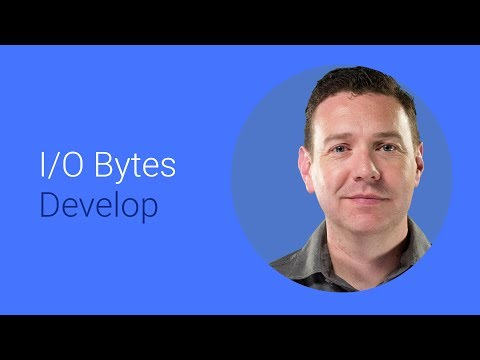

## Android Work 

  

** 视频发布时间**
 
> 2014年6月25日

** 视频介绍**

> In this preview release we've added more features to the Android framework for Enterprise. In this video, we introduce a unified launcher for personal and work use and describe new concepts like 'profile owner' & 'device owner' to support both BYOD and Corporate owned devices.We also give an overview of how we'll be enhancing the Play Store to allow IT Admins to deploy apps to employees and describe the APIs that'll be available for Enterprise Mobility Management.

** 视频推介语 **

>  暂无，待补充。

### 译者信息 

| 翻译 | 润稿 | 终审 | 原始链接 | 中文字幕 |  翻译流水号  |  加入字幕组  |
| ----|----|----|----|----|----|----|
| 卢治泷 | Martin | -- | [ Youtube ]( https://www.youtube.com/watch?v=FbVWtYPpzIs ) | [ Youtube ](https://www.youtube.com/watch?v=VPl7XOmEisc) | 1504010496 | [ 加入 GDG 字幕组 ]( {{ book.host }}/join_translator ) |

### 解说词中文版：

大家好  我是詹姆斯.凯里  Android团队的产品经理

现在我要聊聊Android Work

Android Work是一个完整的解决方案

它让Android完美地为企业应用服务

我们就从APP开始讲吧

Android Work有一个统一的交互模型

不论是对于个人应用还是企业应用

这非常有利于雇主

因为只需要一个设备就能满足个人生活上和工作中的需要

IT管理员能将APP上传到Google Play

供组织内的用户和团队

下载使用

我们已经加强了Android framework

这让用于工作的Android设备能提供

一个统一的界面给通知和最近浏览

不论是个人应用还是企业应用都在同一个launcher里

在launcher里  APP的徽章会有一个Android Work

的图标来指明这个APP和它的数据

是分离的并且安全地被IT管理着的

Android Work有一些新特性来支持

那些允许使用个人设备工作的组织

和那些给员工发放工作用设备的公司

BYOD是指员工使用他们自己的设备来工作

为了实现这个  IT管理员

需要在设备上创建一个安全的工作档案

它将把工作需要的APP和数据与

个人使用的APP和数据隔离开

我们已经加强了系统框架来统一化launcher里的

个人用和工作用APP  并且让通知和最近浏览同时

为两个档案显示

这提供了一个统一的用户体验

但同时又保留了适当的隔离

来为商业数据保证了一个安全的环境

对于公司的专用设备  IT管理员

能从一个全新的设备开始配置

然后通过一个供应步骤

这个企业应用就能为设备拥有者配置好

设备拥有者是一个特殊类型的设备管理员  它们不能

被设置为无效

这样公司就能保有对整个设备的完全控制

包括数据和APP

这个Android Work的设备拥有者模型

是刻意设计来满足对远程管理

和安全性的最高要求

并且建立在现有的Android设备管理员的概念之上

在这一次发布中  我们添加了新的APIs

来配合统一的用户体验  支持Android Work

的工作档案  以及更多其他的作用

一组关于政策和APP管理的功能

将在所有的Android Work设备间保持一致

让我们从管理用户的APIs开始

作为激活BYOD设备的一部分

一个设备策略客户端APP创建一个Android Work档案

用来把公司的APP和数据与个人空间隔离开

Android Work档案只有在员工

提供一组验证信息给IT管理员批准过的设备策略客户端（DPC）之后才会被创建

工作档案被DPC所持有

但是与设备用户以如下一种方式联系在一起

它们的通知和最近浏览是共享的

接下来我们要谈的是档案拥有者APIs

档案拥有者是设备管理者的一个特殊情况

它有一些额外的特权

相应的能够访问一些额外的API

档案拥有者不能被设备主用户修改

档案拥有者的权限在Android Work的档案范围内

并且被定义为Android Work的一部分

它的部署流程是被IT管理员批准的

下一个是设备拥有者

设备拥有者很像档案拥有者

但是权限范围是整个设备

设备拥有者是额外添加的一级特权

它包含了档案拥有者的所有特权以及更多

从为供应状态开始

设备拥有者能控制整个设备

例如包括wifi访问

所有的档案拥有者APIs能被设备拥有者访问使用

Android Work APIs主要会被

移动设备管理开发人员所使用

另外一类APP不需要指明它们是

档案拥有者或者设备拥有者

这是非常重要的一点

对于大多数开发者而言  Android Work将是透明的

去看看这次新的Android释放吧

你能轻易地集中注意力在企业的需求上

现在让我们来看看Google Play

Android Work引入了新的方式来支持企业内的

大规模APP部署  通过Google Play来实现

IT管理员能从Play商店选择

哪些APP对于他们的员工是可用的

无论一个公司仅仅有几个APP或者几百个APP  这个方式都很有效

Google Play将提供企业

新的授权选项  包括批量购买

这样APP能在不同的组织之间进行购买和部署

仅仅通过一个简单的交易

像我们之前已经接触过的  企业通常

与专业的移动管理公司合作

来管理他们混合的企业设备和

员工自己的设备

因此Google Play的新的APIs允许企业移动管理

或者企业移动管理（EMM）提供者  将Android设备管理集成

到他们现有的产品中

或者提供附加值特性

注册的EMM提供者能为企业服务器

企业应用的控制访问提供安全身份验证

并且能设置策略来限制

用户能在工作档案内做什么

在设备上  Google Play

会安全地将APP提供在Android Work档案内

IT管理员有很细粒的控制权

来使在Google Play里的应用对

单个员工  或者整组的  或者整个公司的员工可用

IT管理员甚至能部署他们自己内部的APP

直接到工作档案里  通过Play Store APP

最后  企业应用有时

需要一些功能  刻意地要

让IT管理员来配置  而不能让终端用户自己来

因此我们添加了API来配置每一个应用策略

EMM能通过使用Device Policy Client来配置

每一个应用策略  只需要使用使用Android Framework里的

Device Policy Manager的一个新方法

我希望这是关于Android Work很有用的一个介绍

我们真的非常激动能与我们的设备商  

应用开发者和其他人员一起工作来帮助把Android的强大力量

带进办公室

目前  我们有一个设备管理代码的示例

和八个API文档在L开发者预览里

今年晚些时候  我们会有为你提供更多更新

当第一个Android Work设备被发布的时候

这是我的特殊荣幸来为你们介绍这个新的方法

来在你喜欢的设备上安全地工作和娱乐

到这里我的介绍结束了  让我们一起

我们能让Android在工作中运用起来

我的名字是James Kelly  感谢你的观看

