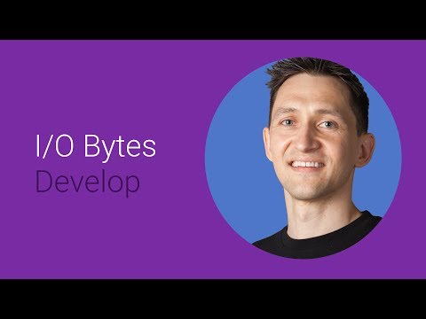

## Building great Android media experiences 

 

** 视频发布时间**
 
> 2014年6月25日

** 视频介绍**

>  Learn how to use the high-level Android multimedia APIs to quickly add media to your application, and create a great multimedia experience. This session will cover video playback and recording, controlling subtitles, and taking advantage of external displays.

** 视频推介语 **

>  暂无，待补充。

### 译者信息

| 翻译 | 润稿 | 终审 | 原始链接 | 中文字幕 |  翻译流水号  |  加入字幕组  |
| ----|----|----|----|----|----|----|
| TWL007  | 贺颂 | 暂无 | [ Youtube ]( https://www.youtube.com/watch?v=_ComBx_QiYY ) | [ Youtube ](https://www.youtube.com/watch?v=cw_0hZdtFu8) | 1504020510 | [ 加入 GDG 字幕组 ]( {{ book.host }}/join_translator ) |

### 解说词中文版：

画面  声音和音乐是我们每日生活中

重要的组成部分

对Android的生态环境以及应用方面来说更是如此

我是来自Android视频框架团队的Lajos

我将要讲述的是如何利用

我们一些专注视频的新API来

在Android上创造卓越的多媒体体验

好消息是你没必要作为一个访客

来将令人印象深刻的多媒体元素加入到你的程序中

因为Android已经为你做了很繁重的工作了

Android 拥有易用的高级API

可以让你用最小的工作量去

完成一些很常见的媒体任务

也就是说  可以去轻松的播放和录制视频

也可以轻松的去利用外部显示器

让我们讨论一下视频播放

准备好听一些好消息了么

这是最新加入的

在Android L的开发者预览中

当你使用高级API的时候

我们已经极大的改善了大多数视频播放时候的帧数表现

好了  我们继续

在Android中  最简单的回放视频方式是使用intents

这样做的好处是用户可以使用他们喜好的播放器

但换句话说

这意味着你无法控制回放体验

因此  当回放体验不是你的程序的主体时

你可以使用这种方式

当使用intents来播放媒体文件的时候

总是要设置文件类型  就像在本节的代码示例中描述的那样

这样系统可以为你的文件选择

最适合的媒体播放器

另一个最简单的播放视频的方法是使用系统播放器

MediaPlayer在最早期的Android中就已经存在了

它是把你的视频加入应用中最简单的方式

它包含一些播放控制

比如暂停  快进  以及选择输出在哪个surface

MediaPlayer的文档覆盖面很广

查看API参考  并不要错过API指南

中对一些常见任务以及问题的建议

MediaPlayer可以用来播放本地文件

以及来自网络的流媒体

支持的文件包含3GP  MP4  和通过RTSP或者HTTP流

传输的WebM文件

MediaPlayer也可以播放一些使用

HLS  HTTP实时流的自适应视频

请点击屏幕上的链接

获取更多支持的数据源和媒体文件格式的信息

现在让我们更深入的探讨如何  或更适当的

选择视频播放的位置

MediaPlayer可以在一个既可以是SurfaceView

也可以是一个GL texture的surface来显示视频

在Ice Cream Sandwich中也加入了对TextureView的支持

建议一句

Surfaces也许会被动态的改变或删除

所以建议将它作为Surface Holder Listener来实现

这就是你如何在SurfaceView上播放你的视频

使用SurfaceView的主要优势是

这是唯一一种可以让你播放受保护内容的方式

然而  因为它是一个window  并不是技术上所说的view

它不能像其他的view一样使用动画效果

下面  是一个更高级地使用TextureView的例子

在API Level 14中所介绍过的TextureView  

除了使用GL textures  其他方面看起来像一个SurfaceView

并且他是一个真正的view

正因为如此  它可以被应用动画效果

你也可以在一个GL composition中使

用一个带有texture输出的媒体播放器  

并且显示在一个GLSurfaceView或TextureView中

这就是你如何配置你的MediaPlayer来使用Surface Texture

最新添加到MediaPlayer中的

一个特性是支持显示字幕

在Android KitKat中就已经被介绍过了

你需要使用VideoView来实现这个

VideoView基本上就是一个带有专用MediaPlayer对象

加上显示字幕能力的SurfaceView

Android KitKat加入了对WebVTT格式字幕的支持

然而  一些WebVTT的特性现在并不被支持

使用MediaPlayer getTrackInfo来获取支持的字幕轨

如果播放一个HTTP实时流媒体  

WebVTT字幕轨内部会自动包含一个媒体轨列表

你也可以使用VideoView的Add Subtitle Source方法来加入字幕轨

就像这里描绘的一样的

你可以使用MediaPlayer's OnInfoListener来

监视成功添加的字幕轨

如果一个字幕轨被成功添加

一个新轨就会被创建

onInfo会被带着metadata update来调用

换句话说  如果一个错误发生

onInfo会带着不支持的字幕或者

字幕时间超时的信息被调用

你不能以程序的方式来开启或关闭字幕

这个只能通过你使用这个高亮的intent来

弹出的System Preferences来设置

在一个VideoView上同一时间

只能最多选择一个字幕轨

默认的情况下  会选择最符合

System Preferences的第一个轨

如果没有轨符合要求  就会是个空轨

如果设置改变  默认轨选择也会

再自动执行一遍

每个字幕拥有四个

对应轨选择的属性

前三个  强制  默认  以及自动选择是是否选项

这些经常被普遍的用于字幕

最后一个  可以说是最不重要的属性

是字幕的语言

默认轨选择十分复杂

每个轨会被使用好几个元素来衡量

如果字幕开启  第一个以及大多数情况下

我们首选项是选择没有被标记强制的轨

之后 我们首选选择被标记为默认的轨

只有当你的字幕语言设置到

默认的时候这个标准才会生效

第三  我们首选使用那些标记为自动选择的轨  那些我们估计没问题的

除非另有标记

最后  我们选择符合设置的字幕语言的轨

轨必须至少拥有一个设置标记

或者明确的符合默认设置的字幕语言来参与评级

如果字幕关闭  只有强制轨会被考虑

但是其他的优先参考标志依旧会保留

应用也可以使用MediaPlayer的选择轨  取消轨功能

来以程序的方式设置字幕轨

当这些完成的时候  不管怎么样  在System Preferences中的设置

不会再影响选择的字幕轨

直到VideoView被重置

现在你自己可以设置所有东西了

但是还没完事

你可以也应该注册CaptioningChangeListener回调

就像这里描述的  这样当字幕开启或者关闭

或者本地设置改变的时候

你就可以收到通知了

其他两个回调  字体以及样式改变

字幕渲染已经为你处理这些东西了

现在让我们说一下录制视频

最简单的录制视频的方法  跟你所猜的一样

就是使用intents 这样可以使用用户希望使用的摄像头

来记录视频到一个文件中

只有一种非常受限的方式

来支持设置录像参数

因此  录制视频的质量会极其

依赖于用户的设备

以及所使用的录像程序

因此  如果良好的视频录制质量不是你任务必需的一部分  

我们会推介这种方式

你可以在这个链接中找到更多的

关于如何使用intents来录制视频的细节

抓取或录制视频到一个本地文件的

首选容易方式是使用系统MediaRecorder

MediaRecorder伴随着Android的整个历史历程

它允许你对视频进行一些层级上的控制

比如视频的分辨率以及格式

我并不打算对其讨论太多

因为那里已经有一个很不错的

来教你使用MediaRecorder录制视频的开发者指南

去观看那个视频

并使用MediaRecorder

就剩下一件事情了

在Android L开发者预览中  加入了

从Surface中记录视频的支持

只是

我还没能拨云见日

谈论白热化的事物

看起来每个人都在兴奋的谈论第二块屏幕体验

Android已经帮你涵盖了这个功能

你可以使用Google Cast SDK来传输内容到一个广播接收设备上 

比如Chromecast

Android 2.3及以后的设备都支持Cast sender API

从KitKat MR1起  

你就可以传输屏幕镜像到Google Cast接收器上

使用presentation class来完成这个目标

演讲是一种特殊的会话

其目的是在第二块显示器上展示特定的内容

对于MediaRouter以及resentation classes

那有很出色的API指南以及参考资料

当然在Android SDK里也有两个奇妙的

使用了显示器管理或MediaRouter来

发现额外屏幕的示例程序

一定要去看一下哦

同时SDK还总结了这一集关于在Android上构建出色

多媒体体验的内容

现在去体验一下这些高级媒体API

更多的信息  如往常一样  访问Android开发者网站来获取

参考  指南  以及示例程序

感谢观看