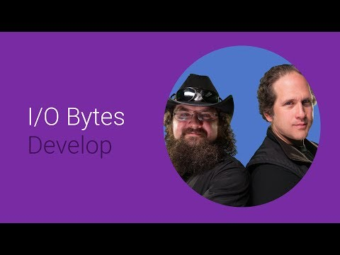

## Getting your Game on the Big Screen 

 

** 视频发布时间**
 
> 2014年6月25日

** 视频介绍**

> Different mediums draw different types of users, offering game developers the opportunity to expand into new market verticals. Learn how getting your titles on TV can help you unlock new types of users.

** 视频推介语 **

>  暂无，待补充。

### 译者信息 

| 翻译 | 润稿 | 终审 | 原始链接 | 中文字幕 |  翻译流水号  |  加入字幕组  |
| ----|----|----|----|----|----|----|
| Guangwei Feng | Wallace4ever | -- | [ Youtube ]( https://www.youtube.com/watch?v=kzuYtDy0ZHs ) | [ Youtube ](https://www.youtube.com/watch?v=MSUz5bRnT4g) | 1504020518 | [ 加入 GDG 字幕组 ]( {{ book.host }}/join_translator ) |

### 解说词中文版：

大家好 我是Dan

我是Google的一名游戏开发倡导者

我是Krispy  我也是Google的开发倡导者

主攻的是游戏方向

在这次视频中

我们将从提纲挈领地讨论如何为大屏幕开发游戏

不是那么巨大的屏幕

而是电视 更像这一个

我们将讨论开发过程中什么应该被避免

什么应该被直接应用 以及 Google APIs 是如何

让你的应用被部署到真正的大屏幕上

许多我们即将展示给你的

将被应用在大屏幕的设备上的

围绕游戏的Android生态系统

特别是 当你考虑到有许多Android设备

都可以连接到大的显示器上时

例如通过MiraCase DisplayPort接口 对接硬件

以及一些搭载了Android系统的电视

你已经拥有了一整套任你使用的技术

可以把你(的作品)展现在已经融合且增长中的观众面前

全世界有众多的手机游戏玩家

他们期待着能把之前的游戏体验

扩展到他们家里最大的屏幕上

我们期望看完这次视频之后

你能受到启发 并确认你的用户能

在大屏幕上获得最佳的用户体验

Android Tvs即将来到

每一个家庭和用户的身边 你最好

确定你的游戏在Android Tvs上体验良好

在Android TV到来之后

你需要延续你已存在的手机开发体验

你可以利用全部的最新的Android技术

包含NDK support库 来完善你的游戏世界

在不可思议的方面上

甚至可以把游戏体验扩展到

利用第二屏幕的交互

电视游戏开发

一开始似乎非常困难

考虑到有非常多的方面需要被考虑

在实践中 并不是非常区别于

你已经在做的手机游戏开发

你的项目可以通过相同的方法来搭建

你只需要多考虑一少许其他因素

让我们开始

从我最喜欢的 — 游戏控制类

许多手机游戏用户使用手势

在他们面前光滑的玻璃屏幕上触碰

来和游戏交互

这在手机上没有问题 但对于TV屏幕就不一样了

我的手臂一定不够长

来够着客厅的对面的电视

我也不行

在电视上 手机般的触碰控制变得没有意义了

即使我的手臂足够长

点触电视太久只会让你的屏幕变得很脏

是的 不是许多人

都有触碰电视 这就是为什么

你需要把touchscreen属性

设置为false 在你的程序的manifest文件里

这是隐含条件 这意味着你需要做出区别。

幸运的是 每一个Android TV

都具有一个能够产生定向垫输入的控制器

以此来让用户和TV交互

是的

而Android参照控制器绝对

是一个开发者的最佳伙伴

它拥有你所期望的游戏控制器应该拥有的

两个模拟摇杆 D-pad(方向触控板) B A X Y 按钮

左和右触发器 左右

缓冲按钮 返回按钮和Home按钮

它还可以和

拥有蓝牙适配器的Android设备进行配对

这意味着你可以玩支持遥控器的游戏

在手机或平板上

这通常是非常有用的事情

我经常非常惊讶和出其意料

当我发现一个游戏 如果有配对的控制器将非常好玩

但却发现这个游戏

不把控制器作为有效输入

甚至更糟糕的是 有的游戏居然用显示在屏幕上的 模拟的

游戏控制器

是的

让我觉得很忧伤 因为开发者已经

完成了相同输入工作的映射

但却没有包含按钮和硬件之间的映射

当所有的市面上的游戏控制器

都支持Android系统后 我不认为

有借口不去这样开发

可能是他们还不知道吧

有可能

但是如果你看完了这部视频 你就已经了解了

了解就已经赢得胜利的一半了

而且还有其他的一些事情你也需要知道的

举个例子 Android Kitkat已经支持了

枚举的控制器

支持这个功能的游戏控制器会亮起相关的指示灯

在你的程序中

你可以调用getControllerNumber函数

来判断控制器的输入信号已经被处理了

你可以用这个功能来确保你的弟弟妹妹

能成为2号玩家

你可以告诉Google Play

你的游戏需要一个游戏控制器

这会在Android TV的Play Store上显示出来

你可以在程序的配置文档中加入细节

这个示例说明这个游戏必须用游戏控制器来玩

你还可以列出所有你的游戏支持的控制器的类型

如果你需要一个多点触控的屏幕

陀螺仪 或者一个游戏控制器

你可以在配置文件中的feature-group来定义它

现在你已经加入了配置支持

在配置文件和游戏中 但还没有完成

你需要考虑用户应该怎么样

选择菜单内容 以及非游戏性输入

最难的事情是

游戏开发者需要处理焦点和选项

许多游戏被设计用触控 所有没有考虑到这些问题

一个可以开始的地方是

改变被选中的字体的颜色

但仅有这个还不足够

在这个例子中 你真的不能

判断是 开始游戏 还是 设置 按钮被选中了

这样就会好一些

最好还是给它加上动画

用动画来传递相关信息

搞定

许多游戏有很多按钮

来连接社会化分享服务等等

这些按钮通常在不是那么明显和导航的地方

这样就更容易关注别人了 是吧？

是的 但是你显然不是一个用户体验工程师

记住 一定要聘请一个好的设计师

一个我最近非常喜欢的游戏

非常出色的把他们的游戏带到了电视

和导航菜单上 但是

几乎不可能购买任何游戏物品

在不触碰屏幕的情况下

进入购买页面让人很沮丧吧？

但是没有人会觉得累如果用控制器来购买

Google Play 的in-app付款支持D-pad导航来移出

游戏框 并且在TV上的界面看起来不错

但是你得确定用户可以把焦点移到那里

让你的导航清晰易懂

是很和你的主菜单一样重要的事情

确保你的TV玩家没有被遗忘掉

让我们换一个话题

来讨论TV开发清单上的另一个重要问题

网络

你可能认为

自己了解Android的网络探测

但是许多开发者忘记去考虑一种可能性

用户可能用以太网连接来连接 当他们开发TV应用的时候

Android TV拥有

有线以太网端口允许更快的网络传输

这意味着Wi-Fi可能被关闭了

但是却仍然连接着因特网

移动开发者不用担心

该怎么去修复 因为设备比较固定

开发者不会通常

写网络检测的代码的时候

考虑除蜂窝网和Wi-Fi以外的连接

好消息是 这非常简单

测试网络连接的时候不需要担心类型

用这些代码

如果你真的想检查有线以太网是否连接了

你可以检查看激活的网络

类型是不是以太网

你应该理解激活的硬件

可以让你的游戏做出更好的选择来使用带宽

聊到硬件 Android TV

拥有图像硬件使用OpenGL ES的力量

你可以画满你电视的TV的全分辨率

用许多像素来负责填充

要明智的使用你像素的力量

是的

事实上我们还不能

用手机的GPU来绘制图形密集的4k场景

暂时是这样

但是有一种简单的方法告诉Android

你想转换为低分辨率

如果你在使用Java 你可以调用

SurfaceHolder.setFixedSize方法

可以告诉你的复合引擎来缩放你的

窗口和屏幕一样大

如果你和其他众多游戏

开发者一样 不用Java开实现图像

你可以在目标窗口中改变size属性

是的 你依旧可以用

GLSurfaceView来本地渲染

上下文属性是共享的

最关键的事情是 你需要确定

你的游戏在大屏幕上看起来很漂亮

许多手机上的快捷键在大屏幕上看起来比较发虚

低分辨率的纹理 低多边形数量模型

几何舍入误差 粗偶差位映射

看 这就是我所说的

是的 兄弟

所以用上这些炫酷的渲染

还有一件事你需要考虑

当你为TV开发的时候

除了史诗级的尺寸问题？

超出屏幕

这件事情 依然存在莫名其妙地存在在现代电视上

实际上 这意味着你的一些内容

可能被推出了显示的可视区域

所以人们需要拓宽屏幕并使用边距嘛？

不

仅仅需要你填满了屏幕

但是让重要信息距离显示边距至少3%

想什么样的重要信息？

顶部状态条 举个例子

让用户看到它非常重要

这通常变得让人生气让用户摆弄

电视设置来尝试能看到你游戏的全部UI

却发现不论怎么更改设置

他们还是不能看到全部内容

所以请让游戏的关键信息远离屏幕的边缘

我希望每一个开发者都知道超屏问题

而不是被迫去了解

让我们看看开发者用

Google Play游戏服务能做什么

Google Play游戏服务

已经被优化来显示Android TV 带有简单的导航

和全新的感官效果

你可以使用成就 领先榜

任务和更多

更多多玩家支持

是的

你可以采用回合制多玩家

和及时多玩家类型 来自Play服务

甚至还有给回合制多玩家的C++支持

我想看一些炫酷的多玩家

游戏体验 当用户用平板玩的时候

在同一间房间里 能听见他们的吼叫

在客厅第二屏体验的数量正在增加

游戏存档可以保持用户参与一个重要的工具

把移动体验扩展到TV

意味着可以在大屏幕上继续游戏

家里最大 最爽 最容易的屏幕

合作多玩家也是值得的

Google Play的游戏有一个重要的API来支持对战类多玩家游戏

至多可以有8名玩家

它会更加更炫酷 如果他们中的一些可以在电视上进行 

在TV上所有事情都变的更好了

你可以解锁你的RTFM成就

等一下 什么成就?

阅读完整的说明书.

它不完全是一个手册 最好是一个网站

我们一直尝试把它变得更好

而关于这一点 有助于我们做出的电视游戏更好。

在这短短的谈话中 我们讨论了很多基础

但是有更多值得去探索的

总结一下 我们

看了游戏控制器 导航的重要性

焦点和选择条

网络操作 和为什么寻找Wi-Fi不是那么重要

TV上的图像渲染和

显示屏可以展示多少的挑战

最后 Google Play服务 以及它是如何帮助

用户带来最好的TV游戏体验

更多详细关于怎样让你的游戏

为TV做好准备 可以在Android TV的新开发者网站中找到

包括重要配置改变

来使用我们全新精简的体验

你可以通过 +DanGalpin 和 @dagalpin来和我们保持联系

以及+KristanUccello或@_krispy_

现在去创造一些有趣 吸引人和能够在

大电视上玩的游戏吧！

