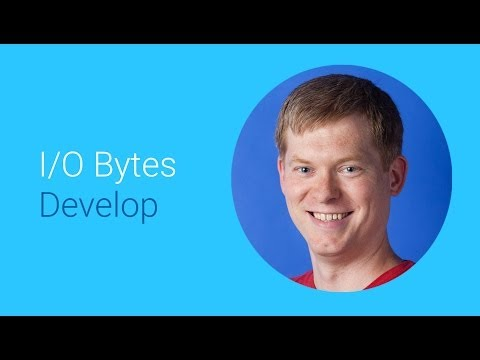

## Building Apps For Android TV

 

** 视频发布时间**
 
> 2014年6月25日

** 视频介绍**

>  Tim Kilbourn gives us an overview of building apps for Android TV with the new Leanback support library.

** 视频推介语 **

>  暂无，待补充。

### 译者信息

| 翻译 | 润稿 | 终审 | 原始链接 | 中文字幕 |  翻译流水号  |  加入字幕组  |
| ----|----|----|----|----|----|----|
| 苏楚霖  | wang7x | 暂无 | [ Youtube ]( https://www.youtube.com/watch?v=lfTECEAH8o8 ) | [ Youtube ](https://www.youtube.com/watch?v=CJTtPgkv8fU) | 1504020520 | [ 加入 GDG 字幕组 ]( http://www.gfansub.com/join_translator ) |

### 解说词中文版：

大家好  我是Tim Kilbourn

来自Android Framework Team

今天我想聊聊如何开发Android电视的应用

Android电视的应用也使用

Android框架里的组件和工具开发

如果你已经开发过手机或者平板的app

那你的经验也适用于开发电视应用

但是  相对于开发手机  平板应用 

开发电视应用有些独特之处

特别是电视的成像像素

比手机或者平板要低得多

没有人愿意在电视上看一堆文本

而且  我们跟电视是通过方向键交互

例如远程遥控或者游戏手柄  而不是触摸

因此确保app里所有重要的元素都是可光标定位的(focus-able)

看看这个为Android电视开发的app的例子

这个app使用尽量少的文本内容

可以通过方向键到达任何内容

使用面板来导航也非常方便

事实上  对于电视的app来说  这种浏览方式是非常普遍的

因此我们创建了一个新的类库

帮助你给大屏幕应用创建更漂亮更易用的app

通过使用Leanback类库的插件和元素

你将能迅速的创建出

更适合电视的app

这个Leanback类库是基于

Model-View-Presenter(MVP)模式的

使用它可以很方便的

将内容的展示方式和存储数据的model对象

隔离开来

model对象抽象于你的app

框架对它没有任何限制

这样不用更改model对象就可以升级一个已有的app

使其能运行在电视上

Views是你已经了解了的不能再爱的Android标准视图

像文本视图  图片视图等等

我们在这个类库里给Android带来的新东西就是Presenter

只要给Presenter一个model对象

它就能将对象里的数据跟View绑定在一起

这样类库的代码就可以用来在你app

里的所有页面显示东西了

特别是相同的项目可以以不同的方式

app里的不同位置来呈现

而这些只需要简单的替换Presenter就可以了

让我们看些例子

这个屏幕页面可以让用户在

内容分类里浏览

这是使用Leanback类库的browse fragment

来实现的

在fragment被初始化时 只需要提供一个适配器对象

里面包含了model对象和

渲染model对象的Presenter

fragment里的类库代码会解决剩余的事情

调用这些方法  那么每个组件的

presenter会逐行显示其内容

接下来  类库还提供一个详情屏幕页面

同一个对象模型 

之前是用小卡片视图显示 

现在却可以通过使用不同的Presenter

来展示更多的细节

我们也能看到在详情总览下面

有几行关联内容

这些也都是Presenters实现的

app内部搜索也是这样实现的

你的app会接收到用户输入的

搜索关键词  然后搜索引擎使用

对象适配器和你指定用来

展示结果的Presenters来实现

还有其他东西能让你的app 

在电视上表现更加完美

我们设计了新的加载器

针对需要尽快展示的内容

进行了优化

它从内容推荐开始

使用现有的Android notifications API

你的app就可以推送用户接下来想看的

视频或者其他内容

你定义好文本和卡片式图片数据

启动器会在主页面显眼位置

展示推荐内容

用户对推荐内容的响应

将决定推荐内容的展示顺序

因此确保你正在开发一款高质量的app

让用户愿意继续使用你的app

大家可以在Android电视的开发网站上

找到关于Presenters  Fragments 和 Content Recommendations

更多的细节和代码

谢谢观看

试试开发你自己的Android电视app吧

