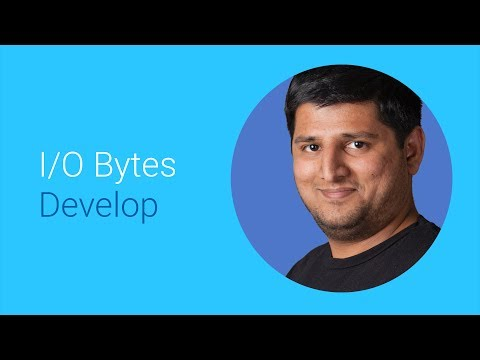

## Demystifying encodes and decodes of WebM

 

** 视频发布时间**
 
> 2014年6月25日

** 视频介绍**

> Tips, tricks and practices to encode a video into WebM using VPx codecs for delivery across the web and on Android.

** 视频推介语 **

>  暂无，待补充。

### 译者信息 

| 翻译 | 润稿 | 终审 | 原始链接 | 中文字幕 |  翻译流水号  |  加入字幕组  |
| ----|----|----|----|----|----|----|
| Alice | Martin | -- | [ Youtube ]( https://www.youtube.com/watch?v=o-TAyIQBOuA ) | [ Youtube ](https://www.youtube.com/watch?v=V0WjC4TDMPM) | 1504020521 | [ 加入 GDG 字幕组 ]( {{ book.host }}/join_translator ) |

### 解说词中文版：

在过去的几年中  我们看到网络上的媒体消耗

呈现令人难以置信的增长  但是网络带宽

并没有保持同样的增长步伐

我是Vignesh

我在这里要探讨一下如何通过利用

一种新的网页视频格式来解决这个问题

视频已经被认为占用了

全世界网络带宽峰值的一半

在某些地方  甚至占用了网络带宽峰值的2/3

WebM项目是一个开放工具和多媒体技术的集合

它的目的是解决网络中媒体带来的挑战

和开展针对多媒体技术的

开放的自由的沟通

WebM项目开发了两种视频编码 VP8 和 VP9

媒体容器  也就是WebM容器

和一种叫WebP的图片格式

这些技术一同驱动

你所喜爱的一些Google服务

比如YouTube和Hangouts

他们也在网络中被广泛使用

例如 NetFlex和Facebook使用WebP

我们在2013年的I/O会议上推出了下一代开放视频编码VP9

使用VP9编码的视频在压缩效率上

比其他的方式提高了50%

目前 Chrome FireFox Opera和Android 

支持VP9视频播放

自从2013年的I/O会议以后  我们在速度

和压缩效率上对VP9进行了改进

这使得YouTube可以选择

VP9作为他们下一代的视频编码

如果你在2013I/O会议之后对VP9的更新感兴趣

请浏览我们的视频  VP9的更新

此外  如果你想更深入的

了解压缩性能实现的编码技术

我们强烈推荐你浏览

我们在2013 I/O会议VP9环节的视频

它叫做  新的开放式视频编码

在这个视频中  我会关注

如何用开源工具使编码VP9视频变得简单

然后继续讨论我们怎么播放这些视频

首先是简单的渐进编码

假设你想编码一个视频

然后希望它能在各种设备中播放

换句话说  你想做的只是

主机上有一个视频  以主机的URL作为源

通过视频标签来播放它

这里是实现方法

递进编码非常简单  它允许任何支持

VP9的播放器下载并播放文件

例如Chrome FireFox和Android

这是建立一个递进的VP9编码的方法

你需要做的只是绑定FFmpeg到

你的输入文件  并设定它使用VP9编码器

这是播放视频的方法

这很简单  不是吗

如果你有更简单的方法

欢迎你把想法发送到这个电子邮箱

好了  如果你想在网络上提供视频服务

你还可以采用

一些HTML5相关技术

HTML5技术使你可以给你的客户

提供非常流畅的体验

以往的技术是很难实现的

用来解决这个问题的工业标准叫做DASH

DASH表示HTTP上的动态自适应流

它让你根据客户端的约束

选择能够提供

最佳可视质量的流数据

实际上  这是

端适应播放

在google  我们使用DASH和HTML5技术实现自适应播放

比如  多媒体源扩展

在YouTube上提供很棒的流畅体验

例如  使用VP9和DASH

我们改善了流媒体视频的关键参数  重缓冲

VP9 DASH视频对重缓冲的改善

在成熟市场大概有25%  在新出现的市场能达到50%

我们从多媒体开发者那里听说

为VP9建立DASH清单是很有挑战的事情

我很高兴的宣布我们使用FFmpeg

以及一系列开源工具

可以简化编码过程

现在让我们来看看如何编码VP9 DASH视频

并产生清单文件

对VP9视频进行编码  使它与DASH兼容

与渐进编码非常相似

只需要进行一些小改动

对于DASH来说  视频和音频

被分开编码  并保存到不同的文件中

你还需要传递额外的DASH变量给FFmpeg

这样它会产生与DASH相兼容的WebM文件

现在你已经有了编码过的视频和音频文件

你可以使用WebM的DASH清单工具

来产生DASH清单文件

WebM DASH清单工具是WebM工具项目的一部分

你可以在页面上的网址

下载我们使用的工具  通过它建立DASH流

和清单文件

好了  现在让我们说说集成一个视频播放器

通过DASH 播放VP9视频

重申一下  VP9解码已经

支持Chrome FireFox Opera和Android

同时  这代表着超过10亿的设备和浏览器

可以播放VP9视频

尽管这里有两款播放器能使其简单一些

但是创建一个VP9的播放器播放自适应视频

还是有些难度的

这两款播放器能使自适应VP9播放在两个

最流行的平台上运行  Web和Android

首先是Android

YouTube开源播放器叫做

Exo播放器  它支持VP9的自适应播放

想知道更多关于在你的应用中使用Exo播放器

播放VP9 DASH视频  可以在YouTube上看关于Exo播放器的话题

对于Web  我们在dash.js中加入了对VP9 DASH的支持

dash.js是一个非常好的多功能媒体播放器

并完全建立在HTML5上

关于如何使用dash.js来播放自适应VP9视频

可以在页面的网址上找到更多信息

使用这些工具  VP9内容的编解码

变得容易多了

现在轮到你们讲述了不起的故事

或者开发下一个了不起视频播放器了

当然  我们随时可以提供帮助

在webm-discuss@webmproject.org上给我们留言

谢谢

