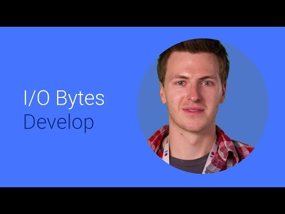

## From Holo to Material 

  

** 视频发布时间**
 
> 2014年6月25日

** 视频介绍**

> Do you have a Holo-themed app that you want to update to use the new Material styling available in Android L? I'll show you the basics of how to do this, along with some pointers along the way.

** 视频推介语 **

>  暂无，待补充。

### 译者信息 

| 翻译 | 润稿 | 终审 | 原始链接 | 中文字幕 |  翻译流水号  |  加入字幕组  |
| ----|----|----|----|----|----|----|
| Galory | 任皓 | -- | [ Youtube ]( https://www.youtube.com/watch?v=x5-ntYM_2UY ) | [ Youtube ](https://www.youtube.com/watch?v=Ue7c0IAUVwI) | 1504020526 | [ 加入 GDG 字幕组 ]( {{ book.host }}/join_translator ) |

### 解说词中文版：

CHRIS BANES  嗨  我是Charis

我在 Goolge 开发者关系团队工作

你想使用新的随Android L(Lollipop)发布的Material样式来

改进你应用程序的外观么

我将向你展示怎么办  以我Banesy的

顶尖建议

但是首先  有一个关于新的Material

设计原则的介绍

这些原则适用于所有的设备

从 Android设备到网页浏览器

他们是我们设计应用程序外观  运动和交互的

综合性设计指南

好  为了开始这一学习旅程  我们需要一个应用程序案例

我们将使用XYZ Reader  你可能以前

看过这个视频  名字叫Android Design Action

现在这个应用程序最大化地利用了

一个优秀Android应用具备的很多要素

像是操作栏上色彩的设计

对触摸的反馈响应  标准尺寸的使用   

图形化的显著使用  不管是在列表上  还是细节的UI上

我们的目标是使得它像这样

那我们开始吧

第一步是改变它的主题

从Android L中可用的新的Material主题  

找一个来继承  那里有等量的Material主题

相对于你的应用程序现用的大多数Holo主题

我们的案例应用程序使用了DarkActionBar作为

基础主题  因此我们会在值为v21的文件夹里创建

一个新的样式XML文件来重新定义

现有主题  Bacon主题继承自DarkActionBar主题   

的Material版本

做完这个之后  我们将做

的事情看上去是这样的

现在  你应该注意到了很多东西

默认的操作栏现在更加丰富多彩

而且这与在UI设计中鼓励色彩的使用密切相关

可点击项目现在接受新的填充触摸反馈

整体上看  因为空间采用不同的方式处理

衡量标准发生了变化

因此我们还没有自定义Material主题

我们继续  把我们的品牌色彩加入到应用程序里

但是在我们继续之前  先来回顾一下

来看看我们需要怎样用Holo来实现自定义颜色功能

下面是我们styles文件的一小部分

我们只是自定义了菜单栏

而且你可以看到主题相当复杂

如果你也开始自定义任何标准的小部件

比如按钮或任何文本  你的styles文件

很容易就会变成几百行

有一个明显的缺点

就是它很难维护和更新

但是你也需要在应用程序里把有色彩的

需要绘制的东西打包  比如这些  会增加不必要的膨胀

很幸运的是现在有很多诸如任务栏样式生成器和

Android Holo Colors的工具可以让这变得很简单

但是如果能够在不投入很多工作量的情况下

实现它不是会更好吗

有个好消息是Android L的新的主题化功能

也可以实现这一点

而不需要捆绑那些用来绘制的东西或样式定义

这个新功能允许你在主样式里

声明自己的颜色方案

这是通过设置新的属性  其中最重要的两个

是colorPrimary和colorPrimaryDark

colorPrimary是你的应用程序的主品牌色

而且应用栏和滚动边缘效以及

其他内置部件使用

colorPrimaryDark  正如名字所诠释的  

是colorPrimary的暗变

被用在文本菜单栏和其他方面的配色上

那么回到我们的案例应用程序上  我们的styles文件

变成了下边的  colorPrimary

和colorPrimaryDark在源里设置成了两种颜色

bacon和crispy bacon

之后  我们的案例应用程序就变成这样

你会发现菜单栏和边缘效果已经

改变了颜色来和我们的配色方案搭配

MALE SPEAKER  Banesy的最佳提示

CHRIS BANES  在内部有很多

允许为新绘制对象着色

这是一个很棒的新特点

能允许你在运行时轻易重新绘制颜色

这里有一个可绘制的XML  指定为红色调

使用另一种可绘制对象作为源

另外还有setTint方法在绘制对象上

可以做同样的事

下一步是看应用程序的布局

Material设计原则介绍了一种新方式

来思考应用程序里的空间

使用baseline grids和keylines来提升整体一致性

贯穿整个系统为一体的

接下来我们

将提供关于空间  填充和总体指标

的详细指南

最常见的容器和元素

如列表  网格和按钮

现在要注意大多数情况下很重要的一点

这些指标不由框架指定

意味着你要自己实现它们的布局

我们现在也有一组标准的类型样式和缩放

这些每一个都被选定

来为用户平衡内容密度使得阅读舒适

结合Android L中用的新Roboto字体

更圆  更宽

这些样式会使得你的文本内容更清晰

那么回到我们的案例应用程序

我们将我们的列表转换成一个网格

让我们的形象更加突出

并加入快速直观的理解

为了做到这一点  我们要采取网格容器指南

并将其应用到我们的meats列表里

每个容器引导

趋于具有许多不同的变体  以允许

灵活显示你想显示的内容类型

这里我们将使用两个长的变体

在网格组件导向里有其他变体

每个项目显示不同的文本行数和图形

那么我们看看更深入的指南

每个项目会显示一个方形的图像

伴随有两行文字  既可以覆盖在图像上

也可以内联

它指定了字体和字号的类型

和你所有项目的div间距

在这个变体  我们对文本字体有两种选择

一种是16sp的第一行  12sp的第二行

或者两行都是14sp

现在  你用哪一个取决于你文本的相对

重要性

这个做完之后  它的外观就像这样了

每个项目都为增加图像的尺寸设置一个通行证

而且我们已经最小化了需要显示

文本的数量

现在很明显  我们只在这里只看到了一个屏幕

而且大多数应用程序远远多于这个

你需要浏览设计指南

应用了所有的适当布局指南到你的应用程序UI中

MALE SPEAKER  Banesy的最佳建议

CHRIS BANES  你要在应用程序里使用

大量标准的keylines  以取代你的布局里硬编码一些值

艰难编码  确保你要声明他们

位置是dimension资源

这是开始的三步

但还有更多可以加入

现在我们进入到意象

意象在新的设计语言中是关键原则之一

它应当用来显示相关性  传达信息

并且取悦用户

现在  针对这一部分  我们将

聚焦应用程序的屏幕细节上

当前布局应当利用其全出血图像

的图像

但是  我们将通过使得更身临其境来改善

我们即将做的方式是

采用Android KitKat里添加的

半透明状态栏功能

现在这样使我们能够让应用栏半透明

当内容滚动到顶部时

这使得意象流到外面 [INAUDIBLE]

我们然后把应用程序栏回到视图

当图像和标题都滚出视图时

这种技术是不依赖于Android L中

任何新功能的

这样你就可以在过去的版本中使用它

事实上  Google Play里的许多应用程序已经做到了

你可能已经在Google Play Music应用程序里看到了

我们还让标题和副标题成了视图

或者将它们移出图像  并移植进自己的对比布局里

如此反复  使用应用程序的主色

来强调我们的品牌

最后  正文已经被从设计指南上调整

以匹配主体构造风格

因此最后  这是我们的最终结果

做一个快速回顾  我们的品牌颜色

现在用于整个应用程序  每个画面都使用的

新的基础网格和keylines

我们通过使得UI细节上更加身临其境来

彰显我们的意象

MALE SPEAKER  Banesy最佳建议

CHRIS BANES  你想知道如何

实现半透明的状态栏淡入效果吧

嗯 Roman Nurik最近发布了一个超棒的Android

开发工具protip

作为其中的一部分  他写了DrawInsetsFrameLayout

使得实现起来很简单

你可以从Github上获取他的代码

但乐趣并不仅限于此  

为了帮助你的应用程序实现这一高度

这里我们为这一版添加了更多东西

活动场景转换  

允许你从从Activity到另一个Activity时

API时使用场景和转换API

RecyclerView是我们的下一代适应性视图

旨在取代ListView和GridView控件

RecyclerView已经被设计成

用于铺设逻辑是可插拔的项目

也就是说  你现在可以完全控制

Android已经走向了3D  有了Z轴的高度

以及可以在x和y轴上移动

现在可以在z轴移动

这可以让你的视角来远离屏幕

投射实时阴影创造深度用户界面

最后

浮动的操作按钮是保留按钮的新类型

对你大多数重要的动作而言

他们被识别为一个圆形图标

它漂浮在你的UI上面

感谢您的收看  看看能做些什么

