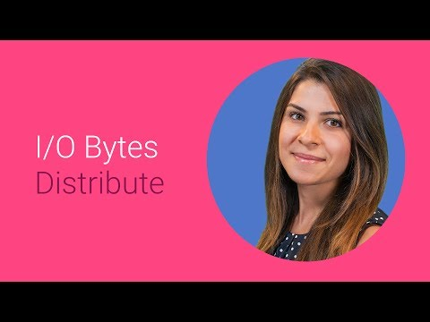

## Subscriptions Made Easy with Google Play

** 视频发布时间**
 
> 2014年6月25日

** 视频介绍**

> What are subscription products on Google Play? When should you use them? How can you use them? This presentation answers these three questions. It also covers upcoming functionality in the Developer Console and the Play APIs -- including setting up weekly and seasonal subscriptions, and enabling your app users to upgrade and downgrade from and to your different subscription products.

** 视频推介语 **

>  暂无，待补充。

### 译者信息

| 翻译 | 润稿 | 终审 | 原始链接 | 中文字幕 |  翻译流水号  |  加入字幕组  |
| -- | -- | -- | -- | -- |  -- | -- | -- |
| Galory | 點墨 | —— | [ Youtube ]( https://www.youtube.com/watch?v=GR2s3L9_ziQ )  |  [ Youtube ]( https://www.youtube.com/watch?v=-Cz_sdzOpJ4&index=8&list=PLvivLNHqjoozvtCAfxwudl-mJ2CVLKZGB ) | 1504030531 | [ 加入 GDG 字幕组 ]( http://www.gfansub.com/join_translator )  |

### 解说词中文版：

ZEINA OWEIS: 嗨

我叫Zeina  是一名Google Play团队的

产品经理 

作为一名Google Play应用程序的开发者

你可能在想

如何才能收回企业成本

谁不想挣钱呢

靠你的应用程序和游戏挣钱的一个方法是一次性购买

不过你还可以通过基于订阅的支付

来实现更大的利润

订阅的好处在于

它可以让你与买家之间形成持续的联系

订阅是双赢的

用户选择自动定期付款

因为他们可以以折扣价来获取相同的巨大价值

反过来  你会得到更多的收入和更多的快乐买家

目前  订阅适应于各种类别的应用

比如纽约时报这样的新闻类应用

MLB At Bat这样的运动类应用

以及类似SmartEducation开发的教育类游戏

Google Play的订阅量一直在增长

而且还会继续季季增长

Google Play订阅包含在我们的应用内结算服务里

因此你将获取同以往一次性购买相同的利润

因此你将获取同以往一次性购买相同的利润

包括全球支付  自动化的财报和存款

包括全球支付  自动化的财报和存款

所以你的应用从来不需要直接处理任何金融交易

最重要的是  应用内结算解决了定期付款的头痛问题

最重要的是  应用内结算解决了定期付款的头痛问题

这样你就可以专注于建立优质的服务

和成功的商业模式

开发者控制台可以让你全面掌控每个订阅产品的定价和计费周期

开发者控制台可以让你全面掌控每个订阅产品的定价和计费周期

选择最适合你服务的计费周期

我们目前支持月度和年度订阅

很快我们也会支持周度和季度订阅

很快我们也会支持周度和季度订阅

你可以为用户提供多种可供选择的方案

比如  你可以新建一个每月5美元的基本方案

和每月10美元的专业方案

而免费试用是一个很棒的方式来鼓励用户

在提交定期付款之前试用服务

咨询一下自己喜欢的市场专家

他们可能会告诉你免费试用是要走的路

当你增加了一个订阅产品

你能做的一个选择是

设置试用期应该持续多久

当然  如果你确实选择提供试用期

注册用户在试用期结束前是不会被扣费的

注册用户在试用期结束前是不会被扣费的

而像其他应用内项目

你可以使用第3版的应用内结算API

在用户登录进你的服务时验证订阅的状态

在用户登录进你的服务时验证订阅的状态

GetPurchases将返回所有活动中的订阅

包括处于试用期的

以及该计费周期结束就取消的订阅

您也可以通过调用GetBuyIntent启动一个购买意向

它的用法几乎和应用内项目一样

只要传给它Item_Type_Subs和你订阅产品的skewID

只要传给它Item_Type_Subs和你订阅产品的skewID

购买令牌可用于你的后端服务器

和Google Play之间同步订阅状态

那么如何维护这些订阅者呢

有时候他们可能不完全满意

你为他们提供的服务

如果有这种事发生

你可以尽快给他们免费一或两周以示好用户

如果你那样做了  他们会很高兴并可能继续订购

甚至更好一点  当他们知道你确实有为任何不可预见的质量差的服务做补偿

甚至更好一点  当他们知道你确实有为任何不可预见的质量差的服务做补偿

他们将传播这些事  而你会得到更多人的订阅

不过  他们有时还是要取消订阅

同样  你可以通过API做到这一点

你可以在他们的收费期

结束后取消订阅

很快  你也可以以全额退款

立即撤销

如果你拿出一个新的伟大的订阅计划

或者你希望你的比较满意的用户从  比如说  月度

移动到年度计划又该怎么办呢

好了  很快你就可以

很容易地添加新订阅计划的购买意向

并允许用户从一种方案切换到另一个

那么下一步呢

好吧  如果你的应用程序可以通过订阅为你的用户

提供极大的价值  那么应用内结算

将同基于订阅的支付一样简单  

将同基于订阅的支付一样简单  

正如我所说  当谈到支付

你不必做任何事

我们处理所有定期付款并存入

到你指定的银行账户

因此你可以专注于自己最擅长的

创造美丽吸引人的应用程序和游戏

如果你准备要开始了  核对一下

开发者帮助中心的文档

有了Google Play订阅的力量

它从未如此轻松地创建与你的用户

有意义和持久的关系

所以  出发吧  创造辉煌  感谢你的收看

