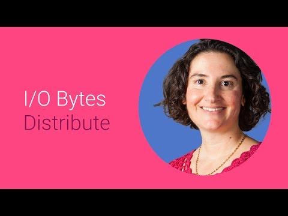

## Maximizing discoverability on Google Play

** 视频发布时间**
 
> 2014年6月25日

** 视频介绍**

> When Google Play surfaces more relevant content to individual users, more developers benefit. Learn how Google is leveraging machine learning to get good at increasing conversion through Google Play search and discovery. (video only)

** 视频推介语 **

>  暂无，待补充。

### 译者信息

| 翻译 | 润稿 | 终审 | 原始链接 | 中文字幕 |  翻译流水号  |  加入字幕组  |
| -- | -- | -- | -- | -- |  -- | -- | -- |
| Alice | 點墨 | —— | [ Youtube ]( https://www.youtube.com/watch?v=lZHwodEg0Xo )  |  [ Youtube ]( https://www.youtube.com/watch?v=aOB_WFwWLrU ) | 1504030538 | [ 加入 GDG 字幕组 ]( {{ book.host }}/join_translator )  |

### 解说词中文版：

RELLY BRANDMAN: 嗨 开发者们

我打赌你在寻找增加你的应用被用户可见和

实现数以百万计下载量的方法

我是Relly

我是Google Play搜索发现组的产品经理

我可以帮助你

对于应用来说 可见性和可发现性

对想在Google Play上被用户检索到是非常重要的

对于典型的应用 绝大部分的安装都是通过搜索实现的

作为一个应用开发者 当用户

搜索一些类似你的应用所能实现的应用时

你希望他们能找到你的应用

想要优化这个过程 意味着

你要了解用户采用哪些种类的搜索 然后

使你的应用数据支持这些搜索

用户一般采用两种搜索方式

第一种是对于那些知道自己要找

什么应用的用户的

例如 对于那些直接通过你应用的名字

来进行搜索的用户

名字并不仅仅是品牌问题

应用的名字能明确的描述应用到底

是干什么的是非常重要的

你的应用是关于网络收音机的么 或是旅行计划 或是播客?

名字清楚明了能抓住那些感兴趣的用户的关注

让你的应用

第二种是用于那些不是明确知道

他们到底要什么的用户的

他们通过关键字 例如属性 来搜索 

例如 我喜欢益智类游戏

同时我喜欢精灵

当你得到用户的关注之后

他们会点击你的应用

关于你的应用的信息会显示出来

你的应用的描述应该清晰的

告诉用户这个应用能做什么 以及他们为什么需要这个应用

接下来 你可以吹嘘你的应有有多么成功

你得过哪些奖励等等

俗话说的好 耳听为虚眼见为实 一张图胜过千言万语

有些用户会通过截图和视频

来判断应用的质量

因此 高质量的应用会尽力提供高质量的

截图和视频供用户浏览

你把你的应用体验越多的呈现给用户

他们也就越有可能下载你的应用

记住 在搜索时 你不需要

做所有的事情

Google Play不断的搜集和统计

安装 卸载 重新安装和参与等数据

那些在所有的统计中都胜出的应用

会更有可能排在搜索结果的前列

所以你能做的最重要的事就是

创造最佳的用户体验

无论是什么样的应用

我们都知道那种咖啡不足的日子的感受

你不知道你到底要找什么

有时 你只是坐在那里 浏览Google Play商店

不做任何搜索 只是寻找新的很棒的应用

基本上有两种浏览方式

第一种是浏览应用主页

第二种是浏览排行榜

当用户打开Google Play商店并点击应用选项

他们会进入到我们所说的应用主页

这个网页包含排行榜和

用户可浏览的目录

例如 新的或者是更新的应用 生活方式应用和学习工具

很酷的是这个网页是针对每个用户个性化过的

而主页的内容是Google Play

为每个用户提供的最新的或者有趣的应用

不关系用户是否对它们感兴趣

当然还有排行榜

如收费应用排行 免费应用排行 下载总量排行

这些排行是新老用户

了解最受欢迎的应用的通用方法

你可能想知道如何让自己的应用

上榜

跟所有的搜索系统一样

我们持续调整我们的算法

从而给用户更好的体验

收费应用排行 免费应用排行和下载总量排行

主要针对新用户或者是刚刚得到一个新设备的用户

他们在寻找推荐的最好的和最受欢迎的应用

从而开始上手

最新付费应用排行和最新免费应用排行会显示那些新上线的且受欢迎的应用

由于这个原因 我们只会列出

最近才推出的应用

最后 变化趋势排行会显示

那些在最近的变化窗口中 排名变化

超出我们预期的应用

这个列表帮助用户了解什么是当前热门的应用

你完成了一个不可思议的应用

现在你也知道如何

在Google Play上最大化你的应用被搜索到的可能性

想要了解更多 请到developer.android.com网站上阅读我们的开发者指南

现在就去让你的应用的下载量打破百万用户的大关吧

谢谢收看

