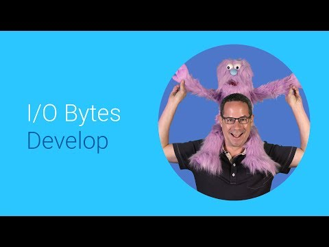

## Fabulous Forms for the multi-device web  

  

** 视频发布时间**
 
> 2014年6月25日

** 视频介绍**

> How to build great forms that work beautiful on the multi-device web, content includes labeling, auto-complete, requestAutoComplete, validation, semantic input types, and best practices.

** 视频推介语 **

>  暂无，待补充。

### 译者信息

| 翻译 | 润稿 | 终审 | 原始链接 | 中文字幕 |  翻译流水号  |  加入字幕组  |
| -- | -- | -- | -- | -- |  -- | -- | -- |
| wang7x | wang7x | -- | [ Youtube ]( https://www.youtube.com/watch?v=iYYHRwLqrKM )  |  [ Youtube ]( https://www.youtube.com/watch?v=38a3XT49Ros ) | 1505070816 | [ 加入 GDG 字幕组 ]( http://www.gfansub.com/join_translator )  |

### 解说词中文版：

噢

噢

开始录了吗?

已经开始了?

好的

好 大家好

大家好

大家好

我是Pete Monster  是Google的开发者大使

我认为internet是面向表单的

填写表单困难是一个痛点  特别是在移动设备上

输入键盘都很窄小  不得不来回切换 

我们小怪兽都没什么耐心  用我们毛茸茸的手指

也能难点到正确的按键

因此在移动设备上  几乎97%的购物车都在支付前被取消

就不足为怪了

这里有一些关于改进表单的窍门

可以减轻你的小怪兽客户的痛苦

提高他们顺利完成的概率

降低你列出的问题的数量

可以减少填写表单的困难

确保输入场都有合适的标签(Label)和命名

使用label元素给小怪兽客户们以指引

告诉他们你需要什么信息

每个label都关联一个输入场

这通过将输入场放置在label元素中  或者通过for属性来实现

使用label也能够帮助改进触摸目标的区域大小

小怪兽客户们可以点击label或者输入场之一

然后立刻开始输入

耶

占位符(Placeholder)提供预期的输入信息的提示

添加placeholder属性  将会用细体字体显示它的值

直到元素获取到焦点

最棒的是  这些都是浏览器自动完成的

不需要额外的Javascript脚本

耶

你知道有什么是比带有大点击区域的输入域

更棒的吗

知道吗

说吧

我等着呢

还在等哦

好吧

我来揭晓吧

就是让浏览器替你自动完成表单

耶

不要使用随机的值作为输入场名称或者id

相反  使用标准的命名约定

例如  想要小怪兽的名字

把输入场命名为fname

许多情况下浏览器不能自动填充表单

那会使小怪兽们发狂

哼

使用恰当的输入类型

能够告诉浏览器哪种键盘最有效

这些新的输入类型提示浏览器

该使用哪种键盘布局

这使得输入信息更容易

不需要手工切换键盘

小怪兽们只需看见符合输入类型的按键

小怪兽和人们都喜欢即时的反馈

所以在他们填写表单时要保持信息随时更新

在他们提交表单之前  确保一切检验通过

不要等到提交表单时

才告诉他们遗漏了什么

尽早告诉他们

这里有一些属性

用于提供小怪兽(客户端)侧的数据校验

pattern属性指定了一个正则表达式

用于校验一个输入场

如果指定了required属性

那么在表单提交前输入场必须输入一个值

对于数字型的输入场  例如数字  范围  日期  时间

你可以指定最小值和最大值

每次增加和减少的步长

用滑块还是用转盘来调整

maxlength可以用于

指定输入场的最大输入长度

当你想要限制小怪兽输入的信息的长度时

非常有用

当内置的校验和正则表达式

不够用时  你可以使用constraint validation API

这是处理自定义校验的强大工具

要保证表单在提交前是有效的

捕获submit事件  然后使用checkValidity函数

检查是否一切正常

如果有问题  终止提交表单

然后通知小怪兽出现的问题

否则就提交吧

耶

最好的表单输入场很精简

易于理解  有宽大的点击对象

使用恰当的键盘  提供给小怪兽们足够的反馈

你的表单遵循这些最佳实践了吗

没有的话赶快改进吧

一旦你照着这些做了  看看这其他的视频

讲解自动完成请求如何

完全消除结算表单的

谢谢观看

拜

进广告了吗

我们还没录完吗

为什么你还在看

我讲完了

没有其他事情要说了

真的

爱卿可以退下了

这不是那种庸俗的

有结局彩蛋的电影

我们讲完了

好 我马上就走了

再见

