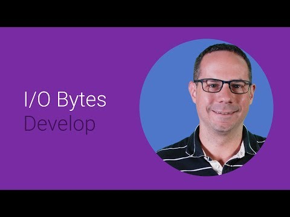

## Testing multi-screen web pages 

  

** 视频发布时间**
 
> 2014年6月25日

** 视频介绍**

> So you need to build a responsive site. We'll look at how you set up your dev environment to best test across multiple devices and screen sizes.

** 视频推介语 **

>  暂无，待补充。

### 译者信息

| 翻译 | 润稿 | 终审 | 原始链接 | 中文字幕 |  翻译流水号  |  加入字幕组  |
| -- | -- | -- | -- | -- |  -- | -- | -- |
| 韩淼 | 段威 | -- | [ Youtube ]( https://www.youtube.com/watch?v=vsmU09PoYy4 )  |  [ Youtube ]( https://www.youtube.com/watch?v=SraLpEs5-d8 ) | 1505070817 | [ 加入 GDG 字幕组 ]( {{ book.host }}/join_translator )  |

### 解说词中文版：

相对于桌面Web的开发  测试移动端Web

需要另一套不同的工具

嗨

我是Pete  来自谷歌开发支持部门

我会讲讲我的工作流程

和你们怎么去用它

来让你的网页在任何设备上显示都不错

我一般会先将桌面浏览器缩小至400像素

来模拟手机屏幕大小

自然也可以去调整浏览器窗口的大小

来感受不同尺寸下网页的效果

当我做完一些基础的工作  包括我的布局

我常用的断点等等

再打开Chrome内置的仿真工具和iOS模拟器

仿真器和模拟器都是很棒的工具

虽然它们不总是百分百准确

但是也八九不离十

Chrome的仿真工具可以让你模拟很多东西

比如各种屏幕大小和分辨率 

比如基本的点击事件

甚至是地理位置和加速传感器的信息输入

开启一个仿真器很简单

只要把开发工具调出来

然后点击Escape来显示控制台

之后选择仿真面板

在这里选择你想要仿真的设备

然后点击Emulate按钮

Chrome会自动重置浏览器页面

这里有一个小提示

因为移动设备通常是竖着的

我们把开发面板固定在右边而不是底下

可以更方便我们开发

至于iOS测试  我通常打开一个iOS模拟器

它可以从苹果的iOS开发者中心下载

通过它让我清楚页面效果和实际表现是什么样

只要用Chrome的仿真器和iOS模拟器

我通常能找到并修复

我碰到过的80%问题 

至于剩下的20%问题  我就必须切换到真机

推荐使用远程调试模式

这样用手头电脑上的开发工具

就可以查看调试和分析真机上的表现

为了使用Safari中的远程调试  进入Safari的设置中

看下菜单栏中的Show Develop复选框

这名字真长

下一步  通过USB把你的iOS设备连接到Mac

之后在iOS设备上用Safari

打开你想调试的页面

现在从你的桌面Safari的开发者菜单中

找到设备并选择你想要去调试的

浏览器页面

这时候  Safari的Web Inspector已准备好运行了

很好

初始化Chrome的设置更为复杂一点

它需要你把开发者选项中的

USB调试模式打开

如果你找不到开发者选项面板

进入设置  然后在Biuld number上

点击七次

对  不开玩笑  七次

还好每台设备你只要做过一次就好

如果你正在运行的是Windows系统

你可能还需要安装设备驱动程序

一旦你完成以上的操作  剩下的就简单多了

通过USB把设备连上你的电脑

然后打开你想要调试的页面

之后在桌面打开chrome  地址栏填chrome://inspect

你现在应该能在桌面浏览器中看到

所有在设备上开启的标签了

如果你看不到  检查下Discover USB Devices是否打开

而且设备上也没有弹出过

任何请求权限的对话框

你甚至可以直接访问本地的文件

或者用一个私有网络的端口转发来翻墙

Chrome远程调试也支持实时转播设备的画面

点击右上角的按钮

之后Chrome在你的开发工具窗口里

实时显示设备上的页面

这样你可以专注于自己的电脑屏幕

而不用来来回回地在设备

和开发工具间切换

但是要注意  这项功能是通过一次次截屏

然后把他们连续地发到桌面上来

所以这里可能会有一些卡顿

如果你已经有了你需要的设备

远程调试用起来很爽  可如果你收到某个设备

的Bug报告  而你手头正好没有

短时间内也不会去买的测试机

或者更进一步  你希望自动运行一部分测试

对于这些问题  我会从类似BrowserStack  Sauce Labs

或DeviceAnywhere这样的第三方服务中选一个

这些远程测试服务提供基于云的

仿真的浏览器和真机的测试

通过这些服务我可以与这些设备互动

就好像就在我手上操作一样

因为我的操作会直接传输给

远端的设备或者模拟器

其中一些服务甚至提供API

你可以利用它们来实现自动化测试

例如单元测试  前后端连调

或者截屏视觉回归测试

以上就是我的Web开发工作流程

我首先会用桌面浏览器来进行初代开发

之后转向仿真器和模拟器完成主要工作

接着上真机来改善所有的效果和实现

当我没有我想要的设备时

我就去第三方远程测试服务找

然后我就准备发布了

吼吼

如果你不确定你的页面是否在不同设备上工作正常

为什么不现在开始呢

我刚刚已经向你展示了三种简单的方法

你今天就可以着手开始

感谢观看

