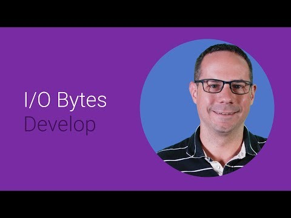

## Deep dive: Google Cloud Messaging for Chrome 

  

** 视频发布时间**
 
> 2014年6月25日

** 视频介绍**

> A deep dive into cross-platform messaging, with a focus on Chrome's API and implementations. [ed: similar talk from android]

** 视频推介语 **

>  暂无，待补充。

### 译者信息

| 翻译 | 润稿 | 终审 | 原始链接 | 中文字幕 |  翻译流水号  |  加入字幕组  |
| -- | -- | -- | -- | -- |  -- | -- | -- |
| 韩淼 | 苏楚霖 | -- | [ Youtube ]( https://www.youtube.com/watch?v=g_zkOOWsmco)  |  [ Youtube ]( https://www.youtube.com/watch?v=MXAQzogUCP4 ) | 1505070827 | [ 加入 GDG 字幕组 ]( http://www.gfansub.com/join_translator )  |

### 解说词中文版：

大家好  我是来自Google Chrome Apps组的Filip

Chrome应用和扩展程序使用类似的网络技术

可以安装在桌面或者Chrome OS设备

这些客户端与传统的API链接

因此不能在普通的网页使用

开发者经常面对的一个问题

就是如何将最新的数据发送给客户端app

假如你在构建一个应用程序

跟踪统计世界杯比赛数据

得到更新的一种方法是轮询

客户端可以定期与服务器建立通信

得到这些最新数据

但它不知道什么时候有新数据

所以有时候它会空手回来

有时候即使已经有了新数据

它也要花很长时间才获得更新

这就不好了

它不仅浪费网络和电池

还会给期待信息更新的用户

糟糕的体验

好消息是可以使用chrome.gcm的API连接Google Cloud Messaging服务

解决这些问题

那该怎么做呢

你可以告诉你的应用服务器

当有新数据时需要提醒哪些客户端更新

并且使用GCM推送这些数据到正确的客户端

它是怎么完成的呢

通过GCM Downstream Messaging

首先在GCM上注册你的app

并指定服务器的发送ID

也就是发送信息的服务器ID

然后接收返回的注册ID

下一步  应用发送自己的注册ID给服务器

还有感兴趣的

信息类型或者比赛

随着比赛进展 

服务器根据自己的注册ID发送消息给GCM然后GCM会处理剩下事情

扩展应用甚至不需要

在信息发出的时候运行

因为一旦消息被Chrome接收

它会启动你的app并触发chrome.gcm消息事件

这就是如何确保你的用户

不会错过心仪的比赛的方法

如果服务器发送消息时Chrome处于离线状态

这也不成问题

因为GCM会从服务器接收信息并储存在队列里

一旦设备在线了

GCM发送队列信息   Chrome启动app里chrome.gcm

的消息事件

如果Chrome长时间不能到达

消息可能被丢弃

因为超过了他们的生存时间或者队列已满

后者会向app

发送一个特殊信息并触发chrome.gcm

的信息删除事件  让你知道这个情况

并让你控制这个局面

OK  这就是Downstram Messaging

现在讨论下从客户端如何向服务端

通信

没有GCM  客户端可能通过XML http请求

向服务器发送信息

如果用户这时候没有网络连接

这个请求会重复很多次

这种情况下资源就没有得到很好的利用

好在chrome.gcm API提供

从app发送信息到服务器的功能

使用相同的云信息架构

如果用户希望追随意大利国家队的比赛

你可以调用chrome.gcm的发送功能

发送信息给服务器

信息最多可以包含4KB的数据

而且必须指定收件人的地址

也就是对应服务器的ID

在向GCM发送信息之前

Chrome会在本地保存一份备份

以防用户网络状况不好的时候

可以重发信息

一旦Chrome在线  它尝试发送所有队列信息

当GCM服务器证实了消息的接收

Chrome会在本地存储中删除相关信息

当Google Cloud Messaging发送

信息给服务器

你也得到了方便

节省工作还方便传输

不管发送的时间或网络连接状态

跟Downstram messaging一样

你可以找到更多关于如何配置服务器

使用在线信息传输的细节

就像Downstram messaging

你可以使用time-to-live参数

让Upstream Massaging对时间更加敏感

比如说用户

在一段时间内不在线

Chrome就可以让信息过期并丢弃

给Upstram Messaging设置time-to-live有两个好处

它允许你在Chrome端

设置消息队列的大小

当传输时间结束或者超过了队列的大小限制

Chrome会抹去chrome.gcm未发送的错误事件

并提示信息没发送成功

允许应用采取相应措施

看起来都很完美  但是你一定在怀疑

多少钱

Google对于GCM不收取费用

你现在就可以使用它

想要学习更多关于chrome.gcm API

请关注我们的文档页面

记住  Google Cloud Messaging

让实时交互的app开发更加高效方便

试一下

