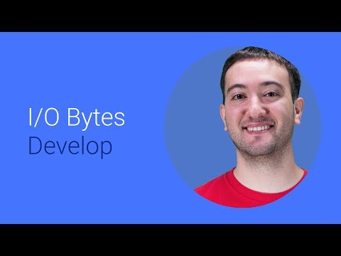

## Web Performance Testing at YouTube 

  

** 视频发布时间**
 
> 2014年6月25日

** 视频介绍**

> Even though YouTube operates at a scale of over a billion users per month, web performance testing follows the same core principles that you can apply to your own site. In this video, learn about how we measure the page load speed and how we instrument tests to make the experience even faster. We'll look at two front end performance testing methodologies: Real User Monitoring (RUM) with Client Side Instrumentation and synthetic testing with WebPagetest.

** 视频推介语 **

>  暂无，待补充。

### 译者信息

| 翻译 | 润稿 | 终审 | 原始链接 | 中文字幕 |  翻译流水号  |  加入字幕组  |
| -- | -- | -- | -- | -- |  -- | -- | -- |
| wang7x | 高冰 | -- | [ Youtube ]( https://www.youtube.com/watch?v=k9dtjsLi9Lw )  |  [ Youtube ]( https://www.youtube.com/watch?v=mONBxek7UAI ) | 1505070828 | [ 加入 GDG 字幕组 ]( {{ book.host }}/join_translator )  |

### 解说词中文版：

大家好

我是Rick Viscomi  负责优化YouTube

在本集视频中  我会和大家分享

我们是如何测试网页性能的

还会说一说个人网站比较实用的技巧

这里有两种测试网页性能的方法

一个是Real User Monitoring（真实用户监控）  简称RUM  另一个是Synthetic testing

真实用户监控  正如它的字面含义

它会收集用户浏览网站时与性能有关的数据

对于YouTube而言  RUM为我们全方位地提供了

用户对网站的体验状况

再来看Synthetic testing  它更像一个实验室

通常用于根据需求来分析特定的用户案例

两种方法都会收集性能数据

但二者的区别在于  RUM侧重于衡量

网页的加载速度  Synthetic testing侧重于

如何让网页更快的加载出来

收集和分析RUM数据最简单的方法

是使用现有的性能分析产品

实际上  Google Analytics就是这么一个工具

在Google  我们使用一套我们自己定制的解决方案

称为Client Side Instrumentation  缩写CSI

RUM的工作方式可视为三层结构

首先  我们部署客户端代码

用于提供网页计时(Timing)和网页状态数据给RUM JavaScript脚本库

然后  脚本库将这些数据打包

发送给分析服务器

最后  分析服务器

通过一个仪表盘展示分析结果

大多数RUM工具在监测网页时  一般都会调用现有的

对于我们来说  视频播放速度

是我们很看重的一项性能指标

指标的制定要根据

应用的功能

和用户期望来制定

还有一点很重要  那就是需要考虑

可能影响性能的上下文信息

比如  YouTube用户可能会用到实验性的功能

我们就需要了解

这些功能对性能可能会产生什么样的影响

通过跟踪变量的变化

我们能更好的了解

特定用户群体的情况

同样  在关键路径和视频重放之后

CSI beacon会被悄悄的发送

这有助于使测试不会

影响到用户的体验

为了分析性能数据  我们来看看CSI仪表盘

在这  我们能够看到随时间变化的性能曲线

可以对照比较实验组和正常操作组的数据

例如  在这个折线图中

我们拿实验的数据和正常操作的数据进行比较

在最后一个节点之前  实验组数据的耗时更低  运行更快

我们可以在CSI仪表盘上

将数据按变量进行分离  以便理解是什么造成了这样的结果

我们按照浏览器将数据分割

可以很清晰的看出浏览器B导致了

性能的下降

值得一提的是  由于我们是

从海量用户中收集数据

他们使用不同的设备  处在不同的网络环境中

我们通常会

取统计数据中的中位数

来代表性能的好坏

好了

RUM就说到这里

现在我们再来看看synthetic testing

我们使用WebPagetest  这是一个免费  公开的工具

我们不从真实用户那里收集数据

相反  配置synthetic test面向一个特定的统计群体

为了减少网络异常带来的影响

这些测试运行在一个类似于实验的环境下

并会重复试验

因此多次反复测试会令结果更加可信

最后  当结果出来后

我们就能根据测试时的网络日志

分析指定的指标项

WebPagetest能够让你完全掌控

你想要测试的用例类型

例如  我们可能对DSL连接下

Chrome浏览器浏览网页的性能感兴趣

作为一个免费公开的工具

WebPagetest运行在联网的普通计算机上

然而  为了测试YouTube  我们需要更多的访问权限

才能访问YouTube的beta版本

因此  在Google内部

我们运行私有的WebPagetest实例

测试结果通过一个图形化的瀑布流图

来展示网络中的各项活动

在这个视图中  我们能够精确的看到

视频重放在关键路径上的活动

最后  WebPagetest还在瀑布流上注明了

我们为YouTube指定的指标

这为我们提供了必要的上下文信息

以确定具体是什么导致了性能下降

关于synthetic testing就说到这里

记住RUM仅在你提供了有用的指标时才起作用

CSI只是众多工具中的一种

并且你的解决方案应该不能影响到用户体验  而且还要是轻量级的

Synthetic test应当被设置为

代表普遍的用例  例如特定的浏览器

连接  和网页统计口径

并且  通过在内部网络

部署synthetic test服务器

你可以在发布之前验证性能

想要了解更多NavigationTiming API的信息

打开这个链接  查看Mozilla Developer Network的文章

想要了解更多使用WebPagetest的信息

访问这个连接 并且留意

今年晚些时候我出版的书

谢谢观看

