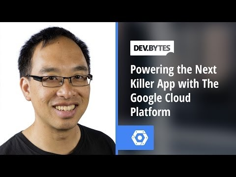

## DevBytes - Powering the next killer app with the Google Cloud Platform

** 视频发布时间**
 
> 2014年3月21日

** 视频介绍**

> Building your next app may be easy, but scaling that app is harder. This is where the Google Cloud Platform comes in. In this video, Wesley Chun introduces viewers to the core components in the platform. Once you become familiar with the features & services provided and have heard some stories of what others have already done with it, maybe you too can use it to leverage Google's scale & innovation to build that next killer app.

** 视频推介语 **

>  暂无，待补充。

### 译者信息

| 翻译 | 润稿 | 终审 | 原始链接 | 中文字幕 |  翻译流水号  |  加入字幕组  |
| -- | -- | -- | -- | -- |  -- | -- | -- |
| 韩淼 | xin.zhang | -- | [ Youtube ]( https://www.youtube.com/watch?v=xuPKrjJ8Ijs )  |  [ Youtube ]( https://www.youtube.com/watch?v=V3igLTSjdQA ) | 1504210672 | [ 加入 GDG 字幕组 ]( http://www.gfansub.com/join_translator )  |

### 解说词中文版：

WESLEY CHUN: 我是Wesley Chun

在Google我们希望我们的工具

能够帮助你建立出下一个杀手级应用程序

在这期Dev Byte  我会给你介绍

Google云平台的核心部件

我也会分享其他人在使用它时的一些

小故事

一旦你熟悉了这个平台的服务

你也会被Google的丰富资源  经验和性能所影响

来帮助你强大你的好点子

在Google  我们总是在考虑规模和创新

这是一些研究论文

多年来我们发表的

其中许多论文直接导致了Google云平台的服务

你已经知道Google Search  YouTube和Gmail服务 

他们已经在Google大规模的运行

如果你可以利用这些服务之后的这种规模和创新

来为你的伟大想法提供帮助呢

这就是Google云平台的价值所在

让你的应用得到Google的力量

那什么是Google云平台呢

简单的说  它是一个服务的集合

这些服务由三个类别组成  计算  存储

和应用程序  以帮助你的应用规模化运行

选择你想要的服务

而只需为你使用的资源付款

我们从计算类别开始

我们已经有了Google App引擎和Google Compute引擎

让我们从Compute引擎开始  我们在基础设施里

的计算方案即服务层

创建Linux虚拟机并且连接到它们

就像其他网络计算机一样

它们的特点是拍摄持久磁盘快照  虚拟机在线迁移

以避免烦人的维护周期

网络连接和防火墙  负载均衡

以及为高可用设计的地域分区

以实现你的技术栈并且解决真正的大问题

有多大呢

恩，这里有一个真正的大数据例子

比如说你要打算结婚了

你想要一个盛大的婚礼  需要准备邀请你

最亲密的150亿位朋友和亲戚

他们中有大概70亿来自地球

其他人来自其他星球

不管怎样  我们只能说我们有

你组织的地点  大约

每个100字节的信封

为了确认这里面没有任何重复

你需要将所有数据排序

正好  MapR团队去年做了一些相同的工作

在Compute引擎中使用Hadoop去设置分钟排序记录

他们的app能够获取150亿个100字节大小的记录

也就是1.5TB  或1500GB的数据

并在不到一分钟的时间内进行排序

在此之上  它们可以重现这个结果

持续跨多节点运行不同的

集群配置

点击这个链接获得更多细节

另一个计算解决方案是App引擎

我们的平台作为一个服务提供方

这个方案提供给不想管理这方面事情和

不希望解决这么多系统管理问题的开发者

因此在硬件和你的app之间的组件

例如操作系统  数据库和Web服务器

都是由Google进行托管  因此你可以专注与自己的应用程序

使用熟悉的语言来构建你的解决方案

像Java  Python  PHP和Go 

上传你的代码并且让Google照顾这一切

Snapchat是一个十分流行的照片分享服务

它一天服务超过3.5亿张照片和快照

是什么让他们发展到今天的规模

是Google App引擎

Google云存储为你提供大型数据仓库

存储大量的文件和几乎任何大小的blob格式数据

对用户提供安全的控制访问

以及应用程序和其他Google云平台的服务

可以处理和分析你的数据

Song Pop是这一代的名字

这个曲调应用运行在Google App引擎上

伴随着Google云存储  他们的app

一天为8千万客户提供超过18TB的音乐

Google Cloud SQL是在云端完全托管的  高度可用的

关系数据库服务

创造  配置和使用MySQL数据库

但是是在我们的数据中心承载它

标准的MySQL Wire协议

让你从任何地方使用任何app连接上云端SQL

同时它也支持JDBC

从复制  加密  补丁管理和备份中释放自己

以便你可以专注于你的解决方法

它的一个最好的特点是它的

按使用付费模式  用户可以选择为一个数据库

仅当它被使用时才支付费用  然后在剩下的时间

使用便宜的存储

Google云数据存储是存储

NoSQL的键值数据的地方

它是一个完全托管的服务  可以自动的处理

分片  复制和扩容

存储的机制是非结构的和支持基于对象

或者SQL-like的查询  与资产交易一样

云数据库是同样的技术

支持App引擎本地数据存储

Google BigQuery是一个令人兴奋地  大规模的数据分析工具

可以让你在数据集中做查询

之前是不可能的  困难的或是很消耗时间的

这些数据集比如四十年前婴儿的名字

每个字都用Shakespeare书写

或者是1929年以来的全球历史气象站数据

使用BigQuery  你用SQL查询可以在几秒钟内

分析TB级别的数据

在BigQuery的交互式Web控制台中

你可以针对你的数据集做点对点的查询

用今天讲的三个公共数据集其中的一个进行测试

例如我刚刚提到的那个

或者这个特别的查询

它可以使你推到五大最新的维基百科页面

Google Cloud Endpoints使你无缝的

创建APIs或者应用端点到你的服务里

让你更方便地添加新的Web或移动前端

到你现有的服务

它是你的应用前端客户端与

后台连接在一起的胶水

通过Google App引擎  

你的网站或手机客户端可以连接到云端

这样你可以去后端服务

或者能满足这些需求的App引擎的概略代码

给到你实际上的后端  无论它

在计算引擎上还是其他外部服务器上

安全可以通过数据授权自动地

在前端和App Engine之间完成

甚至还有一个工具可以生成客户端代码

Android使用Java  iOS使用Objective C

通用网络访问使用JavaScript

来帮助你更加快速的进行

这就是Google云平台

为其他人做了什么  最重要的是

它可以为你做什么

我们期待在你下一个伟大的想法中帮到你