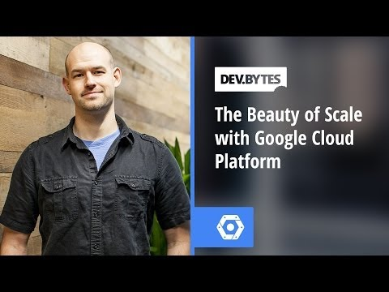

## DevBytes - The Beauty of Scale with Google Cloud Platform

** 视频发布时间**
 
> 2014年2月28日

** 视频介绍**

> When talking about Cloud Offerings, it's easy to forget the data-centers that make it all happen. In this video, Colt McAnlis takes a quick look at maintaining Google's scale through it's data-centers, and how developers can leverage the same hardware and software running google's services to write their own applications.Make sure to join the Google Cloud Platform Community to connect with other developers. 

** 视频推介语 **

>  暂无，待补充。

### 译者信息

| 翻译 | 润稿 | 终审 | 原始链接 | 中文字幕 |  翻译流水号  |  加入字幕组  |
| -- | -- | -- | -- | -- |  -- | -- | -- |
| xin.zhang | 段威 | —— | [ Youtube ]( https://www.youtube.com/watch?v=CJbmJ1W5wys )  |  [ Youtube ]( https://www.youtube.com/watch?v=Fj9C8KrWUyQ )   |   Youtube | 1504210678 | [ 加入 GDG 字幕组 ]( http://www.gfansub.com/join_translator )  |

### 解说词中文版：

嘿  大家好

我是Colt McAnlis

我这次来快速盘点一下

某些Google数据中心的幕后故事

预告一下在3月25日  Google云平台将会有

一个筹备已久的发布会

你们一定不要错过

但是在此之前  我们可以

先来看看Google运作背后的机理

当你们谈论Google时

你们在谈论的其实是大数据

我们每个月会处理超过

60亿小时的YouTube视频

同时  还有来自Google的1000亿次搜索请求

我觉得最赞的是每分钟激活了1000台

Android设备

搞定如此大的数据量可不是件容易的事儿

我们需要打造一个全球范围的基础设施来处理负载

一切从横跨太平洋铺设光纤开始

到建成数据中心为止

这些中心开创地融合了科学设计  艺术美感和实用功能

例如  看一下这个俄勒冈州的数据中心

所有这些彩色管道可不是为了作秀

每种颜色都代表了详细的

关于水温和流向的重要信息

这在你想要从数公里的管道里

追踪泄漏时就显得至关重要

再看一下这排位于佐治亚州的服务器

这些大功率的节能LED灯

告诉我们服务器机架上一切正常

这个数据中心在南卡罗来纳州

有一个三层楼高  装满机器的仓库

当其中一个存储单元出现故障

自动机器人会去抓到那条磁带

并移除掉

最棒的在于所有的这些技术

不只是为我们自己所用

通过Google云平台的支持

你可以使用同样在支撑着Google的

网络计算和存储服务

并且它提供了方法让你去配置

组合API和服务来满足你的应用需求

这就是Snapchat开发者做过的

他们的四人小团队

借助了Google App Engine的杠杆作用

使Snapchat成为2013年最热门的下载应用之一

收发每天超过35千万张的照片

再比如Song Pop  他们在很短的几个月内

从默默无闻到服务250万的日活用户

仅仅是雇了一个工程师

来优化性能和加载速度

这也正是你们预计的效果

只要你们也同样使用了

Google云服务的话

当我们谈论到云服务提供的东西时

往往提到的大多关键词是

站点隔离  或者虚拟机

又或者负载均衡

有时候我们忘了很小的东西 

螺母  螺栓  焊线  接头  风扇

供水系统  当然还有彩色管道

它们也是要感谢的功臣

我们在Google的15年中已经建立了

数个美丽而强大的数据中心

现在所有的这些服务任你使用

请登录Google+加入Google云平台社区

并且不要忘了在3月25日回到这里

到时会有个不容错过的发布会

我是Colt McAnlis

去弄出点动静来吧

