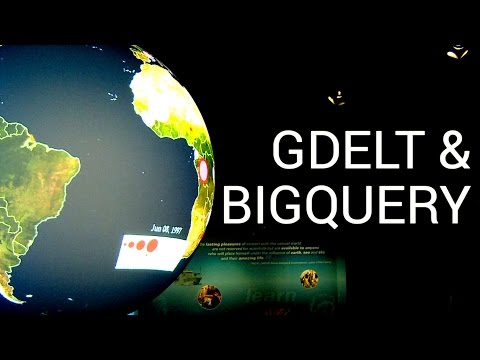

## GDELT & BigQuery: Understand the world

** 视频发布时间**
 
> 2015年2月12日

** 视频介绍**

> The GDELT project aims to collect every relevant event in human society, and make it analyzable by anyone interested in learning from it. Hosted on Google BigQuery, it already indexes more than a quarter billion rows from the last 35 years, and grows daily with all the latest events and news. Join Google Developer Advocate Felipe Hoffa on his trip to meet Kalev Leetaru – the creator of the GDELT project, Louisa Koch – NOAA Education Director, and Amanda Traud – Data Scientist at L-3 Data Tactics. Together they'll explore how government, academia, industry and end users can benefit from GDELT.Read more about this experience at: https://medium.com/@hoffa/understanding-the-world-with-sql-the-gdelt-bigquery-video-6070daf9f865

** 视频推介语 **

>  暂无，待补充。

### 译者信息

| 翻译 | 润稿 | 终审 | 原始链接 | 中文字幕 |  翻译流水号  |  加入字幕组  |
| -- | -- | -- | -- | -- |  -- | -- | -- |
| xin.zhang | 苏楚霖 | -- | [ Youtube ]( https://www.youtube.com/watch?v=Psp7YivWL90 )  |  [ Youtube ]( https://www.youtube.com/watch?v=ZiuoXgbzNWM ) | 1502200379 | [ 加入 GDG 字幕组 ]( {{ book.host }}/join_translator )  |

### 解说词中文版：

FELIPE HOFFA  大家好

我是Felipe Hoffa

我们现在是在NOAA

美国国家海洋和大气管理局

今天我们要去参观他们的球面科学展示系统

在一个巨大的3D球体上

可以展现所有的信息以及世界正在发生的一切

我们打算使用它来了解一下GDELT

一个包括了全球发生的事件  语言  语音的数据库

用来主动的收集  分类和计分

在世界上任何地方都能看到的

每一条日常新闻

在本视频里  我们将要用一些实际的例子来展示

如何使用BigQuery探索GDELT中的数据

我们会邀请到Amanda Traud 看她是

如何使用R语言对国家之间不断变化的关系

进行探索的

我们也会邀请NOAA教学总监Louisa Koch

来探索在整合GDELT与其他数据集的过程中

显现出来的惊人可能性

首先  让我们回到NOAA

与GDELT的创造者Kaley Leetaru见面

来了解一下他的项目及其如何工作

这就是NOAA的球面科学展示系统

我们可以立刻展示出整个地球

比如  我们正在关注的发生在智利的2014年海啸

以及它是如何影响到全世界的

我们能看看GDELT吗

等待几秒之后  它就出现在我们眼前

汇总了世界所有信息

Kaley  你能告诉我们更多

关于我们正看到的东西吗

KALEV LEETARU  GDELT项目的想法实际上是这样的

如果你愿意的话  我们来创建一个

人类社会的仪表盘

如果你今天这样想

地震可能发生在地球上的任何一个地方

而且已经设置了巨大的全球传感器网络

并像美国地质勘探局USGS 一样分组

这样可以获得地球上发生在任何地方的地震的实际信息

他们知道在哪里发生的

震源深度是多少

哪些人会被影响

在几秒钟内就都知道了

但是人类的活动呢

想象一下

地球上任何地方都可能发生抗议活动

为其创建一个数据集的能力

正是GDELT项目所关注的

其实就是创建一个关于人类社会的全球目录

想象一下每天搜集世界上所有的新闻媒体

网络  出版  广播  超过100钟语言

都在通过计算机不停地处理

你怎样与它们交互  展示它们

理解它们

对于我来说  NOAA的球面科学展示系统

是如此的令人兴奋

它具有2.5亿条记录的庞大数据集

和方便使用的功能

想象一下可视化

你不会有比在一个物理球面上

来展示地球的一切更好的办法了

FELIPE HOFFA  当访问NOAA时

教学总监  Louisa Koch

加入了我们并分享了

她对GDELT数据集的想法和初衷

LOUISA KOCH  NOAA产生了大量的

关于海洋和大气的信息

我们每年花费数十亿美元

来收集海洋和大气数据

它对于人类活动的意义

真的非常重要

GDELT是一个惊人的数据库

在球面上展示它是如此的令人兴奋

现在  球面科学展示系统中大多数的数据集

是物理数据集

告诉我们地球是如何运行的

GDELT告诉我们的是社会系统是如何运行的

可以给我们展现出我们称其为家的地球

一个完全的新视角

FELIPE HOFFA  GDELT太棒了

它监控着这个世界

但是我今天想知道的是

GDELT如何获取所有的信息

KALEV LEETARU  是的

没错

其中一个技巧就是

尝试监视整个世界的媒体

当然  这是一个复杂的过程

将这些文本新闻文章

这其中有大量的混乱格式  需要转化成统一编码

来记录发生了什么

在哪发生的  哪些人牵涉到了  及它的详细信息

然后所有流程进行到结束时

则可以得到一些可用的CSV文件

并且发送到BigQuery中

最后在每一天结束的时候

BigQuery处理它们并生成一个CSV文件

使其可以在网站上使用

还会使用BigQuery上传工具

将其发送到BigQuery中

等待大约一分钟之后  它就上传到BigQuery中了

它就被添加到了这2.5亿记录中

现在你可以在你的计算机中使用BigQuery

并且访问最新的资料

FELIPE HOFFA  GDELT已经从过去35年世界范围内发生的事件中

索引了超过2.5亿行数据

它每天还会装载超过100,000行的数据

我与Kalev坐在一起进行探讨

如何使用BigQuery来探索GDELT

看看我们做了什么

KALEV LEETARU  我们打算在这里做的是

一个简单的实验

来展示如何处理这些数据

我们为何不从乌克兰开始呢

很显然  很多新闻报道中都出现了乌克兰

我们获取数据  例如

我们现在只是从乌克兰的数据中

统计发生的事件次数

具体地说  让我们看看这次冲突事件

因为有很多乌克兰的事件

那么在这个例子中  什么是我们想做的

我们仅仅关心的是事件的数量

我们不关心其中的细节

例如  我们仅仅想要知道

每个月乌克兰有多少事件正在发生

FELIPE HOFFA  每个月

过去的一年里

过去的10年里

KALEV LEETARU  让我们看看过去的30年

我们回到1979年

通常以select count开头

然后指明我们想要做的事

很显然  首先我们要限制仅仅是Ukraine

然后我们要指明Action

我们要指明我们想做的事

就是这里的action

对每一个事件来说

它记录了一大堆不同的细节信息

其中一个就是事件发生的地点

就是这个事件发生的实际位置

我们指明这一活动发生的国家代码

实际发生的地方就是UP

不要问为什么UP是乌克兰的国家代码

像我们刚才这样做  正如我们所指明的

哪些事件是在乌克兰发生的

但是我们想按月分解

所以我们要回到这里

插入month-year

从根本上说  我们现在是按月分解

把所有事件的数量加起来

另外  根据month-year进行分组

按month-year进行排序

这样  如果我们运行这个查询  我们将会得到的返回结果是

从字面上说  每月乌克兰发生了多少事件

实际上  我才意识到这将会给我们所有信息

但是这是一个好的例子

它将给我们所有信息  不仅仅是冲突的事件

FELIPE HOFFA  也许你会惊讶

结果出来了

这些是什么

KALEV LEETARU  我们可以在这里看到

每月实际上记录了多少事件

你可以看到在1979年1月  记录了23个事件

在1979年2月  记录11个

我们往下滚动

我们直接跳到最后一页

你可以注意到这些值坐落于50到80之间

FELIPE HOFFA  430种不同的事件

KALEV LEETARU  没错

比如我们看这里  我们开始看到超过100,000的记录了

如果我下载它  下载这个CSV文件

并且让你看到实际上看起来是什么样的

让我们继续并用图形表示

我喜欢可视化  因为这样更容易看懂

我们继续用图形表示这些数据

我们可以看到  哇

乌克兰在这些时间段并不太多

在这里  你可以看到一个确定的数字

也许是100或是一个月或其他

当然这里是苏联的衰落时期

然后开始增加  增加

我们开始看到其他的数字

当然  我们也看到了图形表

在短时间内呈火箭式地上升

但是你有可能会说出点道理

我的意思是在过去的一年里

发生了很多事情

但是  面临的问题是  在同一时间

全世界新闻媒体的总量

在成倍的增加

你真正想要做的是

实际上想要标准化这些

我不想看到原始的数字

我想要看的是

在那一天的整个GDELT的信息总览

FELIPE HOFFA  为了规范事件的数量

我们需要知道两个数字

第一  每个月在GDELT中

全世界事件的总量  我们通过一个简单的计数来计算

然后是与乌克兰相关的事件的数量

我们可以在计数语句中添加一个IF条件来获取这个数字

最后  我们需要去掉ALL WHERE语句

否则  我们第一个计数是不对的

因为仅仅与乌克兰相关的行

将会被考虑

我们现在可以从BigQuery中

得到两者之间的比值

相反  我们导出为一个电子表格

生成每月的比值并展示出来

KALEV LEETARU  现在我们继续

我们记得  之前只是绘制了乌克兰的

如果你看这里  你会看见乌克兰的图形

让我们看看这个总数

这是从GDELT找到的所有事件

显然  我们可以看到  Google新闻的诞生

确实

带动了很多基于网络的新闻诞生

我们看到这个巨大的螺旋式前进

事实上看到这个

的确  使人想到乌克兰有一个巨大激增

但是问题是这个最高点实际上

会被GDELT中过时的信息

所影响

我们想做的不是绘制原始的数字

而是绘制百分比

那么我们看到这些

只要简单的做一个除法

用乌克兰的事件数量除以事件的总数

得到一个百分点的值

现在我们用曲线图来表示

这可能看起来有几分相似

但是实际上  我们在这里看到更多

现在我们开始看到一些有趣的事情

此外我们可以看到所有事件

我们可以看到关于乌克兰

某种事件发生频率上涨和某些有趣的事情

但是你知道  这里有一个挑战

就是我们现在着眼于乌克兰的一切东西

可能我们想要的是变得更专注一些

比如说抗议

因为此外  着眼于与乌克兰的一切东西

或许不是那么的有趣

那么我们要做的就是我们要进入到这里

并且我们要指明  限制为抗议

如果我们想要指明抗议

我们就要指明一个称为Event Root Code的东西

记住在这里的事件

有300种不同的分类

所有的抗议类以14开头

如果我们返回  记住这里  我们看看14类型

可以看到它的所有不同的类型

绝食抗议  政策  抗议领导人换届

抗议集会  抗议政策改变

在我们的例子中  我们只要指明为所有

如果我们指明Root Code等于14

则会匹配到任何抗议

现在如果我们再次运行

我们会得到更有趣的东西

这是仔细检查和查找

GDELT中所有与抗议相关的一切东西

返回  然后每个月

总共多少抗议的数量是

被记录在GDELT中的

在那个月乌克兰有多少是被报道的

FELIPE HOFFA  那么在1979年1月

KALEV LEETARU  它表明它在世界各地

发现了400个抗议

此外  在1979年  比现在少的多的电子媒体

在乌克兰也没有发现任何记录  显然

随着苏联的占领  还少了更多

比如我们下载为一个CSV文件

加载进Excel

这是总共的抗议数量

这是乌克兰的抗议数量

然后再来一次  这是乌克兰的百分比

那么然后是  我们说

我们要像这样做除法

那么接下来我们要做什么  所以此列实质上

将是本月来自乌克兰的

所有抗议事件的百分比

如果我们要检查这个数据  我们将其绘制出来

现在我们看到了更多有意义的东西

让我删除这个以便给我们多一点的空间

你可以看到在苏联占领期间  只有非常少的抗议

显然  苏联对抗议非常严格

然后  当然  抗议

伟大的欧洲革命开始于

苏联解体

轰

现在你突然看到很多的抗议活动

你看到了峰值

克里米亚

你看到了橙色革命

然后你看  当然  你看到今天我们在何处

但是你看到有趣的是  

乌克兰的抗议活动确实已经减少了

因为我们正走向现在

很显然  大部分的原因是由于

现在发生在乌克兰的已经

由抗议活动转移到

全面的大规模的军事冲突了

这就引发了一些有趣的问题

例如  我会回到这个查询语句

代替抗议  让我们看看

正如我们所说的  为什么抗议会下降呢

难道是乌克兰变得更稳定了

好吧 代替抗议  我们回过头来看看冲突

例如  战争

我们改变14为19

现在我们运行这个查询

现在我们说的是

查询所有的冲突活动

世界各地发生的战争

对于每一个月  计算我们看到的总数

然后  计算发生在乌克兰的数量

FELIPE HOFFA  我们继续探索GDELT的基本知识

以及如何查看每个国家的时间线

在这段中  我也会会见Amanda Traud  她是一个数据科学家

她的工作就是探索GDELT

她在L-3 Data Tactics工作  

是一个大数据分析和云计算解决方案服务的专业提供商

他们使用了R语言

来探索GDELT的数据和国家之间的关系

以及它们是如何随时间变化的

对于这个项目  她使用一个web应用框架  Shiny

将R语言代码转换为交互式的web应用程序

让我们做更多的了解

AMANDA TRAUD  实际上Shiny

是R语言的一个包  它允许你创建

基于浏览器的应用程序

所有这些应用程序都是基于浏览器的

而且任何人都可以在我们的Shiny服务端使用

FELIPE HOFFA  真赞

那么你有一个Shiny服务端运行着R语言编写的Shiny应用程序

AMANDA TRAUD  是这样的

FELIPE HOFFA  你能让我们更多的了解这些应用程序吗

你做了什么

AMANDA TRAUD  当然可以

FELIPE HOFFA  用GDELT的数据

AMANDA TRAUD  我最喜欢的应用程序是

GDELT的国家网络仪表盘

你可以输入一个日期范围

比如说我想知道上周

国家之间的关系是什么样子的

所以我选择了10月15日和10月22日

输入我的BigQuery ID

然后点击查询

FELIPE HOFFA  好的

我们这里出现了一个漂亮的网络

AMANDA TRAUD  是的

FELIPE HOFFA  你能解释一下后台发生了什么吗

AMANDA TRAUD  当然可以

FELIPE HOFFA  这个应用程序的组成有哪些

AMANDA TRAUD  是两件东西  HTML和R语言

首先  我将向你展示R语言代码

R语言有一个称为Shiny的强大的库

你可以使用它创建这些基于浏览器的应用程序

当我从BigQuery得到返回数据时  

后台Shiny服务端的R语言函数正在生成表格

并创建一个边列表

在网络中  一条边是

连接两个点的线

因此  这里根据我得到的所有事件生成了表格

找出角色1和角色2

在表中决定是哪个国家

并生成它的子集

然后是边上的权重

基于事件的情况  它们是如何连接的  

FELIPE HOFFA  我懂了

这是完全开源的吧

AMANDA TRAUD  是的

全部都托管在GitHub上

所以如果需要你可以下载它的代码

它在data tactics的GitHub上

FELIPE HOFFA  这看起来很漂亮

你还有其他可用的应用程序吧

AMANDA TRAUD  的确

第二个应用程序将给我们展示一个表格

包含我们可能想要的GDELT的所有信息

对这个应用来说  我们要输入

我已经输入了日期范围

那就是10月的1日号22号

然后输入我的项目ID和客户端ID

跟第一个应用一样

接下来选择一个角色

现在  我能选择在GDELT数据库中

任意可能的角色

我已经选择了中国

FELIPE HOFFA  GDELT已经有很多的角色可供选择

我们可以看一下吗

AMANDA TRAUD: 当然

它有

FELIPE HOFFA: 国家

它有

AMANDA TRAUD  太多了

FELIPE HOFFA  组

那么我们打算看一下中国在10月1日到10月22日

发生了哪些抗议活动

AMANDA TRAUD  没错

FELIPE HOFFA  这个应用程序正在查询BigQuery

AMANDA TRAUD  与另一个一样通过JavaScript

我点击查询按钮  它转到GDELT在BigQuery的数据库

并给我返回一个表格

这有不同的列清单

它们在数据中很有用

FELIPE HOFFA  是的

太精彩了

就是这些你和Aaron一起收集的数据

让你能跟其他数据联系在一起

AMANDA TRAUD  完全正确

这是一种类型的数据  然后我引用到其他的应用中

在其他的应用程序中  我使用角色1  角色2

以及平均基调

FELIPE HOFFA  为了更多的了解这个应用程序

可以访问GDELT板块  

以及在L-3 Github网页上查询开源代码

那么你如何找到BigQuery呢

它是如何改变GDELT的项目的呢?

KALEV LEETARU  BigQuery对这个项目来说

是难以置信的精彩

事实上  在GDELT的第一个3/4生命周期里

我无法访问GDELT

我手上有2.5亿条记录

但是我不能查看它

我不能问一些最基本的问题

一个简单地查询  就可以给我一个

涉及到两类角色的所有事件的列表

在传统的数据库中可能需要一天时间来查询

通常人们会说  哇

你可以给我提取叙利亚的所有事件吗

这涉及到某一个角色

我会说  当然  但是为提取这些信息

将花费一天半的时间

BigQuery真正从本质上给这个难以置信的数据集

去除了障碍

BigQuery现在确实正在改变这个障碍

这方面有绝大多数的想法

现在我们毫不夸张地说在一段时间内

可以检查所有世界历史

并查看在世界历史上那段时期最相似

200万年前和50万年前的联系  2分钟和半分钟

一行SQL语句搞定

FELIPE HOFFA  那么下一步是什么

BigQuery  GDELT  数据世界的方向在哪里

KALEV LEETARU  今天你看到的GDELT

最精彩的部分

它就是

它处理世界上所有的媒体新闻

它创建这个难以置信的数据集

GDELT也有一些额外的扩展

像学术文献

处理全世界在社会文化问题上的

学术文献

因此我们有一个引用地区最多的

引用图表

现在想像利用GDELT  今天发生了哪些新闻

结合全世界同一个领域里

所有专家的数据

然后结合Google Freebase

它给出所有的结构化信息

例如  GDELT知道  

美国总统奥巴马

Freebase告诉我们他还曾就读于哈佛大学

然后它会告诉我们  另外的一些人

也曾就读于哈佛大学

然后我们开始获得这些结构上的联系

使我们能够组合它们

然后能够关联在BigQuery中的其他数据集

诸如维基百科的页面浏览量

好的  能够说当一个特别的人

突然出现在新闻中

每个人都马上在维基百科上搜索那个人

是什么主题让他们在同一时间段内

进行寻找

那个人或那个政党

或其他事情  他们是如何被

运用和理解的

这只是魔术

你只要把数据放在这里

这有点像电力

你走进一个房间并且轻轻按下电灯开关

你想这是多么简单

然而不可思议的是

基础设施使之成为了可能

但你不会考虑这些

你轻轻按下电灯开关 

你真的不再担心查询耗费了什么

你只要提出问题

它就可以了

无论你想像什么  都是有可能的

FELIPE HOFFA  这就是今天的内容

感谢您加入这次了解世界

的探险旅程

很高心可以见到Louisa Koch和Amanda Traud

来了解工业  学术界  政府

以及最终用户如何受益于这个非凡的数据集

当然还有Kaley Leetaru和GDELT背后的人

要获取最新的进展

和有趣的用户实例

请浏览它们的网站gdeltproject.org

还有更多的等你去发现

现在你可以使用这些数据

编写你自己的查询语句  并分享你的结果

如果你喜欢这个视频  请分享给你的朋友们

本视频由Google云平台提供  我是Felipe Hoffa

我很快就会从大数据世界中

带回更多的故事

保持好奇心