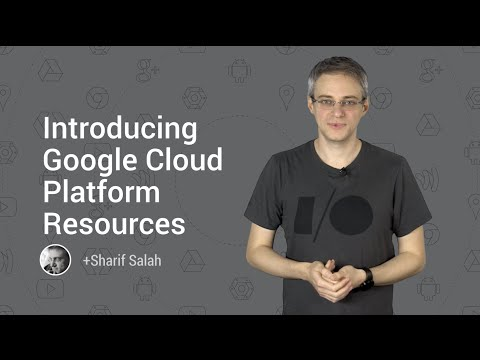

## Introducing Google Cloud Platform Resources

** 视频发布时间**
 
> 2015年1月21日

** 视频介绍**

> If you’re new to Google Cloud Platform you'll find a rich variety of content published by Google as well as the wider community to help you get started developing.

** 视频推介语 **

>  暂无，待补充。

### 译者信息

| 翻译 | 润稿 | 终审 | 原始链接 | 中文字幕 |  翻译流水号  |  加入字幕组  |
| -- | -- | -- | -- | -- |  -- | -- | -- |
| 姜昭宇 | 程路 | 程路 | [ Youtube ]( https://www.youtube.com/watch?v=eMlwcZSt7vk )  |  [ Youtube ]( https://www.youtube.com/watch?v=Sl68Ka1Upko ) | 1501190370 | [ 加入 GDG 字幕组 ]( http://www.gfansub.com/join_translator )  |

### 解说词中文版：

 如果你刚刚接触Google云计算平台

你可能会感到迷茫  我应该去了解

哪些最有用的资源去帮助我快速开始呢

这里有很多的资源  有些时候

很难下手

所以今天我将带领你进行快速的入门

Google最近与Udacity合作推出了

一个新的课程以帮助您了解

组成App Engine的组件

在课程中有很多的视频内容

以及实际的动手去练习编写代码

并且有一个综合讨论的论坛

所以你可以随着一个成长的社区一起学习

每年Google都会在旧金山举办I/O大会

2014年的Google I/O大会上有非常棒的

代码实验室(code lab)  其中有两个是

Google云计算平台关于

GCE和GAE的

实际上  I/O大会有很多的更多资源

去帮助你学习和使用Google技术

大多数的内容都是可以提供您在线观看的

Google已经按照产品类别对内容进行分类

并且你可以找到很多主题演讲

例如大数据查询或云计算引擎

一旦你开始致力于你自己的项目

这里还有一堆有用的工具可以真正

帮助你理解所有API和各种可用的

参数

在这些工具中我最喜欢的是强大的API浏览器

它允许您在浏览器中列出  互动和体验

所有的可用的API

其中最棘手的是  大部分的API

使用OAuth认证  Google就把这些API

集中放在了另一个Playground中  旨在帮助

调试OAuth协议下某些复杂的问题

最后  还有三分之一的Playground是为

Google云平台而设计的  并且为您提供

一个网址做试验

可以直接体验不同的服务

在你的浏览器上  并且不需要安装任何

其他东西

当你感到已经使用的比较熟练了之后

我强烈建议去cloud.google.com/docs

查看更多的详细文档

关于移动应用开发的方方面面  你都可以找到相应的

文章教程  大数据  游戏解决方案甚至更多

你也可以找到大量的示例代码

在Github的Google云平台账户托管

实际上有很多的资源库都在Github上

所以Google建立了一个前端页面

能够使你容易的找到

你要找的示例代码

您可以通过技术  编程语言或解决方案来搜索内容

迟早你会碰到一个问题或困难

你想寻求一些帮助

可能是调试一段代码出现的问题  或是性能问题

甚至是你只是想理解一下大家热议的

新特性是什么

对于一些代码中的技术问题

你需要寻求帮助的话

我建议前往移至Stack Overflow(问答社区)

你可以在那里找到很多有经验的开发者

和Google工程师来帮助你解决问题

只需要使用这些标签去找到你的问题的

最相关的答案

若是想要了解更多关于设计和类库的使用

请查看Google+上的Google官方云平台

社群

我发现新手开发者需要一点时间

去了解Google云计算产品的生命周期

Google云平台产品生命周期

有一系列的阶段

在新产品的功能开发的早期

Google可能会提供一个alpha版本

在这一点上  开发者可以通过表单等反馈

把他们列入白名单  并去尝试新的功能

对于alpha版本  Google往往将开发者

加入到特定的Google群组

它们可以提问问题  提出建议  并且提出问题

之后的一段时间

Google通常提供一个测试阶段

可以使所有人都使用新功能

在这个阶段  你可能没有服务等级协议(SLA)的保障

你能看到一些开放的  未解决的问题

接下来是  所有的功能都可以使用(正式发布)

开发人员能得到全面的支持

文档和服务等级协议(SLA)  到最后

一些服务需要被弃用  这期间通常会采取

一种叫做弃用方案的政策

在这个期间  你应该计划

去迁移某些功能或有问题的代码

以保障弃用方案结束后你的应用不会受影响

最好就是时刻关注Google云平台的

最新公告和新闻

获取即将发生的事件  新的功能

和弃用政策的信息最佳途径是官方博客

您也可以注册我们的月刊邮件通知

这样在您的收件箱中能够收到最新的信息

最后  这里有几个伟大的年度活动值得我们去关注

每年许多的Google开发者社区

也叫GDG  在世界各地的

本地社区举行DevFests大会

包括讲座  代码实验室和黑客马拉松比赛

会有很多Googlers和Google开发专家

来参加这样的活动  这也是一个了解

当地的Google开发者社区的途径

许多GDG还举办了I/0-Extend活动  在本地社区

远程观看 Google I/O 大会

的演讲信息  产品预览等等

您可以在developers.google.com/events了解更新信息

请牢记  跟你一样优秀的开发者都在

你们到当地的GDG社区喔

我强烈建议加入你们当地的Google开发者社区

了解一下如何奉献和收获

您也可以通过用我上面描述的方式

在线帮助开发人员

我迫不及待的希望在线上或者线下看到你的加入

并且认真聆听你在Google云计算平台上所做的一切