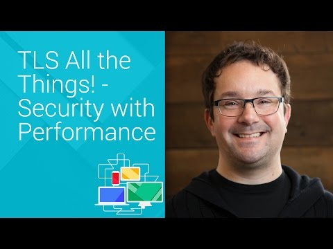

## TLS All the Things! - Security with Performance - Chrome Dev Summit 2014 (Chris Palmer)

** 视频发布时间**
 
> 2014年11月20日

** 视频介绍**

> TLS underlies all security and privacy on the web. Chris explains how to do TLS right: not only to deploy TLS and remain performant at scale, but also demonstrating how TLS is the basis of new performance improvements.

** 视频推介语 **

>  暂无，待补充。

### 译者信息

| 翻译 | 润稿 | 终审 | 原始链接 | 中文字幕 |  翻译流水号  |  加入字幕组  |
| -- | -- | -- | -- | -- |  -- | -- | -- |
| 苏楚霖 | 葛伟 | 程路 | [ Youtube ]( https://www.youtube.com/watch?v=ayD0LiZkWLQ )  |  [ Youtube ]( https://www.youtube.com/watch?v=Mbot1Gt1U6U ) | 1503140412 | [ 加入 GDG 字幕组 ]( http://www.gfansub.com/join_translator )  |

### 解说词中文版：

CHRIS PALMER  大家好

谢谢参加

希望你能开心

更希望你别尖叫或者哭

我注意到Alex说

你们的工作需要HTTPS

Adrian说所有新的 给力的API都需要HTTPS时

我想感谢你们都没有尖叫

不过你们可能是在内心尖叫

但我真的很感激

因为尖叫是很要命的事

因此我想帮助大家减少这些要命的东西

好消息是我们可以

首先  我想告诉大家为什么需要TLS

然后我主要会集中在性能方面

首先  让我们活跃起来吧

你可能知道  Chrome有三个目标

快速  简单和安全

我现在就在Chrome的安全小组

安全适用小组

但是为了同时实现这三个目标同时

我们没有即方便又快捷的方式

也不能忍受低效的安全

同时安全也不能太复杂

因此除非这三种能完美的糅合在一起

否则我们和用户都会不太高兴的

因此我打算用大家熟悉方式

将他们糅合在一起

为什么需要TLS呢

作为一名网页开发者

我希望你们能考虑到用户的需求

用户关心那些

存储在你的应用里面的数据

如果你的应用很重要 

那对于关心隐私和正确性的用户应该更为重要

不管他们在传输过程中是否被加密

即使是一个新的网站

重要的是他们是否能读到真实的信息

但有时候这些信息会被篡改

这是真实发生过的

比如说  AP的Twitter账号

被黑并导致

股票在两秒钟内大幅下跌

这只是因为一条错误tweet被发送出去

可能有人在那两秒钟赚钱了

因此我们要保证这些信息是真实的

以便减少这种事情发生的几率

任何app  即使最简单的新闻发布app

也需要保证安全

如果你不怕这些麻烦

想让你的UI更加生动  符合material design风格的

酷炫图形或者其他功能

你需要解决很多问题

才能让用户真正体验到你的苦心

不幸的是  当我们不使用专用的数据通道

提供验证和数据分离的功能

你和你的用户可能因为这中糟糕的体验永远说再见

事实上  扭曲用户体验

可能是某些人的商业模型

混乱你的商业模型可能也是其他人的商业模型

这里有个Ars Technica的故事

关于Comcast是如何获利的

如果这些出现在你的页面中

你的用户不会有好的体验

你想做什么来改善用户体验呢

你也想让你的隐私策略更加有效吧

这需要TLS提供的基本安全机制

如果你希望你的网站赚钱  我希望是的

这样你就可以买食物或者租一些东西

不管人们是直接支付

很明显你需要确保别人使用的支付设备是安全的

不管是使用信用卡  Paypal  或者其他什么

或者你希望靠广告盈利

靠广告盈利  而不是随便一个人投放广告

这是一个商业模型

有人在Stack Overflow上面问

我想赚钱  通过提供Wi-Fi

来赚钱

如果我从应用中删除别人的AdSense ID

并添加我自己的AdSense ID

会给我制造什么麻烦吗 

很明显  答案是  有病吧  老兄

观众笑

HRIS PALMER  确实有人这么做
也有人想这么做

在这个演讲之前

我曾在Austin的一间咖啡厅里连接他们提供的免费Wi-Fi

他们往Google的首页

插入各种各样的东西

包括诱惑我下载软件的  这个在过去是可以实现的

这是很多年前  那时候Google搜索还没使用HTTPS

人们也这么做了很长时间

这是一个可行的策略

因此我们要在一起  将他变得不再可行

TLS出现了

这有益于你

和你的用户

也有益于你的收益

但让我们看看他的性能

因为人们很关心

这个会不会拖垮应用速度 

像我们之前说的  希望响应速度能足够快

像纸张一样平滑

如果TLS破坏了这些  那我就麻烦了

那为什么不会呢

HTTP/2是HTTP的新版本

即将推出

在他之前我们制作了demo版本

可能你听说过SPDY

Google的很多站点都使用了他

Chrome支持

我想其他浏览器至少也有一种支持的

HTTP/2被标准化

当我们打开TLS  我们体验到了强大的效果  

速度提升

这是有很重要的原因

HTTP/1更适合文档

HTTP/2更适合应用

他是为了满足动态应用的需求而特制的

类似网页上的实时app

因此要求它在网络上的表现

跟古老的基于文档的HTTP是明显不同的

因此HTTP/2带来了很多非常重要的优点

让网络上的app更加敏捷

其中一个是复用

如果你想使用HTTP/1这样的功能

建立一个TCP连接  当你提供一个get/操作

他们会返回你要的答案

如果你想保留这个已建立的连接

你可以发送另外一个get或者post或者其他什么

这很给力

也实际有效

但我们需要的不仅仅是快速的响应

这些2014年时髦的应用

对于这个  我们在HTTP/2里实现了复用

某种意义上  有点类似缓冲流中的缓冲流

如果你听说过SCTP  有点类似的东西

一旦你向某台server建立HTTP连接

你可以在你的HTTP/2连接里

发送请求或者响应请求

在相同连接的不同时间段

他可以存活很长时间

而且可以发送很多东西  不仅仅是文档

还可以是缓冲流  视频流媒体

交叉请求icon  avatar

提交一个comment  这些都能在同一个HTTP连接里实现

因此这对于有限的pipelining

有限的存活期而言是个很大的提高

同样也解决了我们的问题  在一个连接

你需要获取CSS来布置你的页面

但如果你在等待预先请求的

JPEG加载

直到你的JPEG加载完毕  你都不会获取到任何CSS

这就是格式造成的问题

突然将网页格式化变得特别慢

因此这种头文件加载问题是网络里最大的问题

HTTP/2能在应用层很好的解决这种问题

这是非常重要的

另外一个很重要的是

服务器  客户端或者其他

在长存活的连接里初始化一个流请求

可以告诉另外一端这个流

在其他正在传输的流之间是如何重要

服务器可能会说  客户端  这就是我的主页面

现在你要开始加载JavaScript了

这个非常重要

jQuery  我们不能没有他

然后你需要CSS

然后还有用户需要的avatar  这些都非常重要

但这是第三步

在获得JavaScript之前别请求其他的东西

因为获取JavaScript是最重要的

之后客户端才能知道

如何处理后续的包

你才能更低延迟的加载页面

才有更好的用户体验

客户端或者服务器都可以初始化一个流请求

你可以说  服务器  我将发送一些更新

假设一个邮件应用

在你执行其他  比如IM之前

先处理邮件的发送

当邮件更加重要时  或者相反

不管怎样

这都是一个超级酷的功能

然后有一个额外的功能

HTTP/2可以压缩HTTP请求或者相应的头文件

过去  你可能压缩了网页代码的主体部分

但有时候头文件会非常庞大

如果你有大量的cookie

或者大量的选项  而且还不断重复

这时压缩头文件会是更美好的事情

现在我们可以了

这个非常有用

但这些都只工作在TLS上面

有两个原因

一个是我们真的需要

未来的网页更加安全

如果你的移动应用  即使是

Windows和OS10  更多的是iOS和Android

大部分这些应用都需要签名

如果你没有开发者的开发证书  你不能进入Android store

同样没有开发证书

也不能进入iOS商店

这样人们才能相信他们获取到的是真实的app

如果你想使用这些功能  HTTPS

TLS也可以

第二个原因是性能

我们需要点到点的可靠性

来传递这些东西  复用的流传输

头部压缩

我们需要客户端和服务器之间的交互

对于中间干预的事情是不透明的

任何人想向你的数据流中插入广告

也在做相似的事情

我正在削减你代码的头文件

来调优你的网站

貌似挺多这样的

我正在为你摆脱这些事情

如果你需要这些

或者你的app就依靠这些

或者他们可能会说

我正在减少你图片的规模

相信我  这是更好的

用户可能会说  怎么都变得这么模糊了

或者什么其他感觉

或者被动的入侵

平均入侵时间只要11分钟

非法入侵  恶意篡改

如果这些都没混乱你的流量

为了插入广告

可能还插入恶意软件  广告软件  欺骗软件或者间谍软件

这些都可能发生

不管他们是出于好心

还是恶意

我们都不需要担心

事实上  HTTP/2在网络上是如此的不同

哪些想在中间搞小动作的  希望使用HTTP/1的那一套

来混乱你的网络时

是会出错的

根据经验我们知道

在非TLS上部署HTTP/2是相当困难的

普通的TCP  各种弊端都可能发生

因此我们需要可靠性

你可以想想  在计算机内部

我们有USB电线  有PCIe

假设我们正在组建一个大型主机

信息全都通过无线传输

任何人都会混乱

实际上也有

因此我们需要TLS提供的安全机制

事实上  这些参数被重复不断的使用

自从最初的网络

如果你没有读过  应该好好的读一读这篇非常好的文章

Jerry Saltzer 1980年写的

我觉得他可能在1979年起草

他尝试着定义一个

称之为严谨文件传输应用的东西

这个基本上就是我们正在使用的HTTP

他说  如果你正在建立这样的东西

你需要服务器

告诉客户端  这就是你的文件

然后让客户端基于某些原因

相信他们获取的是完整文档  没有任何篡改

你会怎么做呢 

可能会在两端建立可靠的机制

或者在中间

你可能使用电话网络

尝试制作某种可靠机制

或者类似的东西

但他建议

放置可靠机制的地方应该在两端

任何在中间发生的可靠协议

应该在网络的低层

如果他们实现了则是锦上添花了

其实并不经常生效

如果真正关心  可以在端点设置

这就是TLS提供的加密了

他的加密提供了服务器验证

数据完整性和数据保密

什么意思呢  我说加密

他会让想在中间搞小动作

变得不可行

摆脱这些捣乱的东西

其实并无法完全禁止  但需要更多的精力

不像以前那样  因此我们称之为更好

我希望加密机制能实现他们的意义

尽管他们他们一般都是这样

比我聪明多了

事实上  安全和可靠是类似的东西

安全是别人企图混淆你的信息  他仍然能为你

提供可靠的服务

可靠是比如有噪音  坏天气

闪电影响到服务器  这些讨厌的东西

安全不是闪电冲击

而是炸弹  或者人为的插入广告

因为我们的服务是面对全球

因此我们必须居安思危

听起来不错

我想要HTTP/2的所有优点

我想给我的用户提供安全性能

我希望隐私策略可以行之有效

我希望用户感觉不错  开心

安全的使用我的app

但我听说TLS很慢

这是真的吗 

如何修复 

嗯

这个问题有很多不同的答案

如果你觉得不像一个是非的答案  而是一个8比特长的答案

高六位可能并不慢

低两位也是

我们可以调整出来好多东西

我的同事Ilya Grigorik有个很酷的网站

如果你没看过  值得去看看

他会解释为什么高六位是0

网站地址是  istlsfastyet.com

答案是我们需要更多人来使用它

而且有一本很好的书

关于如何调优后两位的

但让我们想想如何确保

TLS总是可以满足我们的性能要求

如果说在人们觉得无聊转移注意力之前

我们有1000毫秒的时间

那我们如何保证能满足这个底线呢

让我们做点什么来确保

TLS可以满足要求

第一件事就是修改高层协议

第一　内容层  HTTP层

HTTP/2几乎就是关于在大部分这些HTTP层次里

进行的协议调优  因此你不需要再自己去处理他们

他提供很多节点可以调节

像给不同文件类型和素材排序

但是内容层会耗费更多的资源

在我的经验里  大部分的网站

甚至所有的网站　都是这样子的

这里有些例子

看  就是这些

想想  当你想

如何去调优  高层或者低层协议

你需要经过这样一些流程

从设置一个量化目标开始

如果你没有明确的量化　比如说1000毫秒

或者每个页面加载少于50kb

或者其他的  按照定义  这些都没有问题

可能很明显的

但在我以前的工作中

我做了很多测试  那时我会要求人们打开HTTPS

他们会说  那样很慢

我会说  好吧  知道它有多快吗

他们会说  我不知道

但是它是非常快的

这是真的

它应该是最快的

但如果你不知道它到底是快还是慢

那你就不知道TLS是多好的东西了

而且他们都不喜欢这个答案

然后我会画图并给他们例子解释

假设你有量化的标准

1000毫秒  来衡量这个现况

我们很快会谈到衡量

清楚我说的么

准备好了吗  即使没有TLS  满足不了你的要求

好吧  让我们开始

已经准备好了吗

那就让我们开始吧

假设你还没有  你可以玩玩这些圈子

看看这些红色方框的意思

你看到多少连接

你下载了多少资源

每个资源占了多少byte

减少这些东西

多少TCP握手  多少DNS查询

我看这个网站  因为他们要

每个页面并列加载50种资源

从超过25个CDN节点上并列读取

然后查询25个域名

然后再建立TCP或HTTP连接

可能太多的并列处理会是个麻烦事情

再一次  HTTP/2会帮你处理这些事情

但他在内容层还是有很大的影响

因此实现这些

再次衡量这些状况

结果怎样呢

满足我们的要求没呢

或许往回看看

或许你有新的要求

你想减少你的量化目标

很好

很明显  现在你可以做的更好

500毫秒代替1000

这很美好

但你觉得满足你的要求  你可以看看这些绿圈圈

搞定

当你添加TLS之后  你就可以再做这些测试了

确保能满足你的要求

如果不行  修改一些东西

让我们回头看看  TLS的表现比我们的预想还要好

因此我们必须使用它

我承认  TLS并非不耗费任何资源

我喜欢这样子做

然我们来个投票

这是TLS的东西

服务器验证  数据完整性  数据保密

而且还有很多加密

还有额外的网络流量来实现握手

谁认为对称加密  数据加密

在拖慢TLS

有没有人这么认为

没有人这么认为么

有意思  因为网络上所有人

都这么认为

其实他们错了

你们是正确的  好样的

另外可能导致慢的是

非对称加密  公钥  私钥配对

当你说  hi  我真的是twitter.com

在目前的情况下没人可以

修改这个我提供的担保

然后客户端说  好的  让我们计算数学配对

这个慢么

有人认为么

有一些  不是没有

举手的人是正确的

这确实是有点慢

这是可以修复的  但是  你得付出点什么来修复它

有点像刚才的毫秒

你会注意到的

这是不愉快的经历

第三个会拖慢我们的

是网络  握手的部分

谁认为这很耗资源

很多人  你们对了

就是这样

但你担心TLS

首先担心网络

然后是非对称加密

别担心对称加密

这样想

我们可以看DRM视频  是吧

他经过了对称解密

然后发送给你的GPU

没人知道这个视频是被加密过的

因为他根本不重要

所以别担心这个

担心网络

我们可以摊平这些损失

当然  是在我们处理好数据层之后

因此你需要做的是

在玩红色方框的每一步时  继续衡量

Chrome会提供一些好用的丈量工具

我是这些DevTools的忠实fan

他们非常好用  很可能你已经知道了

有一个网络标签告诉你

Chrome是如何在网络上加载你的app

这里我说的app就是网站

这是一个页面加载

我每天都看New York Times

我一直想知道内容是如何处理的

这可是很重要的

在你笑之前  保证你自己的不会这样

我不是向他们找茬

只是因为这是一个大家经常访问

的站点

我们可以在网络标签里看到好多东西

告诉我们每个请求的类型和状态

加载网页需要多少秒

请求什么时候发生

看这里  57个请求

我只是访问首页而已

就已经传输了半兆的数据

这是什么请求  可能是15

我猜是指向底部

用了1  2  3秒钟时间

我们也能看到每个资源多大 4kb 500

不管他是什么

因此这有好多关于New York Times是如何加载的

还有一些不好的东西

确保我们将需要的东西都放到适当的分类

因此第一件事  他们整合了很多小图标

很明显的  如果你有50个图标

你肯定不会同时提交50个请求取获取他们

因此你将他们整合在一起

这个可帮了大忙了

因此确保你已经完成了这些

因为逐个开始一个新的网络连接的

系统开销真的会让你想死的心都有

那时  TLS看起来就真的很差劲了

如果你真的有50个仅仅为了去获取零散的图标

那拖慢你的这些东西

可以很方便的修复

首先  我们有一些JavaScript

经过gzip压缩的

请确保你有使用压缩

但即使压缩过了  还是有62kb这么多

想想浏览器需要复制

并执行这所有62kb的压缩代码  

乘以5或者8

很快  我们就看到大量的代码

而这只是冰山一角

这有另外一个JavaScript  因为某些原因  没有压缩

而且设置成不缓冲

明确的设置成不缓冲

结果发现经常是这些一样的情况

他们可能已经缓冲了

当然  他们也压缩了这些代码

尽量确保你每次都使用

压缩和缓冲

这有个麻烦的地方是

可能会让TLS花费更多的资源

这个包含在里面的CSS文件

是经过base64编码的

base64编码乘以什么比率  有人知道么 

4/3有人说一又三分之一  这是正确的

比他原来还大

这取决于如何编码

然后他们被设置缓存300秒

这是半兆的内容啊

这样每五分钟钟

你就需要去请求半兆的文件

而这些内容可能跟五分钟前的一模一样

这是不是很要命

真悲哀

这真的非常慢

这会超出你的承受范围

因此在Chrome的DevTool里面

可能很方便的看到层的内容

看看TCP  DNS和IP层

有谁使用Wireshark

可能有人使用  好样的  大部分都使用过

这样你就可以看到很多了

包括在Wireshark里面TLS层是什么样子的

而且我发现有个吸引注意的地方

但我总是尝试说服别人

使用HTTPS时

我会拿出这样一个类似的页面  然后就会有很多眼光看过来

这个页面有好多这样子的东西正在运行着

这个  是非常小的页面加载

只需要四分之一秒就能获取所有的包

总共是18个

我们可以看到在最下面没有可视化文档

这看起来不像网页

只是一个加密文件

这就是你要那些有意插入广告的人看的

这是空的

那些人  那些入侵者

不怀好意者  你想让他们无法实现

这很好

可以看到他起作用了

我们可以看到这些包是很小的

有一件需要说明的事情

服务器Hello  包含了这些证书

可能是2700  2800字节

可能也大概是一个完整页面的大小

这又是一个不愉快的经历

我真的想摊平这些开销  减少他们

有件事需要确保的是

TLS的会话可以存活得足够长

你不需要重新建立连接

不知道你是否知道

你可以重启一个存在的TLS会话

客户端和服务器在完全不同的TCP连接

已经完成握手的连接上

不管是5分钟或者5天前  只要

双方都保持着这个cache

因此  确保你的服务器被设置成

保持足够长的TLS会话

你就可以不用频繁的花费

昂贵的网络流量了

而且  像HTTP存活期或者管道

或者HTTP/2的流媒体都能从这些已经建立的

连接中获益

而且  你需要确保这些初始化事物

TCP建立  TLS建立

都能在TCP的初始化冲突窗口里完成

否则  你将需要等

连接的握手交互

这个会严重的拖慢你的速度

好消息是  将会有网络标准

扩大冲突窗

过去  可能2700  2800字节

就会冲破你的预算

但现在  更多的是

你可以用Wireshark或libpcap或其他工具

实际上握手时  并不会超出你的

初始冲突窗口

因为这样很不好

现在你可以有更多的头部空间

可能是5000  甚至8000字节

这可帮了大忙了

但如果你的服务器证书非常大

或者连接非常长

又或者你的CA给了一个包含他们log的证书

他们的logo通常都是JPEG

这可能就浪费好多空间了

而且那些都是在非常重要的字节位置

因此别在那里犯错

简单的看看  几乎所有人

我吃惊的是你们都已经最大限度的

调优你们每一层的代码

但仅仅这么一看  你会发现很多头部空间

可以变得更加安全

总之  我看到了从SPDY到HTTP/2的好处

而且  当Google转向HTTPS时

他的整体延迟缩短了  而不是增加

即使是可接受的增加也会是非常酷的

但更多的时候  我们实际上可以做得更好

通过引进点到点得安全和可靠机制

这个对于用户是有好处的

谢谢出席

我将会出席下一个访谈环节

会有一个我的专场

如果有什么问题  欢迎与我交流

谢谢

鼓掌

