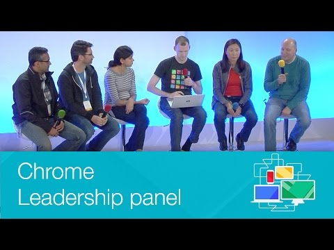

## Day One Closing Remarks - Chrome Dev Summit 2014 (Sundar Pichai)

** 视频发布时间**
 
> 2014年11月20日

** 视频介绍**

> Sundar Pichai presents the closing remarks on Day 1 of Chrome Dev Summit.

** 视频推介语 **

>  暂无，待补充。

### 译者信息

| 翻译 | 润稿 | 终审 | 原始链接 | 中文字幕 |  翻译流水号  |  加入字幕组  |
| -- | -- | -- | -- | -- |  -- | -- | -- |
| 伍文其 | 卢治泷 | 程路 | [ Youtube ]( https://www.youtube.com/watch?v=BVWAk661NL8 )  |  [ Youtube ]( https://www.youtube.com/watch?v=FZ0_BHIAAaA ) | 1503150417 | [ 加入 GDG 字幕组 ]( {{ book.host }}/join_translator )  |

### 解说词中文版：

大家好 

很高兴来到这里

对不起  我忘记关掉手机了  

但还好的是 

我们有这个很不错的功能  我可以把这玩意儿调成请勿打扰

我认为很不错 或者就我认为

好了

很高兴来到这里

谢谢

对我来说 当我第一次听到这个研讨会 我非常的激动

这真的很棒 我们有一种方式

可以与网络开发开放者社区发生连接

网络本身就是一个对我很重要也很熟悉的事物

在我还没有加入Google的时候

在我看到Gmail启动的那一刻

我意识到你也可以在网页上写一个类似Gmail的应用

这个发现对于我非常重要

我们的开发者平台

在其中扮演了至关重要的角色

我们已经走过了很长的路

但我非常的激动能在这里见到大家

并且通过这种方式可以与开发者社区连接

网络正处于一个重要的拐点

同时我认为它

会一直变得更加强大

但我看到移动端 是一个非常非常深刻的转变

几个月前 我回到印度去启动Android One项目

看到人们得到他们第一次在

智能手机上的运行体验是非常了不起的

在个人电脑时代  可能达到

16亿到17亿用户

移动端已经超过那个值 且仅仅是智能手机

在我们有生之年可以肯定

将是第一个计算平台

几乎覆盖全世界

所以我们预计超过50亿人未来几年内

拥有一个智能手机连接

同样对于我  我们都没有生活过这样一个阶段

如此多的人使用计算设备

所以这是一个非常深刻的转变  

我很高兴地看到下一波 互联网会在

那样的模式下扮演的角色

我们正在看到巨大的引力

我们坚定地致力于这个领域

我们投资了很多

你可能从听说过 Chrome团队

已经拥有超过4亿用户在移动端上使用

所以对于我来说 我们感到了巨大的责任感

在确保互联网在移动端的进化方面

互联网具有独特的特性

它在各个事情上都做的特别好

我认为我从来没见过像它一样的东西

当我看到作为一个开放者

你能写的东西  它可能会有一个长尾效应

你可以到达你的用户

人们能搜索到它

人们可以在社交网络找到一个链接 浏览你的网站

这个模型是简单的

这是通用的 并且它是有效的

不需要安装 不需要下载 什么都不需要

而这种模式 我认为在计算机中是非常重要的

并且保留它也是重要的

对我 所以我很高兴地看到 什么都可以用手机做  

作为一个平台 我已经看到它做出的一些努力

无论是专注性能 已经达到

一秒60帧 无论是离线工作

以ServiceWorkers PolymerStuff

你可以通过Material Design构建伟大的设计

等等 这真正地让我兴奋

所以希望我们能继续推动这一切

尤其是当我使用(听不清）  

我可以看到有趣的应用程序和网页和浏览器

都可以走到一起

而我们在这个早期阶段  它们的界线变得越来越模糊

所以如果你快进几年 我抱有期望地认为

我们能使用户和我们所有人以这种事物演变的方式感到惊讶

而且我认为 保持一个开放的心态很重要

所以没有什么好说的

除了  这是一段美妙的时光

对我来说  网络不能没有

像你们一样的开发者

这是它最后的症结

人们开发伟大的应用从而真正推动计算机的国度

用户能在他们的设备上做的

像我之前所讲到的 

是一个达到50亿用户的机会

我认为这是一个最大的机会  我们所有人

都将在我们的有生之年看到计算领域有这样的光景

所以希望大家受益于这一点

有了这样的 我想说感谢各位的光临

你们会有一天的时间直到明天  祝你们好运

我会很快见到你们

