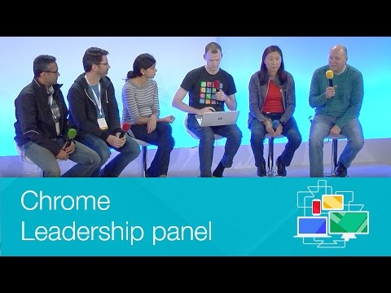

## Chrome Leadership panel - Chrome Dev Summit 2014

** 视频发布时间**
 
> 2014年11月22日

** 视频介绍**

> The Chrome Leadership Panel is your chance to help direct the platform. Let the Leadership team know where your issues are and how you would like them to be solved. Ask tough questions and get your vo

** 视频推介语 **

>  暂无，待补充。

### 译者信息

| 翻译 | 润稿 | 终审 | 原始链接 | 中文字幕 |  翻译流水号  |  加入字幕组  |
| -- | -- | -- | -- | -- |  -- | -- | -- |
| 田源 | Galory | -- | [ Youtube ]( https://www.youtube.com/watch?v=ztHMwIAbZ5M )  |  [ Youtube ]( https://www.youtube.com/watch?v=l9IZC6srMCM ) | 1503160422 | [ 加入 GDG 字幕组 ]( {{ book.host }}/join_translator )  |

### 解说词中文版：

Jake Archibld: 好  那么我们现在开始

接下来我会邀请研发小组的相关人员上台

他们组成了领导团队

里面有Rahul Roy-Chowdhury

他是产品经理  负责Chrome项目

想要打招呼的筒子们  举起手来

他来了

接下来是Darin Fisher

你们不用一个一个上来，要想也行。^___^

耶

你有头衔

你们都是有头衔的人

Darin是Chrome项目负责研发的副总

大家会在会议的开始认识他

Avni Shah  Chrome项目负责产品管理的副总

Grace Kloba  Chrome移动端的首席工程师

然后是Greg Simon  他是Greg Simon

GREG SIMON说  好了

谢谢

JAKE ARCHIBALD  是Chrome项目的技术总监

我是Jake Archibald

Jake重点业务的首席副总监

GREG SIMON  刚提的

Jake Archibald: 嗯嗯  那么你们这几天一直

都在这个版里提出问题

那么请别停下  继续提问

Chris Wilson在查看这个文档

并且会通过互联网向我推送信息

你可以在版主页面里发帖  或者直接发到推特上

当然  我们在讨论中间也会准备无线话筒。

所以如果你可以排队向我们提问

我们可以现场答疑

好吧

让我们先来看看第一个问题

Chrome封装的程序  尤其是插件

在桌面版的浏览器里已经得到广泛使用了

那么我们什么时候能在Android设备上使用Chrome插件呢

RAHUL ROY-CHOWDHURY说  我来回答这个问题

主要有这么几点

Chrome应用可以通过Cordova框架

兼容Android和iOS平台

并且目前仍然兼容

这种方式之前就支持  并且

后续我们仍然会继续提供支持

我们并没有将Chrome插件

移植到Android或者其他手机平台

而且我们目前尚没有这方面的计划

如果大家之前有类似场景的应用

并且愿意讨论一下的话

我愿意和大家聊聊

但是目前为止还没这方面计划

JAKE ARCHIBALD说  那么有什么具体的原因

阻止了我们在插件方面的发展呢

我意思不是希望AdBlock插件出现在我的手机上

因为那样的话体验就差了

那么我是吗

不是吧

GREG SIMON说  真的

有一个技术原因  就是RAM

当然  Chrome很占内存

而且插件通过网页会注入JavaScript

然后突然  它无法回收内存

因为在这个数据结构中  开发者原来所需要空余内存

被插件占用了

这会产生雪球效应

然后很多内存被占用

然后就会好像无法确定具体的问题是什么

JAKE ARCHIBALD说  我觉得Firefox就经历过这个问题

用户常常会说FireFox很慢

但是其实这不是Firefox本身的问题

主要是插件造成Firefox变慢

所以我觉得在手机上  这种问题就更加严重了

GREG SIMON说  感恩节的时候  当家人过来

告诉我说Chrome很慢的时候

我就会直接打开Incognito窗口

然后说  可以了  再试试

GRACE KLOBA说  那么这里我想补充一下

关于Greg所提到的内存的问题

对于Chrome来说  它类似于渲染进程  它的浏览器进程

和旧版本的插件运行在他们各自的进程中

然而在移动平台上  你无法在前台同时

运行所有的这些进程

因此我们尽量使Chrome能够运行在最佳的状态

JAKE ARCHIBALD说  所以V8绝对是针对

JavaScript运行效率的革新

但是目前我们发现比Chrome越来越多的ES6特性出现在Firefox上

当然了它目前还并不稳定

那么大家怎么看

GREG SIMON说  嗯  没错

当你对比其他浏览器的时候

会发现我们在V8中一些特性稍微落后于ES6

但是如果你看看我们在过去六个月所做的工作的话

你会发现我们已经有了很大的改进

我们已经增加了映射和几何

在旧金山我们有一个团队正在用JavaScript完成类的代码

所以不久  大家就能看到新的一些特性出现在Chrome上

但是要记住  V8的侧重点还是在速度上

而对于提高JavaScript速度的竞赛目前依然没有结束

而我们会继续在这个方面进行努力

那对我们来说十分重要

DARIN FISHER说  同时赞一下chromestatus.com

在那里你可以找到ES6中已经实现的特性的汇总表

比如词汇审查等等

GREG SIMON说  嗯嗯  没错

在Chrome里

JAKE ARCHIBALD说  那么问一下现场观众

ES6的哪一项特性是你认为优先级最高的

在新一系列的JavaScript中什么是你最喜欢的

观众说  Promises

观众说  Arrows

GREG SIMON说  那么Promises是的

DARIN FISHER说  Arrow函数目前已经在开发中了

GREG SIMON说  没错

观众说  Generators

JAKE ARCHIBALD  不好意思  没听清

是什么

请再说一遍

观众说  Generators

JAKE ARCHIBALD说  Generators刚刚完成

Generators已经完成了

欢呼  鼓掌 

DARIN FISHER说  绕开问题的好方法

笑

JAKE ARCHIBALD  很公平的

我觉得听到有人说  Generators

所以我迫不及待要把这个好消息说出来

GREG SIMON说  我听到有人说Modules

我也很喜欢Modules

但是它的标准有太多

所以我们希望先让它稳定一些再说

DARIN FISHER说  没错  正如Greg所说的那样

我们在扩展V8的功能的时候

十分谨慎  因为

我们必须确保功能的实现

和运行效果都是高质量的

大多数情况下  当你添加新特性的时候

你也增加了复杂度

我们希望能够万无一失

而万无一失需要一定的时间来实现

JAKE ARCHIBALD说  有人也提到Promises了

那么  我们已经优化了Promises

但是当你将Generators和Promises

一起用的时候就会变得很有趣

因为你的代码既像同步调用又像简单的程序流

所以确实有必要说一下

对我来说  ES7中我想要的特性

是异步函数  它构成了该语言的一部分

在你要等待Promise的时候

它会异步地暂停程序流

这是很明智的做法

好吧  抱歉  跑题儿了

嗨  各位

笑

那么Chrome开发工具  它借鉴了Firebug

并且和它一起运行

所以我认为可以说

它是名副其实的web调试工具

不过现在FireFox和IE也迎头赶上了  他们也在革新

那么我们在做什么呢

Greg Simon：其实我一直

为Chrome DevTools的研发团队感到骄傲

每次我打开它的时候  它就好像

带有魔法一样蕴含着新奇的东西在里面

真的是很不可思议

当然了  所有这些特性

有时会让你很难找到需要的东西

两周前我们在BlinkOn上聊过一些相关的内容

在那里我们讨论过2015年

准备在Blink上进行的大项目

而其中的一个是需要告诉各位的  各位开发者

当你们需要将构造页面的时间

也就是进行布局  绘图这些操作的时间

和JavaScript缩短到16毫秒以下的时候

所以当你迷失方向不知所措的时候

寻找一些2015年的关于  更多的提醒  的内容  这样

JAKE ARCHIBALD说  那么有什么关于

移动平台或者运行效果的内容

出现在新版本的DevTools中吗

你有没有一个具体的  我是说如果  GREG SIMON说  没有

JAKE ARCHIBALD说  没有  好吧  笑

GREG SIMON说  嗯  这个真没有

但是我的意思是说在过去九个月中

负责Web平台的团队的工作就是能减少你的工作量

我们希望打破局限

这样大家可以随心所欲的运行JavaScript

开玩笑的

但是最重要的是  我们希望打破原有的局限

这样当程序变慢以后  你可以改进它

而不必依赖bug报告

在12周之后  进行发布什么的

我们希望工具能给大家更大的帮助

JAKE ARCHIBALD说  说到DevTools

我发现当我使用Mac OS X操作系统的时候

每天用  我发现了很多

不可思议的特性

所以我决定

花一天时间按着Option键

然后点击所有的东西去探索其他的功能

我听到一些开发者说他们对于Chrome DevTools

有同样的感受  里面有很多

没有被广泛使用的特性

需要被挖掘

有什么我们能做的吗

GREG SIMON说  我在工作中经常会使用DevTools

里面的功能基本上都是这样的

或许我叫不上他们的名字

但是没错  你说的对

我们能做的还有很多

有些关于HTML5 Rocks的文章

也许我们可以展开聊聊那些

但这是个开发工具

它会包含很多底层的内容

它不像网页那么赏心悦目

但是它也有它华丽的地方

JAKE ARCHIBALD说  那么关于新的Web平台

我们很积极的推出了Service Worker

DARIN FISHER说  耶

JAKE ARCHIBALD说  耶

但是对于浏览器和不间断审查

仍然有不同的意见

同时我们也希望能够推动消息推送  部署

消息推送  目前对于服务器的消息服务

也没有统一的设置

在没有统一的标准之前

我们就积极推出该功能

会有什么不妥吗

DARIN FISHER说  我认为是的  有一种折衷的方案

重要的是在这个问题上我们要有积极的态度

因为开发者们的确需要

我们努力解决这些问题

而Service Worker的确是能够

起效的东西  目前它的研发事实上已经有段时间了

正如你知道的一样  Jake

JAKE ARCHIBALD说  但是它是相对的  不是吗

虽然已经有1年半的时间

但是和标准的制定时间相比  它就好像20分钟那么长

DARIN FISHER说  嗯  的确是这样

但是它的研发工作已经向外界公布

已经有很多来自Mozilla的同行和

Google产品团队的

相关的议论和互相合作

他们都极度渴望这些特性

所以反馈渠道是非常棒的

我最终了解到  我们正在努力搭载Service Worker

并且我们可能是第一个搭载Service Worker的浏览器

这意味着我们将会承担一定的风险

风险是当其他浏览器供应商都搭载该功能时

我们就会变得有点另类

而这个风险显然我们已经意识到了

并且已经密切关注

并且要确保我们的选择是对的

而不是为平台增加复杂度  因为如果那样

就不好了

GREG SIMON说  我们也使用一种分层的方法

来搭载Service Worker

而标准中有些还没有成型  Jake

JAKE ARCHIBALD  抱歉

GREG SIMON  没关系

没事

但是我们希望能够搭载一个最精简版的

那么什么是我们能够提取出来的最精简并且有用的部分

以表示我们的态度并且大家能有可用的

工具呢

如果你有疑问或者

你对我们如何决定搭载什么东西好奇的话

请查看blink-dev里的邮件列表

那是个公开列表

上面的人员都是Blink引擎的开发者

但是  有一个叫做Intent的进程

叫  Intent to Implement  和  Intent to Ship

所以当一个开发者进来说

我希望参与开发  我想把特性X加到平台里

所以我就可以向这个团队发一封邮件

即Intent to Implement  它意味着低摩擦

类似于PSA

但当你准备好去打开它时

你需要发送一个  Intent to Ship

而且我们没什么特别的因为我们是Google

我们也发这些

然后你会看到Googler在那来来回回  你要

搭载Service Worker吗

疯了吗

所以我们要解释我们的原因

这些都是公开的

都已经发布了  你可以随意查看

JAKE ARCHIBALD说  没错

而且如果对于我们的工作流程或别的东西

你有什么具体的问题

可以用无线话筒提问

它不是无线  但是大家都可以用

所以如果你有疑问  那就大胆问吧

没错

我觉得通过Service Worker和其他的特性一起

我们可以在未来三年依靠这些东西

而且还可以实现一个更好的API

我们也许可以提出一个更简单的规格标准

但是那样一来  结果就是大家都没法用Service Worker了

GREG SIMON说  很对

JAKE ARCHIBALD说  所以我觉得我很乐于做我们正在做的

将那些东西向前推进

我们也看到了它和Promises一起

但是我们要对我们的Promises的东西进行修改

但是我们从数据上知道

它不会破坏已有网站

GREG SIMON说  是的

我觉得这个团队里没人对鲁莽感兴趣

DARIN FISHER说  但是你的观点不错

通过Chrome的Dev频道和Usage Counter

里面有很多参与项目的同伴

我们可以更清楚该采纳的东西

并且对已搭载的特性

进行小幅修改的风险有了更清晰的认识

并且你也可以在blink-dev上看到这些更新

被发布

而开发者  重申一下  都十分在意

这些改动所带来的影响

JAKE ARCHIBALD说  酷

观众有什么问题吗

观众  有

我是个初学者

你认为什么是最好的web应用编辑器呢

尤其针对Chrome开发

GREG SIMON说  什么是最好的Web编辑器

比如  DARIN FISHER说  我非常喜欢用Vim  但无所谓

GREG SIMON  很有意思

历史上有很多想要创造终极web编辑器

的尝试失败了

JAKE ARCHIBALD说  我觉得是  反正我用Sublime Text 2

还没转到Sublime Text 3

因为  我觉得因为开发者花在

一个特定编辑器的总时间  就好像一个移动的屋子一样

你不能直接起身就走

它需要  因为即使

DARIN FISHER说  1993年我学到的这些快捷键

直到现在都依然好用

笑

GREG SIMON说  另一件事是

在Web平台上做同样一件事有很多不同的方法

对吧

而且它不会把自己交给

某些能帮你完成所有事的ID

通常  有名的ID会把你局限在一种思路上

而Web不会这样

我是说Web没有固定的模式

它只是有一个大体的范围

JAKE ARCHIBALD  我对

建立在Web技术上的一些编辑器

十分着迷

但是这仅仅是对于初学者来说的想法

你可以先用用编辑器

等你对Web平台更加了解后

就可以换成其他

你喜欢的编辑器

你可以通过Web平台来熟悉它本身

DARIN FISHER说  我感觉jspin已经成了

我们团队里的一个专用词

没错

观众  我们大家的共识是

没人认为Chrome DevTools是编辑器

它实际上是一个很不可思议的东西

GREG SIMON说  没错

对的

所以我相信研发团队把它

加进来是因为Chrome DevTools编辑器

本身就会用它在DevTools上运行  我很确定

DARIN FISHER说  的确是这样

他们实际上会针对DevTools专门做一些开发

很有意思

而且很酷

GREG SIMON说  事实上  他们甚至

做了一些插件可以将数据存储到本地

JAKE ARCHIBALD说  好吧

我们来听听下一位观众的问题

观众  好的

那么有一种  我猜如果你觉得移动Web应用

和原生应用是等同的话  那应该有三个

不同的角度来进行评价

在性能上等同  在功能上等同  比如蓝牙之类的

以及在发行方式上等同

比如应用商店  Web应用和原生应用

在同一级上展示

目前有没有计划将

Chrome商店和Play商店合并呢

有关于这方面的消息吗

RAHUL ROY-CHOWDHURY说  我可以解答一下这个问题

我们目前没有将Chrome Web商店和Play商店进行合并的计划

或者将Chrome Web商店引入到移动端的计划

但是你提出了一个不错的建议

对于如何在web应用与原生应用之间

如何搭建桥梁

你已经知道了我们

对于性能和功能上所做的工作

探索是很有趣的

模型也各不相同

我觉得web神奇的地方在于

探索是没有障碍的  简单的  也是全球化的

任何东西都是简单点击鼠标就可完成

无需安装过程

也没有门槛

你仅仅点击一下链接  就可以进入体验

所以在某些方面  随着web在移动端的发展

我们希望能够在新的框架下

web依然能够保持它原有的优势和品质

观众  对

所以我觉得应该快速跟进

有些人会通过Cordova来封装web技术

来增加扩展功能

但是我得说即使大多数这些完全都是

针对应用商店发布

所以在同一个应用里你可以找到需要的特性

而这些特性大家也许在web应用里已经期待已久了

所以随着时间推移这些技术都会改变

你会怎么想呢

你会通过Cordova打包

或者未来会有另外一种更好的方法能避免使用Cordova

JAKE ARCHIBALD说  我觉得你说的对

应用商店模型针对内容搜索十分十分有效

Google未来会为Web搭建内容搜索服务

或者类似的引擎吗

DARIN FISHER说  我Google一下告诉你

笑

JAKE ARCHIBALD说  用于搜索

但是我认为这点很对

我们发现很多人去应用商店找东西

即便我们已经有很多网站也能做这样的事

RAHUL ROY-CHOWDHURY说  我认为我们不需要

规范来做这些工作

我认为开发者  就像你们一样

对于你们所需的东西  你们比别人更清楚

而你们需要决定哪个是合理的

如果探索仅仅通过在社交媒体上

点击链接  比如说啊  这种方式

能够找到你的应用并且被很多人使用

那么web可能就是一种合适的模型

如果你很喜欢商店打包的方式

或者你觉得会有机会用户在主页屏幕

上保留你的应用  并且

获得很高的重复使用率  那么应用商店就是一种更好的选择

我感觉没有万能的选择

大家昨天听到的一个主题

就是我们发现一小部分排名靠前的应用

采用了商店模式  并且把应用

放在主屏幕

并且用户对这类应用的使用率很高

但是从长远来看  你是否能获得所期望的

用户关注度  并不明朗

尤其是用户设备上还有很多其他种类的应用

而对于这些用户和开发者

也许web是很高级的模型

所以需要具体分析

你的应用到底有哪些需求

GRACE KLOBA说  而且我希望补充一下

关于android版Chrome

和iOS版Chrome  它们都会添加一个Home页面

所以如果用户真的希望一直查看这个网页

那么他们可以很方便的把链接添加到主屏，而且也能很方便进入

JAKE ARCHIBALD说  我认为大家之所以

喜欢Play商店

是因为它提供了较为初级的交易平台

那么我们如何增加Web的竞争力呢

AVNI SHAH说  没错  问得好

我会针对这个问题展开  其他人可以补充

所以支付模型和产品流通

对于移动Web来说十分重要

我觉得这是大家的痛点

对于用户来说也是一个很大的痛点

有很多不同的解决方案

很多人对于这个方面很感兴趣

而且也没有确定的答案

而我们所能看到的一些解决方案  其中一个能预见到的问题

就是对于集成和与集成相关的困难

所造成的较低的理解力

因此要在大范围的应用里

使用web开发就显得更加困难了

但是他是我们十分关心的

是我们一直在思考的

我觉得有些东西我们是可以做的

比如AutoFill  这是我们已经具备的技术

而且已经加入到当前平台了

它的功能很正常  无论是帮助开发人员

制作简单的标签还是类似的东西

要比现在所能见到的好很多

所以我认为有些解决方案

是可以供我们采用来为用户和开发者降低困难度

所以会一直改进

JAKE ARCHIBALD说  那么来看看下一位观众的问题

观众  谢谢

我不知道这个问题是不是该问您这个团队

但是我觉得今天应该是我离研发团队最近的一次了

Node.js很依赖V8  而且

貌似Google并没怎么参与那个项目

所以我想问问有没有计划为Node完善一个

长期支持的V8版本

GREG SIMON说  那么你认为

那些改进能使V8更好的支持Node呢

观众  不  V8很棒

只是Node有时会落后V8版本

我只是想问问你们是否有相应的计划

GREG SIMON说  嗯  也许

和Node项目的作者聊天的时候也会说到这个问题

我是说V8是公开的API  并且我们很高兴Node用到它了

真的很棒

但是  V8团队也没有义务

为Node推进V8版本

JAKE ARCHIBALD说  但是如果他们能继续推进的话

会是一件很棒的事  因为

你们毕竟也得添加Promises和Generator

Node团队  我觉得有很多

关于Promises的API需要进行讨论

但是我希望他们能添加Promises

尤其是作为平台的一部分

观众  谢谢

JAKE ARCHIBALD说  这是我喜欢的问题

如果你在其他浏览器中看看Google Docs和Inbox

会有一个banner弹出提醒你使用Chrome

而对于Inbox  整个网站会被屏蔽

而且甚至在基于Chromium的浏览器中也是一样  比如Opera

Internet Explorer仅仅将Skpye作为跨浏览器的应用

什么时候Google成了坏人了

哨

笑

AVNI SHAH说  我们可以讨论一下

最后那个问题的前提吗

笑

把它摆出来

RAHUL ROY-CHOWDHURY说  对  是个已经提出问题

但是我认为我们还是喜欢跨浏览器的东西

正如我说的  Web的超能力

是它能够工作在不同的浏览器上

不同的环境上

它是能够普遍适用的

Chrome就是要把这种情况实现

对于Inbox  我不知道

为什么他们会针对Chrome专门开发

可能是一个产品质量的问题

可能是阶段性的过程

但是可以确定的是我们喜欢在所有浏览器上

运行具有Google特征的东西

也许在常期维护的浏览器和

无更新浏览器之间有些隔阂

但是总的来说  我们还是希望那种普遍适用情况能够出现

我不觉得里面有什么冲突

JAKE ARCHIBALD说  所以我才这有一点  哦  抱歉

继续吧

观众  那么在这个会议中

有一件事可以确定就是对于V8和运行时渲染

会有更深层次的融合

我已经听说现在已经将Blink和V8集成起来了

在每个页面渲染的末尾

引擎会触发一个GC Pause

这样它能更好的利用空闲时间

而我不知道会不会对于在

这些浏览器内部开放用户脚本

用户JavaScript脚本

因为GC Pause  比如说

使得用WebGL编写程序变得很有挑战性

因为你永远不知道什么时候

你会触发GC Pause

所以你会在用户线程中

以JavaScript的方式运行WebGL  而这样会打断你的动画

而且那意味着更难

GREG SIMON说  没错

我不认为我们会暴露GC

或者不使用GC  因为这会造成

RAM的不当使用  并且RAM占用会变得比现在糟糕

作为程序员  你能控制垃圾回收系统最好的方法

是不去重新构造对象

但这也不是最好的答案

作为一个老开发者  我们同意你的想法

在过去的这些年中  我们团队有一个共识

就是我们不会再做更高级别的事

相反  我们会优化平台

所以你看看Service Worker

你可以用它来描述App Cache

因为那是我们搭载ServiceWorker

而没使用App Cache的原因

然后你可以看到很多那样

低级别的  并且简单的基本元素

他们在其他框架中也开始被使用

而不是仅仅显示对话框

DARIN FISHER说  另外  在blink-dev中  你可以参考类似的内容

有一个叫做Oilpan的项目

它负责Blink中的垃圾回收机制

而其中的一部分有机会

在堆栈释放或者类似的情况下进行准确的GC操作

而且我们通过有序安排这类工作会达到更好的效果

最酷的是作为开发者

你可以开始数数  如果你没有创建

很多对象  那么你就无需

在特定的时候担心垃圾回收的问题

而且如果你尝试在WebGL中创建渲染功能

那么你需要考虑一下需要创建多少

对象等等

GREG SIMON说  是的  这个观点很对

V8是垃圾回收的  而V8团队可以

在运行时控制垃圾回收  这样他们就能将V8与编辑器连起来

Blink用的是引用计数系统

所以工作顺序是自由的  并且处于随机顺序

但是不是可预见的顺序  特别是Web开发者无法预测

但是将引用系统切换为

图形  我们就能追踪了

我们可以更好进行控制  当我们

在Blink中释放对象时

JAKE ARCHIBALD说  所以这就是为什么

有两个设备目前仍然没有浏览器

正如你们所说的  手表和Anroid TV

在这些设备上  我们已经放弃web了吗

笑

GREG SIMON说  哇哦

AVNI SHAH说  没有

笑

DARIN FISHER说  你需要麦克风吗

AVNI SHAH说  不  不需要

Greg  你需要一个吗

GREG SIMON说  嗯  好

GRACE KLOBA说  我想我先来说吧

我戴着手表  但是根本没有

必要在手表上使用浏览器

所以我觉得不同的设备  有不同的用途

手表主要是用来收集数据的

并且对于提醒功能也是一样

所以举例来说  我们的Service Worker

将把这个问题搁置一边

将通知推送给手表

会在M40 frame中出现

JAKE ARCHIBALD说  M41

GRACE KLOBA说  41

好吧

有时候

对  推送通知  这个会出现

对于TV  不会有浏览器

但是有Chromecast  是旧版浏览器

大家所需要的就是一个浏览器  对吗

GREG SIMON说  对  我不觉得Chrome的成功是

运行在各种平台上的二进制

我希望大家都能够接触到这些设备

DARIN FISHER说  而且很多这些设备

都能和其他设备相结合

而手表很明显属于配件

JAKE ARCHIBALD说  Twitter上有个问题

而且它用的词比我平时用到的都多

你认为如何能够明智地

解决material design在未来成为UI设计基础的时候所存在的

对于用户体验的潜在限制吗  观众  什么

观众  什么

JAKE ARCHIBALD说  很对

笑

JAKE ARCHIBALD说  好多单词啊

DARIN FISHER说  你能再读一遍吗

JAKE ARCHIBALD说  不  我觉得难

能读完一次就很开心了

好吧  我觉得这个问题是说

如果Material Design未来成为Web设计的标准

我们是否无法再在设计方面有所突破

AVNI SHAH说  我觉得这个最后会出现在Material Design版块

在那我最终会看到这个问题

所以我会重复他们所说的

material design提供了

构建你应用程序的框架

但是它不会限制多样性

而且它也不会限制你应用的功能

它仅仅提供了构建程序的模块

和程序构建初期的模块

所以我认为它是一个很重要的工具

但是它不会限制革新

GREG SIMON说  对的  它是一个备选项

而且Polymer也是备选项

当你坐下来使用Xcode开发iOS  或者Eclipse开发Java时

你就有了主题

对于东西的外观  你会有各种不同的选择

所以你总是可以走开去

绘出你自己的东西  但Web不行

它只是白色的

所以白色就是主题

JAKE ARCHIBALD说  那么下一个问题

Dart的未来是什么呢

它就好像在监狱里一样

就好像使人们陷入困境

无法找到需要的东西一样

有没有向Chrome添加运行时的计划呢

DARIN FISHER说  对于运行时  没什么新的内容

但是Dart团队准备将Dart一直到JS

他们将推出一系列新的更新

比如递增编译等等

Dartium项目旨在令开发者能够

在开发过程中更快地调整

Dart团队努力使

Dart开发进展顺利

所以基本上就是这样了

JAKE ARCHIBALD说  那么Service Workers什么时候

会出现在Android的WebView上呢

原生程序什么时候会提升

Service Worker的重要性呢

DARIN FISHER说  嗯嗯  我们正在解决这个问题

GRACE KLOBA说  对  没错的

DARIN FISHER说  而WebView会自动升级

昨天这事就收到了欢迎

鼓掌

JAKE ARCHIBALD说  我们接下来的内容

就是要鼓掌么

我们可以一直说  WebView  自动升级

鼓掌

WebView  哦不  我不说了

昨天也发生了一次

当WebView确实开始具备自动升级的时候

我就说  嗯  耶  迟早的事了

但是也容易忘记它是第一个实现该功能

的平台

我觉得没有哪个移动端操作系统具有

内部自动更新的WebView

GRACE KLOBA说  iOS不就是吗

JAKE ARCHIBALD说  iOS

但是那是随着操作系统一起升级的

我们的操作系统也有这个功能

GRACE KLOBA说  而不是以每六周的速度升级

GREG SIMON说  你说的很对

谢谢

JAKE ARCHIBALD  因此NPAPI

是否有计划打算启用它呢

RAHUL ROY-CHOWDHURY说  是的

所以如果大家一直关注着我们的计划

我们在今年早些时候就已经宣布

我们将在今年底的Chrome版本中

停止支持NPAPI

而且事实上  我们的确在审视和观察着

使用上的数据

而下周会有一个博客帖子贴出来

所以如果你对这个话题很感兴趣

下周来看看我的博客帖子吧

总而言之  正如我们所希望的那样

NPAPI的插件的使用频率在下降

但是我觉得还得在未来几个月

在Chrome里支持它

以使少部分程序员

及时修改他们的程序

所以我们对它的支持会延续几个月

直到2015年

但是在年底

默认关闭它

所以这是我们之前提到的

一点小小的修改

JAKE ARCHIBALD说  Chrome有它自己内部的

Flash播放器版本  所以移除NPAPI不会停用Flash

对吗

RAHUL ROY CHOWDHURY说  没错

Flash和放弃NPAPI是相分离的

GREG SIMON说  Flash也可以在Pepper API下运行

这是一个有趣的故事

你知道大家都关注的

那个小的声音图标吗

我们无法用NPAPI来实现

但是我们需要它

DARIN FISHER说  对  因为Pepper有一个插件的API

可以用在沙箱里

也是Native Client的最基本的东西

但是由于它被用在沙箱里了  意味着

我们可以知道他什么时候播放音频

JAKE ARCHIBALD说  所以我们放弃NPAPI

在Web上和它相关的实际的东西是什么呢

人们看不到的东西是什么呢

恶意软件

回答的好

RAHUL ROY-CHOWDHURY说  没多少

我意思是我们已经看到使用量下降的趋势

而且整体来说  大家已经转向

NPAPI的其他类似方案

如果你在使用NPAPI插件  很多人

已经转向Native Client  因为

他们发现Native Client的API基于Pepper

PPAPI  可以给他们提供他们所需的API

在很多情况下  用到NPAPI的

Chrome扩展插件用它来和

本地应用程序进行通信  比如在Windows上 

就像  你可以想象一个来自网页的插件的

消息类应用可以在聊天窗口

启动一个本地应用程序

所以我们在Chrome扩展插件系统中引入了API

来处理这样特殊的使用场景

所以举例来说  有一些本地消息的API

如果那是你使用NPAPI唯一的原因

你可以无缝转到本地消息API

今年整体的情况  有些开发者

已经开始迁移

使用一些不同的技术

而且还有一个NPAPI停用指导

如果你搜索NPAPI DEPrecation Guide

就可以找到相关的链接

里面会介绍多种方式来停用NPAPI

GREG SIMON说  有很多方法可以实现它

有些比你之前所做的还简单

有一些音乐公司使用NPAPI插件

来和USB吉他进行交互

之后他们直接转到更简单的chrome.usb API了

也不再是C++了

只是JavaScript  而且工作正常

RAHUL ROY-CHOWDHURY说  而WebRTC支持也帮了很大的忙

JAKE ARCHIBALD说  所以在mobile之上

下一件大事是什么呢

是桌面电脑玩完吗

我们是不是现在全部专注在移动平台呢

AVNI SHAH说  桌面不会死的

仅Chrome自己  我们就有超过7.5亿人的桌面版本用户

而且这个数据还是

我们在大约18个月以前公布的

但是这还不是用户增长的原因

我认为Andreessen Horowitz刚刚发布的

这个滑动工具栏会是接下来几周

供数十亿用户上线

通过智能手机会使用的东西

有趣的是他们会

使用智能手机使用它

而手机也是用户使用的唯一渠道

智能手机将成为他们与互联网接触的第一种渠道

而对我们很多人来说  和对于成熟市场来说

手机是次于桌面电脑的一种方式

所以会是一个很有趣的趋势

这将会是人们第一次通过智能手机

与互联网和Web接触

有趣的是很多这些用户

会在非常不同的市场

上线

有不稳定的连接  或是低带宽  或是高数据损耗

手机就显得没有那么强大了

所以我们需要想想如何

能在这样的平台上提高用户体验

来真正让这些用户用的愉快

而另一个我们可以预见的趋势是

跨设备的使用方式

大家都具有多种设备

至少在成熟的市场里

但同样地  如果你想想新兴市场

他们首先从智能手机入门

之后很可能转到他们其他的设备上

那么我们如何来提高这样的体验呢

而Chrome就处在一个很有意思的位置上了

因为它是可以兼容所有这些平台

并且可以真正发挥作用的

JAKE ARCHIBALD说  所以HTTPs就变得非常重要

但是开发者仍然发现它很难用  并且代价很高

而Mozilla发布了他们自己的证书授权机制

那么Google和Chrome是怎么做的呢

会有答案的  各位

笑

DARIN FISHER说  不  我意思是  正如你昨天听到的

我们已经做了很多事以帮助用户理解

如何在他们的网站启用HTTPS

而且还有很多益处

而且事实上  虽然这个很有挑战性

但是它并不像之前那么困难

有很多可用的资源

并且有很多利益  尤其是用户的利益

所以基本上  我们最大的努力  我想说

就是把事情说出来让大家能理解

JAKE ARCHIBALD说  我们现在就在做啊

我们这么做的一个原因是是否让一个网站能够安全运行

那是我们的工作重点之一

DARIN FISHER说  嗯  对的

确实是这样

还有什么呢

JAKE ARCHIBALD说  我收到了现场信息

它来自正在使用该功能的团队

提到Mozilla授权证书因为

是由IdenTrust交叉签名的

那么Chrome未来也会

支持他们的证书验证  非常棒

他们在文档中粘贴了三次

所以我觉得我所说的是很重要的

谢谢大家

所以跨浏览器的HTML5 视频编码支持

已经处于一个非常混乱的状态了

有没有什么计划打算稳定一下这个功能呢

既然我们已经有了我们自己的格式

为什么我们不放弃它们呢

DARIN FISHER说  这些东西目前是比较混乱

这是没错的

我想我们的方式是通过

VP8和VP9来继续推进  来打开编码器

以提供更好的体验

我们和YouTube紧密合作

研究Youtube所提供的整套体验

看看VP9所能提供的效果如何

这是令人兴奋的一件事。

但是从浏览器的角度来看

我们需要面对一个现实就是

我们需要同时兼容新旧版本

而对于WebRTC  也是非常有趣的

这也很有挑战性

很令人兴奋的  当然也是很有趣的

在最近的IETF会议上

已经达成共识  就是标准的WebRTC实现

会同时支持VP8和H.264

JAKE ARCHIBALD说  下一个问题是没用的

但是这个问题是来自会议的组织者

Paul Kinlan  所以我觉得我需要说一下

来吧

DARIN FISHER说  希望交到朋友

JAKE ARCHIBALD说  我都没法带着激情来读它了

Chrome最优先的三个目标是什么呢

不是两个  也不是四个

随便给我来三个吧

RAHUL ROY-CHOWDHURY说  好吧  我可以解答一下

即使那是Paul Kinlan  我们有必要解答它吗

首先第一个任务就是  也是会议的主题

让Web平台在移动平台上更好

大家已经知道了我们所做的工作

都是关于性能  功能

而那是我们2015最首要的任务

第二个就是在移动平台尽量提高用户体验

说的更准确些

就是弱化应用程序和Web之间的区别

而昨天  你看到了一些例子

他们基于Andorid L  并包含Recents菜单

还有单独的位置来开启Chrome标签页

也能打开程序

所以用户不用再去纠结

到底是通过浏览器打开的还是直接打开的本地程序

所以复杂性就没有了

有很多事需要我们去做

来降低用户体验的区别

这是我们的一个长远目标

而第三件我想说的

我猜是因为我们最多能说三个

JAKE ARCHIBALD说  对  不能超过3个

RAHUL ROY-CHOWDHURY说  Chrome的几个核心原则

速度  简单  安全

这是我们从第一个Chrome版本开始

就坚持的原则

而我们后面每做一件事

我们都要保证没有偏离这些原则

这些原则一直存在于我们所做的每件事上

速度  简单  安全永远是我们首要的原则

JAKE ARCHIBALD说  我想可能按规则说

你可以兼顾三个原则无论还有别的什么

但是只要你做到一个原则  你就得坚守其他两个原则

因为这就是规则

笑  那么什么是Chrome最不重要的呢

笑

DARIN FISHER说  我觉得说这个会让大家难过

GREG SIMON说  嗯  我们放弃的是什么呢

JAKE ARCHIBALD说  Chrome应用

DARIN FISHER说  等等

有个板版块  Intent to Removes

在blink-dev的这个版块里

会告诉你我们正在移除的东西

RAHUL ROY-CHOWDHURY说  永远支持NPAPI

不是团队的高优先级的任务

JAKE ARCHIBALD说  XSLT

我想我们正在避免使用它

DARIN FISHER说  这确实会惹怒一些人

JAKE ARCHIBALD说  我刚离开大学的时候

参加过一个XSLT培训课程

我都想死了

接受培训的那一周我都想灭了它

而且它在我后来的生活中也没怎么帮到我

GREG SIMON说  我们在blink-dev上已经有了很激烈的辩论

关于用户希望将它提取出来

作为一种可以后期下载的东西  然后  但是

JAKE ARCHIBALD说  对  我们应该那么做

我觉得在web刚刚出现的时候

是web很低潮的一段时期

就好像坐在帐篷里的长胡须的老人一样

如果有人希望继续  我们就需要转换XML

如果他们继续  我们就在XML里处理

笑

所以Chrome apps应用API

Chrome apps应用API确实有个问题  自从  对不起  笑

鼓掌

我的神呀

我好像还没倒过来时差

Chrome Apps在APIs里有一些信任性问题

自从Google在一些方面使用它  包括无脑应用

比如消息提醒支持

那么我们会长期支持Chrome应用吗

RAHUL ROY-CHOWDHURY说  是的

有一些Google特性

创造了很棒的Chrome应用体验  Play Movies

比如  Play Music

和其他类型的平台不同

Chrome应用平台针对Chrome OS来说

的确是本地开发平台

所以Chrome OS做的很棒

尤其是对于企业用户和EDU市场

如果那对于你们或者开发者

是一个有意思的部分

我觉得你应该考虑是否Chrome应用对你来说是个不错的选择

另一件我要提到的事是我们喜欢web

Chrome OS也喜欢Web

所以Chrome应用并不意味着在那里

你可以构建已经在Web上效果很好的应用

它意味着在那里你可以说一些

web上暂时无法实现的东西

或者安全模型不完整的东西

一个典型的例子是Chrome 应用已经具备了蓝牙 API

所以如果你需要蓝牙接入

而且你面向的是Chromebook设备

那的确是您可以做的事

我们致力于将同样的API移植到web上

你之前应该听到相关的讨论

但是需要一些时间去消化安全模型

和具体实现

但是Chrome应用会在这里停留

Chrome OS是我们极力要去做的

而且这是Chromebook的原生平台

JAKE ARCHIBALD说  那么我们

已经接近提问的尾声了

剩下没几个问题了

那么好吧  如果观众还有问题的话  我们还可以解答

如果有些答案大家不满意

想要对在场的各位施压什么的

请随意

别弄我就行

那么我们接着来看观众的问题

观众  我可以继续问个问题吗

如果有了授权  Service Workers  manifests

等等所有这些  Chrome 应用还有希望吗

RAHUL ROY-CHOWDHURY说  我认为我们的目标是

如果在Web上效果很好的东西  甚至是对于Chromebooks来说

我们就会把它挂上网

我认为对于这几天我们所谈论的这些原因

web是正确的选择

也许有时你需要构建自己的UI  比如

那么使用浏览器标签页就不怎么合适

也许web上没有相应的API

也许在你过去完成的项目中  或者你的经验中

打包模型是很高级的

对于这些原因  Chrome应用也许对你来说是个不错的选择

而且我们还会继续支持Chrome应用

而且我们还会保证Chrome OS能有

一个原生平台来支持开发者使用

想象一下未来  举例来说

新款Chromebook上有一个新的传感器

而你想去了解

如何从传感器上获得数据

Chrome应用总会在那

支持你获得设备的所有功能

然而对于web来说  可能需要花一段时间才能达到那个水平

GREG SIMON说  是的  但是在web上应该更快

而且我们正在尝试通过Navigator Connect和权限限制

来实现它

但是总之  我同意

JAKE ARCHIBALD说  我觉得像Chrome应用这样的东西

会成为很好的测试渠道  不是吗

不仅是针对某一特定事务的API

比如说蓝牙  它们看起来怎样

但是的确是一种好的方法来检验所能得到的功能

对于我们来说是不错的反馈

可以引导我们决定将什么推送到web平台上

RAHUL ROY-CHOWDHURY说  对  不仅是用途

而且Chrome Apps团队

所面临的技术挑战

也会增加Service Worker

和所有其他这些针对web的API

的相关工作量

DARIN FISHER说  挺有趣的

一部分已经开发过Chrome应用

或者正在开发Chrome应用的人

也同样在维护API  比如蓝牙

比如推送消息

而基于Service Worker的东西  因为

这部分内容他们已经想到了

在Chrome应用的开发过程中已经理解到了

但是他们也可以将理解和经验

用在开放的web上

而且他们很热衷于这个

我觉得  对我来说  Chrome应用用于一个特定的领域

正如Rahul之前所说的

我们能够快速推出很多特性

而在Chrome应用过程中  安全模型各不相同

它允许这类东西功能单一

但是我们尽力寻找方法

引入这些功能来使用户

能够充分利用设备功能等等

JAKE ARCHIBALD问  那么有没有什么特殊的计划去标准化一些东西

比如Chrome.serial  chrome.bluetoothLowEnergy

usb.storage  富消息提醒之类的东西

DARIN FISHER说  我认为我们对于这些内容已经考虑的十分全面和

细致了

RAHUL ROY-CHOWDHURY说  我认为之前

Mike已经把这些方面完成了  当他说

蓝牙是最需要搞定的

如果你可以搞定它  那其他问题

也就迎刃而解了

而且你可以找到一种可以复用的模式

所以蓝牙是我们目前的工作重点

他一直专注于信标开发

谢谢

但是他们仅仅传输了一个网址

而且  它突然变的  额  等等

我们在这方面能做的还很多

如果我们有一些  我们可以转向web平台

DARIN FISHER说  对于刚才

我们聊的这两个话题

我十分感兴趣

就像  比如  如果你有一个链接指向一个网站

而这个网站知道如何

使用蓝牙API去和物理设备

进行交互  你可以想象一下

这其中的可能性

这就是URLs的本质  真的很棒

如果你进入一个屋子

然后发现有很多你可以

用来和物理对象交互的URL

而与他们的交互

可以变得很丰富  因为你可以通过一些底层方法

建立和设备之间

直接的连接  比如蓝牙

或者其他我们在未来发布的设备API

JAKE ARCHIBALD说  我们已经

在疯狂的想法中来回跳跃了  比如一个网站可以

在后台监听信标链接

针对特定的来源或者特定的路径

然后你可以步行接近这些东西

它可以弹出一个Service Worker

而且还可以在Service Worker中触发一个事件

你可以做你想做的一切

缓存数据  短提醒  仅仅通过打开网页就行

DARIN FISHER说  事实上  整个模型

都令我很兴奋  因为它能帮助我们解决一些安全问题

因为交互模型十分准确

用户可以和一个特定的设备进行交互

而困难的问题也会得以解决

JAKE ARCHIBALD说  这是个很不错的问题

我们如何看待在未来五年Chrome和其他平台共存

比如Android

AVNI SHAH说  嗯  好吧

我觉得首先我能预测未来五年的样子

也许我说的不准  因为事物总是在发展

DARIN FISHER说  或者你可以变得很有钱

AVNI SHAH说  是的  或者我可以变有钱  要真是这样

我就不在这了

额

笑

JAKE ARCHIBALD说  什么

GREG SIMON说  什么

AVNI SHAH说  我什么都没说啊

别攻击我

嗯

五年会发生很多事

五年前  Chrome仅仅只有一岁

Android版Chrome还没出现

iOS版Chrome也没有

我意思是这个世界在五年内会有很大的变化

所以预测五年以后的事几乎是不可能的

尤其是以我们现在所能感受到的发展速度

但是我觉得

我们依然会努力将移动上的web平台为开发者打造为

最好的平台  让它成为开发者接触用户最好的渠道

提升功能性  提升性能

我不认为这是原生应用和Web应用

之间的零和博弈

我觉得他们都是很棒的平台

而作为开发者  你可以选择适合你的

我觉得他们会共存一段时间

五年

我不知道

我不知道

也许  我不知道  宇宙飞船在这降落

我不知道会发生什么

JAKE ARCHIBALD说  而且宇宙飞船上也会安装浏览器

对

AVNI SHAH说  是的  他们一定会装的

对

JAKE ARCHIBALD说  我们来听听观众的提问

观众  最后一个问题

有没有能让我们看一下侧边工具栏

视频  之类的东西

有可能在这里展示一下吗

JAKE ARCHIBALD说  是Google团队的人

让你们问的这个问题吗

太棒了

好吧  一件神奇的事是  我觉得

上传到YouTube  昨天的视频已经完成编辑并且

分割并上传到YouTube上了

很棒

今天的视频也会很快上传的

而我们会保证到时候将侧边工具栏

的链接放在那里

DARIN FISHER说  这个谈话也会上传是吗

JAKE ARCHIBALD说  嗯  恐怕是的

而且还有说明

这样就可以被搜索到了

也许他们会把我的一些不正常画面给剪掉

笑  我觉得如果在未来五年中我们的进步能够像

过去五年一样

那么未来就会很光明  不是吗

RAHUL ROY-CHOWDHURY说  对

DARIN FISHER说  对

AVNI SHAH说  是啊

JAKE ARCHIBALD说  太酷了

好吧  那就到这里结束吧

十分感谢领导团队

鼓掌

鼓掌