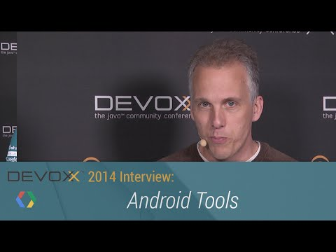

## Devoxx 2014 Interviews: Android Tools

** 视频发布时间**
 
> 2014年11月27日

** 视频介绍**

> Tor (@tornorbye, google.com/+TorNorbye) discusses the unified Android (Gradle) build system, and the state of the Android Studio IDE (hint 1.0: is around the corner).

** 视频推介语 **

>  暂无，待补充。

### 译者信息

| 翻译 | 润稿 | 终审 | 原始链接 | 中文字幕 |  翻译流水号  |  加入字幕组  |
| -- | -- | -- | -- | -- |  -- | -- | -- |
| 虞高 | wang7x | —— | [ Youtube ]( https://www.youtube.com/watch?v=M_zZlZPUR8M )  |  [ Youtube ]( https://www.youtube.com/watch?v=r2brcJu3VKw ) | 1504260743 | [ 加入 GDG 字幕组 ]( http://www.gfansub.com/join_translator )  |

### 解说词中文版：

Alexis Moussine-Pouchkine  大家好

这里是Devoxx 2014

我和Tor主持这期节目

你猜我们在讲什么

Android 开发工具

TOR NORBYE  没错

MALE SPEAKER  首先欢迎Tor

TOR NORBYE  谢谢

MALE SPEAKER  你在之前的

Android开发工具里已经讲了Android的新特性

现在有一些新的东西

显然 Lollipop 刚发布

而你致力于Android Studio

这个ide给Android开发者

带来了很多新东西

构建系统  新的特性  以及许多新的东西

以及接下来会说到的一些

你可以先简单概括一下吗

TOR NORBYE  好的

Android Studio是我们最近几年提出的东西

一个全新的IDE

这是基于IntelliJ IDE创造出来的

提供了大量好的作业编辑器以及XML编辑器

方便上手

而且还加入了一些新的Android特性

来使得Android开发更为高效

这是关于IDE的一些东西

我们正在致力于创建一些外围的工具

Android Studio的一个巨大的变化是

加入了对Gradle构建系统的支持

这意味着加入很多非常非常有用的特性

尤其对于Android开发者而言

举个例子  这很容易让你使用同一套代码

生成免费版本和收费版本

或者你也能很容易的创建一个beta测试版

分散给你的部分用户然后再面向

其他人发布其他版本

你可以很轻松的做到那些

MALE SPEAKER  很明显你们实现这些东西

还有一个原因就是

可以在这个IDE之外完成一个完整的项目

并非这个IDE没有这么好 而是还是有很多特性可以实现

TOR NORBYE  没错

我觉得目前实现的不错了

你想要构建一个项目  你想要分享APK

然而并不在你的系统上构建

还可以发布你服务器上的版本

同时还在上面做测试

对吧

有些团队用了一些不间断的整合的服务器

这些能很好的运行 而且确保都是对的

我们在用Android Studio 和Gradle 构建系统之前遇到一个问题

那时我们在Eclipse里面实现并构建系统

后来我们有一个来自ANT的命令行工具

通常他们是不一样的

他们总是很难有相同的特性

现在我们决定了

用一个统一的构建系统

它可以同时在IDE或者在服务器上运行

这就是Gradle

然后我们在Android Studio上做了这些工作

让它能正常运行

即使构建系统是用Gradle文件配置好的

你不必具体了解它

你可以坐在你的IDE前  打开项目研究对话框

然后说   我想添加一个免费版

还有我想添加一个专业版  并且我想要用这个版本

你可以在图形界面下进行操作

MALE SPEAKER  好吧

但是如果它们想做一些麻烦的应用	  TOR NORBYE  的确有人这么干了

我看了很多专业的用户

我和那些有着上百行或者上千行的

脚本用来执行复杂的包管理的人交流过 

现在他们能用小型的Groovy脚本来代替了

这是他们的一场胜利

MALE SPEAKER  没错

所以这就是在这种情况下使用Gradle的意义

Android是一个很好的平台

无论手机还是平板

如果我们还需要关注他们的参数

TOR NORBYE  手机 平板 还有手表

MALE SPEAKER  对的

我们会讲到那些的

TOR NORBYE  好的

嗯

好吧

MALE SPEAKER  仅仅手机和平板

TOR NORBYE  没错

仅仅手机和平板

对啊

MALE SPEAKER  不不 这已经算是难题了

你期待在Android Studio中得到什么支持

来帮助开发者适应不同的尺寸特性

我们会讲到穿戴式设备和其他的一些

说到一些视觉化工具比如提示 诸如此类

TOR NORBYE  嗯

我们有许多特性来帮助他们

所以我觉得可能最简单的方式来理解

就是你可以在IDE中直观的看到布局

我们有这样的特性 这让你说 嘿

我想看看你的布局

我更关注的是它看上去的样子 比如同时看一个右到左的视角

一个左到右的视角

或者我想看不同Android系统版本

中的样子

那么现在你就能同时看到Material设计

Holo效果甚至是Gingerbread

或者你可以说 我想看到在不同版本中的

布局视觉效果

现在你能很快捷的看到 嘿 这种语言下

这个字符串出错了

在Android中

给不同的配置调用我们提供的资源

是一件很容易的事

举个例子 就像地貌之于方位一样

你可以很简单的说  嘿 这地貌是我的布局

这是我的垂直布局

我们很容易的看到

不同位置 不同方向时候的

布局样子

MALE SPEAKER  没错

所以这本身是一个很实用的特性

当然 如果要说加上穿戴式设备

给它们开发的方式

详细来说

那些通知

但如果你想创建一个给穿戴式设备的应用

这也是其他APK的一个分支

所以这整个是一个整体的构建

是的

有的

并不只停留在表面

