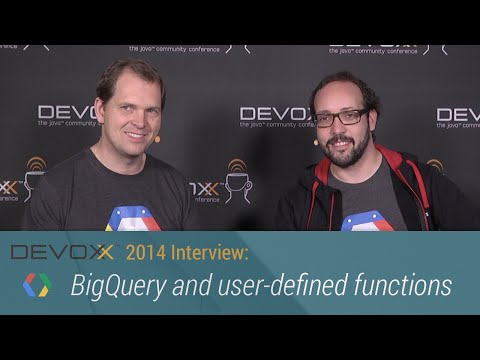

## Devoxx 2014 Interviews: BigQuery and user-defined functions

** 视频发布时间**
 
> 2014年11月27日

** 视频介绍**

> Felipe (@felipehoffa, google.com/+FelipeHoffa) discusses the power and speed of BigQuery analytics and the introduction of user-defined functions.

** 视频推介语 **

>  暂无，待补充。

### 译者信息

| 翻译 | 润稿 | 终审 | 原始链接 | 中文字幕 |  翻译流水号  |  加入字幕组  |
| -- | -- | -- | -- | -- |  -- | -- | -- |
| 段威 | 葛佳恒 | —— | [ Youtube ]( https://www.youtube.com/watch?v=ktSpKip8Q7M&list=PLOU2XLYxmsIJaacrFiQbQGGrPXIWvj1Wr&index=5 )  |  [ Youtube ]( https://www.youtube.com/watch?v=Agd2k1FQe7k&index=22&list=PLvivLNHqjoowK2IZ9j_NYIucUrGgdiDrT ) | 1504260744 | [ 加入 GDG 字幕组 ]( {{ book.host }}/join_translator )  |

### 解说词中文版：

大家好

欢迎回到Devoxx 2014  欢迎Felipe

你好

你好

我们这次聊一聊大数据

你正负责这一块  更准确地说是BigQuery

它也是你昨天在会上

分享的内容之一

对的

我和BigQuery团队的Thomas Park一起做了分享

他是我们的软件工程师

我们展示了BigQuery的一项新特性

用户自定义函数

在我们去聊那个之前

我知道它是一项不错的特性

实用起来也很好

先说说什么是BigQuery

BigQuery是谷歌云端的一款产品

用来快速地分析数据

不需要配置任何的环境

只需要你把待检索的数据上传

就可以用SQL语句几秒内查询出结果

我们把这个叫做

实时互动  我们不需要批处理任务

然后等上一整晚才得到结果

你可以直接进行互动操作

BigQuery让人着迷的地方就是你可以与它实时互动

你是怎么查询的

就是用SQL语句

BigQuery强大的地方

是你不用操心数据表索引的事情

它直接可以运行得奇快无比

不管是怎样的查询条件

它几秒内就完成全表扫描

好的

这就是大数据

但是我不用大数据  需要这个么

我也没有那么大量的数据  对吧

如果你用过数据表和数据库

写过SQL查询语句

你八成被折磨过

对

这个确实是

是吧

如果你之前有过长达数分钟甚至几小时的查询

但是用BigQuery几秒就好了

也就是说我的SQL查询时间一旦很长

相当于我在处理大数据

我只是自己不知道而已

就是这样

对

好吧

并且BigQuery让你方便分享数据

如果你有一些要分享的数据

BigQuery有强大便利的权限控制

可以让你即时地和别人分享数据

而不需要对方进行任何设置

非常好

只要懂点SQL语句

上传你的数据  几秒内就有结果啦

非常痛快

开场介绍你提到了用户自定义函数的功能

这个功能表明SQL作为一门查询语言

可能是有着一些限制的

有哪些限制呢

我喜欢用SQL

它能帮我解决90到95%的问题

剩下的情况就不行了

有时候你更希望的是使用过程化语言

对数据进行转换和分析

与此同时  也能借助BigQuery

在几秒内全表扫描一遍

由此带来的问题是我们如何让过程化语言

和BigQuery在大规模的数据中协同工作

这也是为什么BigQuery团队的Thomas

要加入这项新特性  用户自定义函数

这样你就可以使用JavaScript

写任意你想要的函数了

它是内嵌于SQL查询语句中运行的

BigQuery能做到的事情之一

就是执行正则表达式  还是嵌入的

但是现在不仅限于此

我可以使用一个完整的JavaScript函数进行一些计算

对的

有一个使用场景的例子是昨天我们对日志的处理

有时候日志里有一些URL编码信息

或者其他一些数据信息

数据从来都有冗余的

而且正则表达式

能做的事也有限

可如果你有内嵌于SQL查询语句中的JavaScript过滤函数

就可以对数据进行任何你期望的清理

现在就支持这样的功能啦

那这是如何实现的

你们遇到性能瓶颈了吗

它仍然是可以实时互动的吗

原理上是如何执行的

给我们讲讲怎么实现的

实际上很多人问我们

为什么选择JavaScript

作为开发的语言

对  这也是个好问题

其实  在谷歌

我们开发了一款超快的JavaScript引擎

我好像听到过是V8

对  就是它

我们从Chrome拿来V8

把它放入BigQuery集群中

所以每个节点都会运行V8而你的JavaScript函数

运行于节点中

值得大家注意的是

BigQuery可能不仅仅是一款产品

而更像是一个服务平台

因为Google帮我们完成了所有重要的基础工作

Google来运行集群  设置好环境

显然它还是分布式的

这是最好的实现方式

告诉我们一下BigQuery能

在几秒内处理完的数据的数量

就像你昨天处理的数据一样

我喜欢拿维基百科的日志来举例

它们每月数以十亿计

但是我可以在讲演的过程中随时查询几次

只需要几秒钟  然后不断地修改

来尝试不同的查询

那么当你添加了用户自定义函数

性能会变得差很多吗

当然有性能的问题

进程间会有通信

但是只是节点内的

这样就快得多  我们也能执行所有的查询

仍然是实时的吗

是实时的

非常棒

我们什么时候能用到

要发布了吗

它应该不止是原型了吧

应该是

目前  还没有对外开放

但是有一些人在测试中

如果你们谁有意愿

和我们一起测试  联系我们

我们会为你开启用户自定义函数的功能

联系Felipe Hoffa

如果你们想早点试试新功能

找他就好

同样关注下谷歌云平台上

BigQuery的新特性  用户自定义函数

谢谢分享

我们线上见

再会

