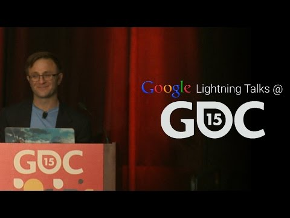

## Lightning Talk: 3 Game Design Mistakes You're Making

** 视频发布时间**
 
> 2015年3月12日

** 视频介绍**

> Todd Kerpelman shares some of the common game design mistakes he made from his years as a game designer. Because chances are, you're making them, too. Also, there's mayonnaise involved.

** 视频推介语 **

>  暂无，待补充。

### 译者信息

| 翻译 | 润稿 | 终审 | 原始链接 | 中文字幕 |  翻译流水号  |  加入字幕组  |
| -- | -- | -- | -- | -- |  -- | -- | -- |
| 段威 | 虎子 | -- | [ Youtube ]( https://www.youtube.com/watch?v=THn4f6zAuJ4 )  |  [ Youtube ]( https://www.youtube.com/watch?v=Jr6dOdZI3yc ) | 1504150636 | [ 加入 GDG 字幕组 ]( http://www.gfansub.com/join_translator )  |

### 解说词中文版：

 ［音乐入］

好  

我们开始啦  

在来谷歌之前呢

我在Pogo担任创意总监

其间我设计了很多款游戏

大部分都挺好的

也有一些不够好没能上线的

看看上面的这些游戏非常棒

我会在自己的LinkedIn主页上着重地展示

而那些被砍掉的同样也有价值

吃一堑长一智嘛

而且我开始注意到自己常常会犯的重复错误

还发现这些错误

并不仅仅发生在我一个人身上

许多同仁在开发各种游戏的时候也会掉进这些坑中

所以今天我想分享其中的三条经验

第一个最最常见的呢

就是胡乱堆砌设计

每当你在一个游戏里

加了所有的东西但是不去完善它就会这样

一般来讲这是因为

你们游戏的核心的设计思路不够明确

你只能通过堆砌设计来掩盖这个事实

往往情况是这样的说 嘿

我们再多加点能量增强特效吧

如果你一直都这么干

很可能你就在马虎地一加了之

又或者你是学院派的

喜欢游戏理论的开发者

情况会变成这样的说

嘿  我们要多加一点高难度的装备奖励

因为这总不会错 对吧

当然

它们很有用

可是你知道给游戏里的每条体系

最多设计几个呢 

其实一个就够啦

对吧

再多点玩家就会觉得不那么有挑战性了

那么如果我们确实陷入乱加设计的怪圈呢 

我们必须先厘清核心

之所以你会添加一些垃圾进来

就是因为你没有对核心的设计了然于胸

首先游戏本来就得看上去很好玩

所以说把能量增强额外奖励这些统统拿掉

只是去稍微玩会儿

觉得有趣儿没 

没有

那就让它有趣儿先

一旦你做到这一点

再往里添加能量增强什么的

就合适了

我的建议是开发的那些能量增强

必须能提供给玩家不一样的体验  而不仅仅是炫酷一点而已

回想一下《马里奥》里的超级叶子

《吃豆人》里小黄球

和《半条命》里的重力枪

都是一些极佳的范例

噢  另外如果你发现你的游戏

不加以上的特效会一点都不好玩  也没关系

就让它保持原样

去开发你的Game Over 条件

得分系统和其他剩下的东西

我们在Pogo好几次都是这么干的

也确实有效

接下来第二点  在好点子上过于纠结

耗时超过预期

有时候我们想出某一个妙趣的点子

我们非常兴奋

觉得它们好得不能再好了

可问题是它会摧毁所有其他的东西

比方举例来说我们找到

一种智趣儿点的等级时间限制机制

它是这么正点和富有创新性

但问题是我们的Game Over条件不够好

得分系统不够好  能量增强特效也很烂

而且任何想到的解决方案

都被直接弃用

就因为和时间限定机制不契合

或者换另一种说法

假如我们现在要做一个三明治

先有的一瓶可口的蛋黄酱

然后才有一些花生酱和果冻

再有根香蕉  但我们都不会放进三明治

就因为和蛋黄酱扮在一起不好吃

所以最后你吃上的不是

美味的花生酱和果冻三明治

而是从罐头里挑蛋黄酱吃

就因为你找不到可以搭配的食材

怎么办呢  把蛋黄酱放一边先

我知道那是很棒的蛋黄酱或者说时间限定机制

但它阻碍了你制作三明治或者说游戏

没任何好处的

而且这种事儿在游戏设计中常常发生

你会有许许多多的好的坏的点子

我觉得一个合格的游戏设计师会去掉坏的点子

而一个优秀的呢

会干掉好的但却偏离主题设计的点子

或者是会限定住我们思维的所谓好点子

就像俗话说  舍不得孩子套不住狼

再让我们看看第三个常见错误上

条件反射地拒绝所有坏的建议

这个症结怎么讲呢

首先游戏测试人员会从你的游戏里找问题

可你看  他们大部分可能是你的朋友或粉丝

他们不会说得很重

与其告诉你说  你的攀爬系统

可差劲了  还不如说

你有没有想过加上一个带抓钩的发射枪

好  问题来了

你知道你是设计者你才是专业的

所以心中马上蹦出来

五条非常合理的原因

来解释为什么带抓钩的发射枪一点用都没有

还会毁了你的游戏

你懂的  我们是游戏设计师

有时候呢  我们有点伤不起

有时候呢  我们有点小家子气

这可能是造成上述反应的原因

所以就给敢挑我们刺的人讲说

他们的点子糟透了  不会有用的

尽管我们肯定是对的

但问题是

即便他们的建议是错的

他们也只是玩了10分钟的游戏而已

他们不明白背后

运行的任何一条系统

他们只是想帮帮忙罢了

所以你要是觉得  抓钩啊什么鬼点子

就再也不去管它了

你就错过了个绝佳的机会

来注意到你的攀爬道具可没有那么好用

是需要进一步改进的  没有人会直接给你这么讲

所以别马上否定他们

无视掉内心告诫你建议不好的声音

尽管它提示的是对的

而应该冷静下来好好想想

为什么他们会从一开时就想给你提意见

他们想为你解决的事是什么 

或者要不然  你就直接去问他们 

当然也可以啦

好来总结一下  第一  不要乱加设计

明确核心主旨

第二  不要因为一个点子好就抓住不放

你就先把它们放一放

第三  不要因为一个建议不好就马上否掉

多细想你的用户要替你解决什么问题

顺带提下  你明白了以上的问题

对于游戏品质而言是极好的

因为从一开始你就已经注意到它们

这样去甄别出它们  有意地去规避它们

等到它们下次要出现的时候及时阻止

看看吧

你们都变成更好的游戏设计师了

只是简单地来听了一下这场演讲

时间到  我讲完了

谢谢大家

［鼓掌声］

［音乐出］