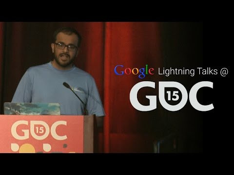

## Lightning Talk: Android TV

** 视频发布时间**
 
> 2015年3月12日

** 视频介绍**

> Watch the complete GDC '15 playlist at: http://goo.gl/whR0PLHow can you adapt the design of your Android game to get it working on Android TVs and into the store? Jamil Moledina shares some best practices for getting it done

** 视频推介语 **

>  暂无，待补充。

### 译者信息

| 翻译 | 润稿 | 终审 | 原始链接 | 中文字幕 |  翻译流水号  |  加入字幕组  |
| -- | -- | -- | -- | -- |  -- | -- | -- |
| 韩淼 | 韩晓健 | —— | [ Youtube ]( https://www.youtube.com/watch?v=wCY5iU66ziY )  |  [ Youtube ]( https://www.youtube.com/watch?v=vbGLaY5mv0M ) | 1504150638 | [ 加入 GDG 字幕组 ]( {{ book.host }}/join_translator )  |

### 解说词中文版：

我是来自Google Play商业发展的Jamil Moledina

领导游戏中战略合作伙伴关系

以及发起Android TV组合

能回到GDC讨论一些关于我们在

Android TV方面的工作感觉非常好

这个平台把Android L操作系统

和Google Play汇集到了客厅

在这里每人每天花费5到6小时

Android TV帮助你到达那里

因为我们在Google Play上已经有了你的商业社区和产品

现在智能TV还不成系统

因为Android TV是一个平台  所以你就可以一次性完成

现在  我们设计的平台

可以使你轻松地把已有的Android游戏适应到Android TV上

这通过在适应新外形设计的指导下

更新manifest文件完成

相对于手机到平板  这是一个很大的飞跃

同时这也不相同

这并不是完全相同的

你需要考虑哪些输入是将要使用的

你已经使你的游戏可触摸  但你如何在游戏中导航

你如何左右滚动你的游戏世界

同时  能使游戏规模直观化嘛

UI可以吗

这里是手机上的Infinite Dreams里的Sky Force 2014

它以摄像作为一个设计--

你拍摄的一个画面

这里是如何适应于电视

他们去掉了风景  增加了能合作的多人游戏

当然游戏手柄控制的支持

同时适应于一些HUD

同时  考虑如何你游戏规模打达到客厅级别

手机游戏一般为3到5分钟

但你如何使它的规模达到15  30  甚至是两个小时

我们在组建Android TV组合的方法

是选择高保真游戏

它可以很容易缩放到客厅显示的尺寸

直到现在我们已经为推出Nexus游戏策划了一切

我们用大致相同的方式

在主要的商店里做一些特色

因此它是一个相同特色的过程

我们用一样的编辑团队

创造了一切

你可以看到组织好的条目

这是商店如何呈现他们自己

通过Greg在他主题里提到的所有设备

我们开始时的口号是质量超越数量

为了证明给开发者

OEM合作伙伴  顾客还有机会空间

因此现在在商店里我们有超过80款40星级的游戏

我们关注与拥有高视觉保真度

高度的可访问性  可控性

与内容性上受众广泛的游戏

并且内容看起来什么样

我们有很好的合作伙伴供应这个商店

从非主流到AAA的开发者都有

Vector Unit的"Beach Buggy Racing"

我们早期看到的很多

Disney的"Castle Delusions"  Senri的Leo's Fortune

Gameloft的Despicable Me

这只是一些我们所拥有的

但是同时  这些游戏来自控制台和PC

像Ubisoft的  Valiant Hearts  和  Oddworld-- Stranger's Wrath

以及独立的点击像  The Bridge  和  Goat Simulator

使你能够

保持你的客厅通过平台与商业模式一致

现在在CES的硬件端  索尼  飞利浦和夏普

展示他们运行Android TV的智能TV

并且Razer的Android TV-powered Forge TV one

Best Gaming Product和Consumer's Choice Award

很大程度上是因为它是一个100美元的通用的媒体播放器

和游戏机

现在  我喜欢这张图

用户的体验将会是什么

当他们在2015年把电视带回家的拆箱体验吗

我们现在正在发展这种组合

这就是为什么现在适应Android TV很重要

这些游戏是最先的搬运工

它们为适用于客厅游戏app文化

转变设置栏

同时  还会有更多在研发中的产品

作为走在前列的平台

在客厅里出现的消费电子设备

商业情况表现的更为明显

我们会看到更多像 Sky Force 2014 的顾客经历

和Greg讨论的关于第二屏幕

的经历

最后  传统游戏开发者的梦想

变得可能  已经触手可及

就是让你的游戏环绕在玩家身边

在没有设备和平台的限制下  它能够无缝的

生存于手机  平板  还有客厅里

你怎么达到这个目标

开发者宣传团队会帮助你

通过技术帮助你分类

并且Google Play团队会在商店中帮助你

通过你最喜欢的社交网络联系到他们

就是这么多

非常感谢你

