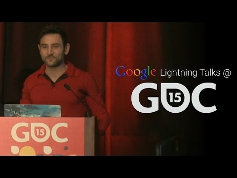

## Lightning Talk: How to Go Viral Without Really Trying

** 视频发布时间**
 
> 2015年3月12日

** 视频介绍**

> Harness the power of YouTube's 1 billion daily users to give your game the publicity and exposure it truly deserves

** 视频推介语 **

>  暂无，待补充。

### 译者信息

| 翻译 | 润稿 | 终审 | 原始链接 | 中文字幕 |  翻译流水号  |  加入字幕组  |
| -- | -- | -- | -- | -- |  -- | -- | -- |
| TWL007 | 葛佳恒 | —— | [ Youtube ]( https://www.youtube.com/watch?v=nDnmeGgd8qc )  |  [ Youtube ]( https://www.youtube.com/watch?v=RSPdNZMD_Eg&list=PLvivLNHqjoowK2IZ9j_NYIucUrGgdiDrT&index=73 ) | 1504150641 | [ 加入 GDG 字幕组 ]( http://www.gfansub.com/join_translator )  |

### 解说词中文版：

下一位  我们有请Ibrahim

他将要跟我们谈一下有关YouTube方面的东西

有谁希望自己的游戏像病毒一样传播开来

有人么

谁不希望自己的游戏以任何像病毒那样的传播方式传播

所以今天  我将要聊一下如何利用YouTube以及YouTube API

来让你的游戏像病毒那样传播开来

并且之后我们还将深入探讨那些

可以让你实现这个目标的具体的开发者的创意

首先  让我们聊一下YouTube

除了是当今最开放的视频分享平台

它也是互联网上第二大搜索引擎

而且现在  我们会看到每天有10亿的独立用户访问YouTube

并且他们每个月会观看60亿小时的视频

他们都去看有关猫咪的视频么（调侃Google的利用YouTube视频来训练如何识别出猫的机器学习模型）

笑

也许

如果我说其中25%的用户是来自移动端呢

看  我给你找到嫌疑人了

就是它  喵星人

笑

你知道

猫无处不在

从一个调查中  我们发现那些玩视频游戏的人

那些玩视频游戏的人

其中的95%说他们会去看游戏视频

以及预告片

所以你在这里看见机会了么

比如你如何去真正地接近他们

如果你使用YouTube的API

你就能获得所有的YouTube服务

所有这些你已经拥有和来自你软件的令人惊叹的服务

之后让你的游戏集成YouTube的API

你觉得这会创造什么

这只会创造出迷死人的东西

哈哈哈

为了详细了解一下不同的服务

我创建了一个分为四个部分的表格

让我们看看这四个不同的方面

第一个  创作部分

Google就是你用来上传视频的地方

第二个部分是发现

这里你可以发现你的游戏中的有趣视频

第三部分是Analytics（一个Google的服务）

你会看到一些关于视频的分析

最后一部分  我们会谈论一下内容管理

让我们从上传开始

像FIFA  或者现在一些其它的游戏

实际上已经具有了实时回放的功能

所以你可以直接从你的游戏内

上传游戏视频而不必切出游戏

向你的朋友展示你的游戏视频然后夸耀你所做出的

这些漂亮的动作难道不是一件很酷的事情么

这样的功能是通过Data API实现的

我们有一个 哔 的上传

你可以通过它轻松地上传你的游戏内容

而不必切出游戏

除去已经使用这个技术的游戏和游戏机

有一些直播平台比如Everyday等

他们允许开发者

立即开始使用API服务  比如抓取视频画面

然后使用Youtube的API上传到YouTube

对于这个技术  他们大多数时间使用Unity来获取视频画面

并且利用WebM来编码

他们利用YouTube API来上传视频到YouTube

除去这些视频的需求  如今

我们也看到了在线直播也变得极其流行

比如说有些人喜欢在线直播他们的游戏

更进一步说  如今这些游戏直播会比体育赛事

事实上甚至比音乐节更加流行

除去那些已经支持YouTube Live Streaming API

的游戏和游戏机

他们甚至出现在一些辅助产品上

比如Elgato拥有一个硬件编码器

比如XSplit是一个软件编码器

它能让你在玩游戏的时候直播你的游戏视频

并且它们都使用了Live Streaming API

你可以轻松地使用它们

将其集成到你的游戏中来让你的用户边玩边直播游戏

并且Direct Lite可以帮助你将所有视频放入播放列表中

你可以随后对这些视频进行管理

和展示

这些很多是上传的事情

我也想讲述一下关于发现

你可以找到有趣视频

并且展示在你的游戏中

比如使用Data API中的搜索功能

你可以找到所有不同的视频

甚至可以利用到使用Topic API的Google知识图谱的强大功能

使用这个搜索功能  一旦你找不同的视频

也许是其它的一些小视频  你就可以使用Android内置的播放器

以及iFrame API来展示这些视频

对于iOS以及其它的一些平台

你可以轻松地在你的应用中播放视频

你上传并展示了视频

之后你想看看你的视频表现如何

这个可能可以预测你的游戏的市场表现

这个时候你可以使用Analytics功能

这个已经在音乐行业中实现了

根据Youtube视频上的热播金曲来预测唱片的销量

这些视频已经在YouTube上了  你只需要进行分析即可

如果你也想做这样的预测分析  你可以使用Analytics API

最后一部分是Content ID API

你可以利用它来声明视频和利用视频赚钱

比如加入增值服务或者利用广告赚钱

或者你可以给你自己的产品做广告

对于这个想法  我们已经注意到ZEFA为那些

发布视频并利用视频盈利的人创建了

一个简单的平台

今天  我只是简单地聊聊关于游戏的东西

我讲了从创作到上传实时直播

发现部分中讨论了寻找视频以及重新上传它们

利用Analytics功能进行分析预测

以及最后谈到的内容管理

你甚至可以利用它进行盈利

如果你想要更多的资源  我们有YouTube开发者网站

youtube.com/dev  在那你可以找到所有的

API资源甚至直接和它们进行交互

谢谢大家

