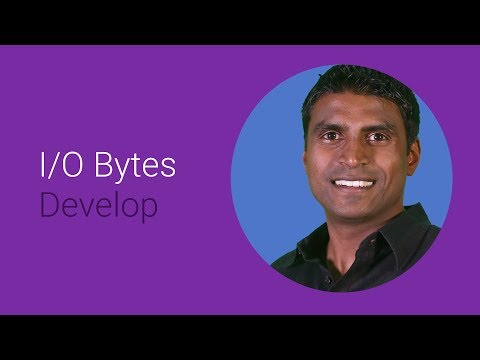

## Google developer tools and APIs for iOS

** 视频发布时间**
 
> 2014年6月25日

** 视频介绍**

> This session will focus on building and utilizing the full Google stack on iOS. We will walk through G+ sign in, Cloud Endpoints, Maps, YouTube, Play Games Services and more.

** 视频推介语 **

>  暂无，待补充。

### 译者信息

| 翻译 | 润稿 | 终审 | 原始链接 | 中文字幕 |  翻译流水号  |  加入字幕组  |
| -- | -- | -- | -- | -- |  -- | -- | -- |
| 韩淼 | 素年待锦 | —— | [ Youtube ]( https://www.youtube.com/watch?v=jrjfZ2ltvgE )  |  [ Youtube ]( https://www.youtube.com/watch?v=CEDrsWzcpXg ) | 1503190436 | [ 加入 GDG 字幕组 ]( {{ book.host }}/join_translator )  |

### 解说词中文版：

你好

我是 Arun Nagarajan  谷歌开发者的忠实粉丝

今天我们将来谈谈如何通过谷歌API建立IOS应用

你知道谷歌是苹果的下载榜上名列前茅

的app吗

我们为苹果手机和平板制作了许多应用

它们被数以十亿计的人所使用

我们也为IOS开发者们提供了大量的API

以便让大家都能够让自己的用户都拥有如此美妙的体验

我们相信不管用户在哪里  都能接触到我们的产品

我们也相信  我们的工具也远胜于Chorme 和安卓

在本段视频中  我们将概览这些API

以及我们为IOS开发者们提供的服务

让我们来看看这些

根据假设你是个开发者将如何解决和探讨谷歌API

一个我们认为可以在出现问题时能极大地帮到你的产品

首先  我们来探讨一下如何建立你的后端数据

存储和逻辑关系处理

每一个伟大的产品都需要一个强大的后端基础设施

它可以随时衡量应用需要什么

你的应用后端要能够做一些异步操作

或是存储一些照片或是做一些推送服务

有大量方案

让你去尽情想象你要建立的应用

有一件非常棒的事

谷歌为你提供了许多服务

它被我们称作  谷歌云后端

我们可以在谷歌GAE上建立服务

并在你的IOS产品上作为API来使用

还有一件非常棒的事  那就是这些API也可以

在android和web系统上使用

所以你可以省下很多开发时间

这里你会看到Python里的一系列逻辑运算

在客户端API上相当简单直白

你会看到这些逻辑运算如何用API语义

以及客户端API来注释

在服务器方面API配置被广泛应用

所以它们和你定义过的API一起很自然的

下一步  你要能够登记和注册新用户

这一步对高品质的应用尤为重要

因为你需要把你的app个人化

保存设置并要能够重置用户状态

你也要知道怎么去做这些

Google+ Sign-in for iOS可以帮你很简单地完成这些

访问 G+ Sign-in的框架和Xcode环境

然后你就可以闲下来了

GPP sign-in能够控制登录

和登录流

一旦有用户注册了

你可以利用API来can actually use the API to request

请求其他信息  比如说他们的外形

照片或其他信息

有关他们的社交图表

你也可以增加其他领域

诸如Google Drive和万年历

以便你可以确保也联系到那些资源

这些都可以在单独的签到上找到

和授权流上

添加Google+ Sign-in可以推进你的app登记

加速进程

举个例子  在IOS上做个DJ应用

会看到苹果上注册用户数上升

32％而平板上是42％  在增加了 Google+ Sign-in之后

所以那里有很大的增长

这样你就可以让你的用户登录

你就要给他们提供you want to be able to provide them

相当拟真的体验

有个好消息就是你也可以使用之前提到的那些

首先  我们来看看谷歌地图

谷歌地图提供了高品质地图和影像地图和信息

这些你一定很熟悉了

现在你可以很容易地把谷歌地图嵌入到你的APP中

你可以很容易地创建出极其美妙的地图使用体验

通过custom data函数使用谷歌地图的工具包

这里是一段代码

看一下如何使用GMS map view

并提供一个marketer和内置相机

这里是一些更加深入的API

它们能增加更深层次的相互作用

或增加先进的功能

Google Cast能够增强屏幕体验

这可以让你的用户通过一个小设备发送和控制内容

如手机或平板，或是电视机等具有大型屏幕的设备上

所以如果你的app展示视频或其他

使用大屏体验会更好的内容

我们极其鼓励你利用Cast SDK

它非常便于使用

首先是流  你要浏览以便找出装备

一旦你注册好了

你只要把流媒体发送到设备上

这个设备被叫做接收机  你可以按需求改变外观

并可以通过标准页面技术尝试接受者的体验

利用脚本

如果你是个游戏开发者，我们为你准备了很棒的SDK

它叫做Play Games Services

你可以通过诸如achievements  leaderboards

实时多人游戏和云存储来增强你的游戏

SDK是可以跨平台操作的  所以你可以在任何平台上使用

而用户可以在IOS设备上开始游戏

并在网页结束它

或者在安卓平台上再战一回

让我们来看看这个叫做leaderboards的游戏设备

的众多特征之一

leaderboards是一个很有趣的方式

来驱动玩家之间的竞争

哪怕只是些普通游戏

这里有一些简单的例子

教你使用GPG的leaderboard的控制

它可以提供大量的API

给你用并展示出leaderboard

而不需要你再做什么

可能有许多脚本

你想嵌入  并且在app中展示YouTube的内容

比如说  一些内容你可以用来帮助

还有一些指导性的信息

在YouTube上都很容易获得

YouTube iOS开发助手

是开源的以便你

嵌入你的app

并能够简单地展示这个简单的框架

你会发现  YT player view里的内容都是开源的

你会发现从那儿加载和控制video极其方便

让我们来看看如何

如何完善app

你一定想知道你的app正如何被使用

哪些部分受欢迎以及哪些地方不受欢迎

你也一定想改变他们

你也不能不停地创建

和重载app

幸运的是  我们有工具方便我们做这些

可能你知道用于网页的Google Analytics

但是你知道还有用于IOS原生app

的Google Analytics SDK吗

这儿你可以看到如何使用SDK

非常简单地跟踪家庭监视的分析

在该例子中

而这些  当然

都需要登录到 Google Analytics的控制台

另一个app开发者必备的应用是 Google Tag Manager

Google Tag Manager能够让开发者们

改变他们app的configuration values属性

而不需要持续地重建和重发他们的app

这对改变configuration values属性真是太方便了

对app中的设置也是如此

例如字符串或是你理想中的界面设置

东能够被动态控制

这段代码将展示 Tag containers如何开放

如何使用简单的API唤醒来检索

现在我们来看看如何通过app

来创造收入

如果你的app上出售真实的产品  做票务或是提供服务

你真的需要深入了解谷歌钱包

谷歌钱包的Instant Buy能够帮你让成千上万的用户

使用谷歌钱包并通过它付款

这也可以帮助他们减少需要做的

所以说呢  这对大家真的是大有裨益

包涵你自己  作为一个开发者在内

在这段例程中有两个关键部分

这儿有多方的潜在的钱包需求

需要你创建服务

第二部分我们来谈谈怎样让服务权威化

怎样通过代理卡来

发送付款信息给你的数据处理机

另一种很好的赚钱方式就是展示高品质的广告

在你的app上

通过AdMob SDK你可以很容易地做到这些

Banner ads占用屏幕的一小部分

来吸引用户点击去体验更为丰富的内容

让我们来看这个片段

我们正在创建一个GAD横幅视图

并添加到APP上合适的界面处

现在让我们来概括一下

我们概览了十种不同的API以及服务

他们都是由谷歌为IOS开发者们提供的

如你所见  这些API可以帮助你解决很多问题

这些问题当你作为一个开发者时可能会遇到的

不管你建立的是哪种类型的app

我们相信  通过这些API

你可以在IOS系统上为用户提供美妙的体验

我们只是简单地从表面了解了这些API

想深入了解  请点击developer.google.com.

