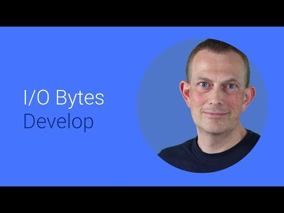

## Dart in Google Cloud

** 视频发布时间**
 
> 2014年6月25日

** 视频介绍**

> Dart's VM is a full featured server, with support for HTTP, SSL, Web sockets, and more. Learn how to build server apps with Dart and deploy (and scale!) to Google's Cloud.

** 视频推介语 **

>  暂无，待补充。

### 译者信息

| 翻译 | 润稿 | 终审 | 原始链接 | 中文字幕 |  翻译流水号  |  加入字幕组  |
| -- | -- | -- | -- | -- |  -- | -- | -- |
| 柚子皮 | 高冰 | —— | [ Youtube ]( https://www.youtube.com/watch?v=UqolCJsvD_g&list=PLOU2XLYxmsIIwGK7v7jg3gQvIAWJzdat_&index=17 )  |  [ Youtube ]( https://www.youtube.com/watch?v=PgdcTZW-BPM&list=PLvivLNHqjoowK2IZ9j_NYIucUrGgdiDrT&index=27 ) | 1505070810 | [ 加入 GDG 字幕组 ]( {{ book.host }}/join_translator )  |

### 解说词中文版：

大家好

我是Soren Gjesse  来自Dart团队

通过我的介绍  会让你了解到为什么Dart在构建云应用方面

是一个很棒的语言

Dart是一个崭新的可扩展的web应用开发平台

它可以在浏览器和服务端上运行

有了Dart  在客户端和服务端上

就可以利用同样一种语言进行web应用的搭建

还能更好的利用

Google云计算平台提供的服务

今天  我会展示在Google数据中心

使用GAE（Google App Engine）的代管VM服务

运行一个Dart应用是多么容易

Dart现已加入GAE豪华午餐

GAE可以在你的应用越来越受欢迎的情况下

自动扩展

GAE的代管VM服务综合了GAE的强大

和通用服务器的灵活

你能够同时拥有对计算自由和VM服务的绝对掌控

并还享有GAE的自动管理功能

由于应用运行在虚拟机上

所以可以在上面安装软件

Dart在服务端虚拟机上运行

没有任何限制

甚至是用本地扩展访问一个C语言库

也是可以的

GAE的代管VM服务支持本地开发

你可以在本地测试

当你准备部署的时候

部署过程会确保相同的代码在Google数据中心运行着

开始之前 还需要做一些准备工作

首先得有Google Cloud SDK

其中包括了一个gcloud命令行工具

你还需要最新的Dart SDK和Dart编辑器

在Dart的官网dartlang.org上有很详细的操作教程

Dart上手还是非常简单

创建一个基础的HTTP服务应用只需要几行代码

导入appengine.dart包

启动服务器

然后处理HTTP请求  这和处理Dart的输入输出流的操作非常类似

如果你已经有了一个Dart的服务器应用

把它迁移到GAE上只需要改动几行代码

你可以在本地执行gcloud app run命令运行你的代码

当你满意的时候

执行gcloud app deploy命令可以进行部署

现在这个站点就已经提供了HTTP请求的服务

GAE包里包括调用Google云服务的API

具体有Google云存储  缓存

用户  日志获取相关的API

先看一下Google云存储

Google云存储是一个用来存储无关系型数据的

的无模式数据库

作为一个无模式数据库  可用来存储

拥有已命名属性的实体

为了提供最大的扩展性  我们提供了两种API

调用基础的API

你可以直接以键值对的形式操作数据库

再高级一点  我们增加了一个映射层

这样  实现存储数据更新变的非常简单

只需添加一些简单的描述说明

来指明你的命令是对应

操作数据库中的哪个部分即可

下面我演示一下  存储一个数据更新操作

是多么容易

首先  你需要模拟数据更新的过程

看一下这个Person类

我们想要存储两个属性  name和age

这个类定义了成员变量  继承自Model类

数据在数据库中的映射关系

是在ModelDescription的子类中声明的

请注意  这里定义了在数据库中各数据的数据类型

当然也可以附加其他的属性

比如可以设置非空属性

设置数据有序属性

PersonDesc类编写结束

Person类也就完成了添加描述说明的工作

类的定义也全部完工

现在  向数据库添加数据

就和创建一个实例一样简单了

这里  我们创建了两个实例对象 George和Sarah

然后调用datastore的commit方法

来把这些实例存到数据库里去

这里我们用了Dart的异步编程模型

当提交进行时

已经得到了返回值

如果你熟悉GAE的Python NDB Datastore API的话

就更容易理解了

Dart是开源的

所有的代码在Github上都可以找到

也可以在pub.dartlang.org网站提供的

Dart包中找到

现在我们来体验一下代码共享功能

当你在客户端和服务端都在使用Dart时

你的前后端就可以共享代码

这很有用  因为这些代码只用写一次

比如  你的客户端和服务端

通过基于JSON的接口交换数据

进行关联数据对象  序列化

和反序列化操作的代码在前后端都需要实现

可将相关的操作定义在公共类库里

这样前后端都可调用这些代码

在前后端共享代码有许多好处

比如不需要用不同的语言写

验证逻辑的代码

这一部分在客户端和服务端都会用到

所以写一遍然后共享出去就可以了

如果一个应用在离线时也可以运行

在这种的情况下

原本运行在服务端的大量代码  现在都要运行在客户端上

在前后端使用同一种语言的话

这种情况就可以轻松应对

代码只需要写一遍  就会一直保持同步

这都是些简单的例子

在实际开发过程中会发现更好的解决方案

现在Dart仅仅刚开了一个头

我们会逐步完善GAE对Dart的支持

在API方面

GAE上还有很多有用的API还没有实现

我们会去逐步完善这部分的支持

我们还在做一件重要的事

那就是让更多平台支持通过Dart访问Googl云服务

Google云存储等许多Google其他的服务在大多数平台上都提供支持

Google云计算引擎提供支持

在自己的服务器端

其他云服务提供商  甚至是浏览器上都提供支持

同样的  我们会致力于

让更多的平台都提供对Google云服务的支持

让你的Dart应用实现真正的跨平台

听到这儿

我想你已经迫不及待要在GAE上

开发你的Dart应用了吧

访问dartlang.org可以获取更多信息

快去构建你自己的Dart应用吧

