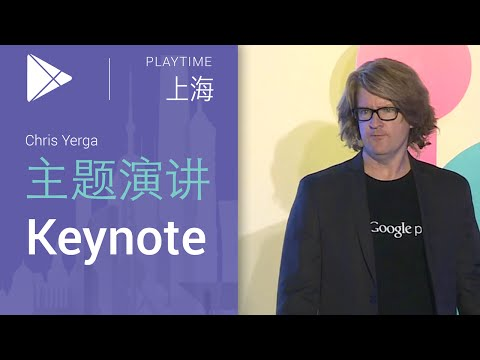

## 主题演讲 Chris Yerga 

 

** 视频发布时间**
 
> 2015年4月2日

** 视频介绍**

>  Shanghai Playtime Keynote, by Chris Yerga (上海Playtime主题演讲, 演讲者Chris Yerga).

** 视频推介语 **

>  暂无，待补充。

### 译者信息

| 翻译 | 润稿 | 终审 | 原始链接 | 中文字幕 |  翻译流水号  |  加入字幕组  |
| -- | -- | -- | -- | -- |  -- | -- | -- |
| 姜昭宇 | 程路 | ——| [ Youtube ]( https://www.youtube.com/watch?v=yMWv5x97iRA )  |  已发布  | 1504060549 | [ 加入 GDG 字幕组 ]( {{ book.host }}/join_translator )  |

### 解说词中文版：

非常感谢Bill 

感谢大家抽出时间来到上海参加PlayTime活动

那么如果说我的口音大家觉得比较奇怪

听不懂  那么现在

可以请大家带上同传耳机

我的名字是Chris Yerga

我是亚太地区Google Play

工程部门的副总裁

我在软件行业已经有25年的工作经验

我觉得现在是

最最令人兴奋的时刻

我们来到这里看到有这么多

有激情和活力的应用和游戏

开发者到会

我们今天有很多很棒的内容要跟大家分享

首先由我来开始跟大家分享

一些Android开发的最新的状况

然后跟大家介绍一些关于

怎么样能够在Google Play建立你的全球的业务

大家都知道  Android是Google发布的一个开放源代码的操作系统

它在几年前推出  并且获得了巨大的成功

我们给大家看一下这Android设备激活量统计表

我们现在已经有超过10亿的

活跃的用户

但是还有一些其他的数据  

这些数据可能不是很容易理解  也就是我们全球每天都有150万

的Android设备激活量

150万  这个设备数量真的是很多

你可能很难想象到底有多少

那么我们就做了一个有趣的实验

我们把这150万个设备都堆起来

会有多高

那么它们是不是会到这个楼的顶楼这么高

还是比我们这座楼的顶楼还要高

那么事实上  如果说你把150万个

这样的Android设备都堆起来

它可是比珠穆朗玛峰都要高

那可能都是到一个飞机

飞行的高度

由这些新激活的设备堆起来的珠穆朗玛峰

每天都有一座

所以说对在座的各位应用和游戏的开发者来说

都是非常好的机会  这是一个

能够获得很多很多的客户的好机会

能够取得这样的成功  并不是靠我们Google

单枪匹马来实现的

Android是得益于一个全球的生态系统

它是包括60家生产商在生产Android设备

有329个电信运营商在全球190个国家

销售设备和提供服务

与此同时  这个生态系统中有一个

非常重要的部分  就是我们在座的各位开发者

你们基于Android平台做出了伟大的应用和游戏

在Google Play上

这个结果也是非常的令人振奋的

在全球有78%的智能手机使用的是Android系统

而62%的平板电脑也是Android系统

这些数字真的都是非常的庞大

所有的这些人都是我们潜在的客户

这就是为什么今天我们的

分享是希望你走向全球

因为这些数字代表的是针对Android

以及Google Play的全球的机遇

86%的Android设备使用的是Android4.0以上的版本

那么这样的话大家就能够用到最新的API

向人们展示你的内容

尽管这些数字听起来非常的庞大

但是毕竟在全球还有50亿人

他们都是还没有智能手机的

我们现在非常关注能够让这些人

也尽可能的都能够使用到Android的手机

最近我们推出了Android One

它是我们即将推出

有原生Android体验的

廉价智能手机

在亚太以及全球新兴市场

同时我们也非常关注不仅仅是

让每个人都能够有个智能手机  同时希望

人们可以使用不同类型的设备  都运行Android系统

我们最近发布了Android TV

通常家里最大的屏幕

就是你的电视机

在座如果有Android

游戏开发者  电视系统对大家绝对

是一个非常大的机会  能够让用户不仅仅

可以只是在手机上  而且能够在他们的起居室  客厅等

都能享受这个游戏

他们都是运行在Android系统上的

所以你不需要花很大的力气就能够

做到这一点

那么我们从很大讲到一个很小  也就是

我们最近发布的Android Wear

让Android运行在手表等

等穿戴设备上

不仅仅能够提升你智能手机的体验

够推送一些通知  能够让你有更多的互动

同样跟健康相关的一些参数也都能提供

计步器等诸如此类的应用

最后  是我们的Android汽车方面的产品

能够直接将Android搬进车载

娱乐系统

针对这些不同类型的设备

我们都在专注于如何将Android

带给用户  不管人们在哪不管在做什么

我们刚刚提到了  Android现在已经运行在所有平台了

包括电视  平板  智能手持设备  智能穿戴设备

这些系统之间能够有一个非常好的用户界面

其实非常重要的

可以给人们带来一致的体验

这个起源于5000年前人们发明了纸

中国发明了造纸术

Material Design 也是我们所做的一点点贡献

我们在思考这个智能的纸张

在21世纪看起来应该是什么样子的

我们之后会有关于Material Design一些

更多的介绍

上面介绍的设备里都运行有Google Play

Google Play运行在日激活可以堆成珠穆朗玛峰那样高的

Android设备上

每个设备上都预装有Google Play

是大家的一站式的一个商店  不仅仅有应用和游戏

还有用户需要的电影 书籍  

等其他娱乐内容

结果跟前面Android的成功

是一样的令人吃惊  我们有

从Google Play里应用量的下载总量是500亿以上

除此之外每个月都有

20亿的应用的下载量

现在我想的给大家分享一下

500亿的下载量  其实游戏占了很大的比重

游戏是非常受用户欢迎的

其中有一个非常有意思的事情值得思考

游戏是每个人都

喜欢玩的

实际上  我们的指标也表明75%的Android用户

都会在设备上去玩游戏

这也就意味着可能之前

人们并不是一名游戏玩家  现在也开始玩游戏了

用户基础是非常广泛的

在Android平台上有很多人在玩游戏

对大家来说是非常大的一个商机

我们在这边也助大家一臂之力

我们有一个Google Play Game Services

可以以供成就系统  高分榜

多人匹配  任务  排行榜等等

我们为大家提供了一些常见的服务

你就不需要在这方面进行额外的开发了

每半年都会有一亿的新用户来

使用Google Play Game Services

它是有史以来增长最快的游戏服务

对于我们的开发者而言  这意味着

用户在玩配备了Google Play Game Services游戏的时候

他们的互动性会更强

我们举例一个合作伙伴

他们内部的数据显示出  使用了Google Play Game Services的

用户在看到了他们的朋友在游戏中

超越了他之后

三天之后回到游戏的几率会增加300%

一周之后回来的几率会增加400%

因此这个不仅仅是

帮助用户之间进行互动

同时也增加了游戏的用户粘度

刚才我们讲了很多的数字

而且也讲到了这个全球的机会

其实我们今天来的最主要的原因之一

就是跟大家来沟通一下我们到底

怎么来帮助各位利用好全球的机会

前面已经说过  我们今天会经常会用到

这个词"go global"

也就是面向全球的机会

每个月有来自190个国家的

的20亿下载量

亚太地区的很多开发者已经

在注册了Google Play开发者帐号

已经充分利用其

进行盈利了

它不仅仅是在全球发布你的应用程序

我们在应用的整个生命周期都会提供支持

起先最早是开发应用

然后是发布  接下来是盈利

最后是一些数据的分析

这样的话就能使得你的App

未来能够不断地优化以助力你的商业业务

所以说今天我会花点时间

跟大家来讲三个方面的内容 首先就是开发

第二就是全球发布  第三就是盈利

那么前面已经说过了  在应用和游戏的开发阶段

我们推荐您集成

我们的Google Play Game Services来获得

我们刚刚讨论过的好处

我们还有其他的一些Google的服务

我们也推荐您看一下

比如说AdMob  可以帮助我们通过广告

这些方式来进行盈利

另外还有一个叫Google  Cloud Platform云计算平台

其实也是非常好的一个服务

Google  Cloud Platform云计算平台可以帮助建立你的游戏或者应用的

后端  与Google自己服务相同的

云架构  假设你有一个一夜走红的

成功的应用  你的用户增长量非常大的话

就可以借助Google的经验和技术

去帮助你扩容

可能远比你自己独自做这些更好

另外还有一点非常的重要就是

我们希望大家能够专注于提升应用的质量

给你的用户带来尽可能好的体验

也可以使得你自己的App的排名不断的上升

未来有更多的安装量

如果你希望从用户那里得到好评  我们也提供

了支持

我们也提供了Alpha和Beta测试

你可以让一小批人先为你的更新

或者新版本做测试

这样就能够确保你在

App和游戏发布之前就解决了所有跟质量相关的问题

为全球进行发布做好准备

Google Play已经提供了190个国家的提供服务

很显然有很多用户还没有涵盖到

这些人当中有很多

都是来自于新兴市场  我们计划部署Android One计划

去支持他们

那另外你的app在本地化的过程当中

在Google Play的开发者控制台

在上传了应用之后

就直接可以订购翻译服务

帮助把你的应用和文本

做不同地区的本地化翻译工作

当然  盈利这个话题是很多人

非常关注的

我们也一直不懈的在这方面努力

希望能够来增加各种不同的方法让

你与用户之间有更多种不同的付费形式

我们在很多国家的市场发布了Google Play点数卡

在用户里这个已经十分流行了

我们增加了不同的支付方式 

举个例子  Paypal

但是我觉得最成功的是  

通过移动电话运营商扣费

就是与移动运营商合作

用户可以直接在应用和游戏里

使用话费直接支付

我们在全球很多的国家都尝试

了这种与运营商合作扣费的方式

你可以通过

运营商话费付费下载  应用内支付  这些都是很流行的

快速增长榜单上的应用几乎都是使用

应用内付费这种方式在盈利

我们同时增加了订阅和周期性收费

您可为您的应用添加周期性收费和订阅结算

付费的数量大的惊人

从2013年6月份到今年6月份

我们已经支付了50亿美金了  

这个是与我们的开发者小伙伴合作产生的结果

那可是一大笔钱喔

那不仅仅是一笔钱财

更重要的是年度环比2.5倍

的增长率

它是一个巨大的市场

同时也在极速扩张

我们也鼓励大家能够去

利用Google Play去建立你自己的全球商业业务

对我们来讲  大家并不仅仅只是

在做一个App  你是在做一个自己的商业

Google Play将会是你永远的伙伴

今天提到的各方面

去帮助你构建你的商业业务

我刚刚提到过的  也是我的总结

我们会伴随在应用的整个设计

开发  发布的整个生命周期

我们也提供数据分析洞察帮助你

进一步优化你的商业业务

此外通过我们的帮助让你走向一个全新的国际市场 

接下来  就请我们在这个领域的

一位专家Ellie Powers上台

她来跟我们也来分享一下

怎么通过Google Play获得成功

